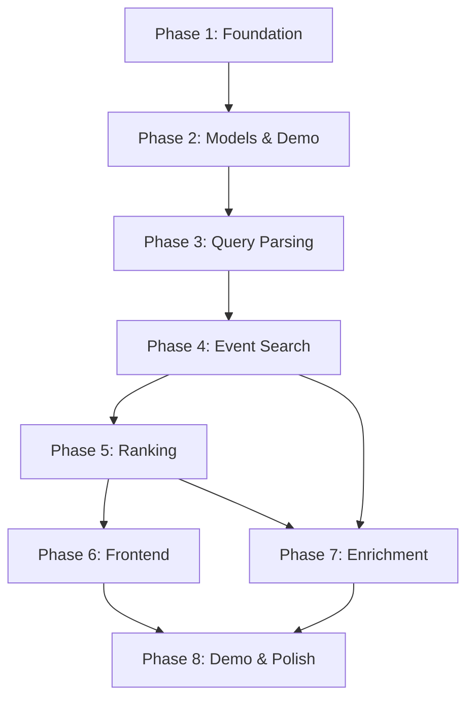

# Pulse AI - Comprehensive Development Roadmap

## Executive Summary

This roadmap breaks down the Pulse AI hackathon project into 8 clear phases, following an incremental build strategy that ensures the application remains runnable and demoable at every stage. The plan prioritizes PostgreSQL from the start, implements LangGraph workflows as the core architecture, and includes robust demo mode for reliable presentations.

---

## Phase 1: Foundation & Project Structure (Complexity: Moderate)

### Goal
Establish a runnable skeleton with PostgreSQL, FastAPI, and operational tracking files.

### Tasks

#### 1.1 Project Structure Setup
- Create directory structure following [`master.md`](master.md:190-215) specification:
  - `app/` with subdirectories: `config/`, `graph/`, `integrations/`, `mcp/`, `models/`, `routes/`, `services/`, `templates/`, `static/`, `db/`
  - `tests/` directory
  - `docs/` directory (already exists)
  - `bob_sessions/` for session exports
- Create root-level files: `requirements.txt`, `Dockerfile`, `docker-compose.yml`, `alembic.ini`, `.env.example`, `.gitignore`

#### 1.2 PostgreSQL Database Setup
- Configure PostgreSQL connection using SQLAlchemy 2.x + asyncpg
- Create [`app/db/database.py`](app/db/database.py) with async engine and session factory
- Implement connection pooling for async operations
- Create initial Alembic migration setup
- Define initial tables per [`docs/08-data-models-and-schemas.md`](docs/08-data-models-and-schemas.md:536-594):
  - `saved_events`
  - `search_history`
  - `api_cache`
  - `outbound_clicks`

#### 1.3 Configuration System
- Create [`app/config/settings.py`](app/config/settings.py) using Pydantic Settings
- Load environment variables from `.env`
- Support multiple environments: development, production, demo
- Implement secure secret handling (no hardcoded values)
- Configure per [`docs/14-deployment-and-demo-mode.md`](docs/14-deployment-and-demo-mode.md:143-166)

#### 1.4 FastAPI Application Bootstrap
- Create [`app/main.py`](app/main.py) with FastAPI app initialization
- Configure CORS, static files, and Jinja2 templates
- Implement startup/shutdown events for database connections
- Create health check endpoint at `/health`
- Set up basic error handlers

#### 1.5 LangGraph Scaffold
- Define [`app/graph/state.py`](app/graph/state.py) with `PulseGraphState` TypedDict per [`docs/08-data-models-and-schemas.md`](docs/08-data-models-and-schemas.md:332-373)
- Create [`app/graph/workflow.py`](app/graph/workflow.py) with empty StateGraph
- Create placeholder node files in [`app/graph/nodes/`](app/graph/nodes/):
  - `parse_query.py`, `validate_query.py`, `search_events.py`, `normalize_events.py`
  - `enrich_venues.py`, `weather_context.py`, `rank_events.py`
  - `generate_explanations.py`, `prepare_response.py`

#### 1.6 MCP Tool Scaffold
- Create [`app/mcp/server.py`](app/mcp/server.py) with FastMCP initialization
- Create tool stub files in [`app/mcp/tools/`](app/mcp/tools/):
  - `event_tools.py`, `location_tools.py`, `weather_tools.py`
  - `ranking_tools.py`, `calendar_tools.py`, `redirect_tools.py`, `demo_tools.py`

#### 1.7 Operational Files
- Create [`TASKS.md`](TASKS.md) per [`docs/06-bob-development-task-plan.md`](docs/06-bob-development-task-plan.md:87-138)
- Create [`HAND_OVER.md`](HAND_OVER.md) per [`docs/06-bob-development-task-plan.md`](docs/06-bob-development-task-plan.md:155-244)
- Create [`ARCHITECTURE_NOTES.md`](ARCHITECTURE_NOTES.md) documenting key decisions
- Create [`KNOWN_ISSUES.md`](KNOWN_ISSUES.md) for tracking blockers

#### 1.8 Docker & Dependencies
- Create [`Dockerfile`](Dockerfile) with Python 3.12+ base image
- Create [`docker-compose.yml`](docker-compose.yml) with PostgreSQL service
- Create comprehensive [`requirements.txt`](requirements.txt) with all dependencies

### Deliverables
- Runnable FastAPI application on `http://localhost:8000`
- PostgreSQL database connectivity verified
- Health endpoint returning status
- Empty LangGraph workflow that executes
- All operational tracking files in place
- Docker setup functional

### Success Criteria
- `uvicorn app.main:app --reload` starts successfully
- `/health` endpoint returns 200 with database status
- PostgreSQL connection pool established
- No hardcoded secrets in codebase

### Estimated Complexity: **Moderate** (2-3 hours)

---

## Phase 2: Core Data Models & Demo Provider (Complexity: Simple)

### Goal
Implement all Pydantic models and create a reliable demo data provider.

### Tasks

#### 2.1 Pydantic Models
- Implement models in [`app/models/`](app/models/) per [`docs/08-data-models-and-schemas.md`](docs/08-data-models-and-schemas.md):
  - [`search.py`](app/models/search.py): `SearchIntent`, `SearchRequest`, `SearchValidationResult`
  - [`event.py`](app/models/event.py): `Event`, `EventCardViewModel`
  - [`venue.py`](app/models/venue.py): `NearbyPlace`, `VenueContext`
  - [`weather.py`](app/models/weather.py): `WeatherContext`
  - [`recommendation.py`](app/models/recommendation.py): `RecommendationScore`, `RankedEvent`, `EnrichedEvent`
  - [`calendar.py`](app/models/calendar.py): `CalendarExportRequest`, `CalendarExportResult`
  - [`redirect.py`](app/models/redirect.py): `TicketRedirectRequest`, `TicketRedirectResult`
  - [`trace.py`](app/models/trace.py): `WorkflowTraceItem`

#### 2.2 Demo Data Provider
- Create [`app/data/demo_events.json`](app/data/demo_events.json) with realistic international events
- Include demo cities: Berlin, London, New York, Paris, Amsterdam, Los Angeles, San Francisco
- Implement [`app/services/demo_provider.py`](app/services/demo_provider.py)
- Support filtering by city, category, date range, budget
- Return normalized `Event` objects matching internal schema

#### 2.3 Database Repositories
- Create [`app/db/repositories.py`](app/db/repositories.py) with async repository pattern
- Implement repositories for: `SavedEventsRepository`, `SearchHistoryRepository`, `ApiCacheRepository`, `OutboundClicksRepository`

### Deliverables
- Complete type-safe data models
- Demo provider returning realistic event data
- Database repositories with async operations

### Success Criteria
- All models validate correctly with Pydantic
- Demo provider returns events matching query filters
- Repository methods execute without errors

### Estimated Complexity: **Simple** (1-2 hours)

---

## Phase 3: Query Understanding & Validation (Complexity: Moderate)

### Goal
Implement natural language query parsing and validation logic.

### Tasks

#### 3.1 Parse Query Node
- Implement [`app/graph/nodes/parse_query.py`](app/graph/nodes/parse_query.py)
- Extract: city, country, category, date range, budget, currency, preferences
- Support deterministic parsing as fallback (no LLM required)
- Handle date phrases: "this weekend", "next month", "today"

#### 3.2 Validate Query Node
- Implement [`app/graph/nodes/validate_query.py`](app/graph/nodes/validate_query.py)
- Check required fields: city, date range, category/keyword
- Return `SearchValidationResult` with missing fields

#### 3.3 Unit Tests
- Create [`tests/test_parse_query_node.py`](tests/test_parse_query_node.py)
- Test city extraction, category extraction, budget parsing, date handling

### Deliverables
- Working query parser extracting structured intent
- Validation logic ensuring sufficient search parameters
- Comprehensive unit tests

### Success Criteria
- "Find electronic music in Berlin this weekend under $100" → correctly parsed
- Missing city triggers validation failure
- Tests pass with 100% coverage

### Estimated Complexity: **Moderate** (2-3 hours)

---

## Phase 4: Event Search & Normalization (Complexity: Complex)

### Goal
Implement Ticketmaster integration, event search workflow, and provider normalization.

### Tasks

#### 4.1 Ticketmaster Client
- Create [`app/integrations/ticketmaster_client.py`](app/integrations/ticketmaster_client.py)
- Implement async HTTP calls using httpx
- Handle authentication with API key from environment
- Implement retry logic and timeout handling
- Map Ticketmaster response to internal schema per [`docs/08-data-models-and-schemas.md`](docs/08-data-models-and-schemas.md:599-621)

#### 4.2 Search Events Node
- Implement [`app/graph/nodes/search_events.py`](app/graph/nodes/search_events.py)
- Call `pulse_search_events` MCP tool
- Support demo mode fallback using `pulse_get_demo_events`
- Handle API failures gracefully with cache fallback

#### 4.3 Normalize Events Node
- Implement [`app/graph/nodes/normalize_events.py`](app/graph/nodes/normalize_events.py)
- Convert provider-specific responses to `Event` model
- Handle missing fields with safe defaults
- Validate all normalized events

#### 4.4 MCP Event Tools
- Implement [`app/mcp/tools/event_tools.py`](app/mcp/tools/event_tools.py):
  - `pulse_search_events()` - calls Ticketmaster client
  - `pulse_get_demo_events()` - returns demo data
- Implement input/output schemas per [`docs/04-mcp-integration-spec.md`](docs/04-mcp-integration-spec.md:46-104)

#### 4.5 Caching Service
- Create [`app/services/cache_service.py`](app/services/cache_service.py)
- Implement cache key generation from search parameters
- Store/retrieve from `api_cache` table
- Implement TTL expiration (15 minutes for event searches)

#### 4.6 Integration Tests
- Create [`tests/test_ticketmaster_client.py`](tests/test_ticketmaster_client.py)
- Mock httpx responses with fixtures
- Test successful response, timeout, rate limit, malformed response

### Deliverables
- Working Ticketmaster integration
- Event search and normalization nodes
- MCP tools for event discovery
- Caching layer operational

### Success Criteria
- Real Ticketmaster API returns normalized events
- Demo mode works without API keys
- Cache reduces redundant API calls
- All integration tests pass

### Estimated Complexity: **Complex** (4-5 hours)

---

## Phase 5: Ranking Engine & Recommendations (Complexity: Moderate)

### Goal
Implement deterministic event ranking and AI-generated explanations.

### Tasks

#### 5.1 Ranking Service
- Create [`app/services/ranking_service.py`](app/services/ranking_service.py)
- Implement scoring formula per [`docs/10-ranking-and-recommendation-logic.md`](docs/10-ranking-and-recommendation-logic.md):
  - `relevance_score * 0.30`
  - `date_match_score * 0.20`
  - `affordability_score * 0.20`
  - `popularity_score * 0.15`
  - `context_score * 0.10`
  - `weather_score * 0.05`
- Calculate individual score components
- Assign recommendation labels: "Best Overall", "Best Budget Pick", "Trending Option"

#### 5.2 Rank Events Node
- Implement [`app/graph/nodes/rank_events.py`](app/graph/nodes/rank_events.py)
- Call `pulse_rank_events` MCP tool
- Sort events by total score descending
- Update state with `ranked_events`

#### 5.3 Generate Explanations Node
- Implement [`app/graph/nodes/generate_explanations.py`](app/graph/nodes/generate_explanations.py)
- Create human-readable explanations for each ranked event
- Example: "Recommended because it matches your electronic music preference, fits your budget, and happens this weekend"
- Support template-based generation (no LLM required)

#### 5.4 MCP Ranking Tool
- Implement [`app/mcp/tools/ranking_tools.py`](app/mcp/tools/ranking_tools.py):
  - `pulse_rank_events()` - calls ranking service
- Return `RankedEvent` objects with scores and explanations

#### 5.5 Unit Tests
- Create [`tests/test_ranking_service.py`](tests/test_ranking_service.py)
- Test cases per [`docs/13-testing-strategy.md`](docs/13-testing-strategy.md:95-114):
  - Exact category match ranks higher
  - Budget scoring
  - Free event scoring
  - Missing data handling
  - Label assignment

### Deliverables
- Deterministic ranking engine
- Explainable recommendations
- MCP ranking tool
- Comprehensive ranking tests

### Success Criteria
- Events ranked by relevance and user preferences
- Each event has clear explanation
- Ranking is consistent and reproducible
- Tests achieve 100% coverage for ranking logic

### Estimated Complexity: **Moderate** (3-4 hours)

---

## Phase 6: Frontend & HTMX Integration (Complexity: Moderate)

### Goal
Build the user interface with Jinja2 templates and HTMX for dynamic interactions.

### Tasks

#### 6.1 Base Templates
- Create [`app/templates/base.html`](app/templates/base.html) with layout structure
- Include HTMX via CDN
- Add vanilla CSS in [`app/static/css/styles.css`](app/static/css/styles.css)
- Create [`app/templates/index.html`](app/templates/index.html) with search form

#### 6.2 HTMX Partials
- Create [`app/templates/partials/event_results.html`](app/templates/partials/event_results.html)
- Create [`app/templates/partials/event_card.html`](app/templates/partials/event_card.html)
- Create [`app/templates/partials/empty_state.html`](app/templates/partials/empty_state.html)
- Create [`app/templates/partials/error.html`](app/templates/partials/error.html)
- Create [`app/templates/partials/workflow_trace.html`](app/templates/partials/workflow_trace.html)

#### 6.3 Web Routes
- Create [`app/routes/web.py`](app/routes/web.py):
  - `GET /` - render index page
  - `POST /search` - execute LangGraph workflow, return HTMX partial
  - `GET /events/{event_id}` - event details
  - `POST /events/{event_id}/save` - save event to database
  - `GET /health` - health check

#### 6.4 Prepare Response Node
- Implement [`app/graph/nodes/prepare_response.py`](app/graph/nodes/prepare_response.py)
- Transform `RankedEvent` objects to `EventCardViewModel`
- Format dates, prices, venue labels for display
- Prepare workflow trace for UI rendering

#### 6.5 Vanilla JavaScript
- Create [`app/static/js/app.js`](app/static/js/app.js)
- Handle loading states
- Manage HTMX events
- Add simple animations (no frameworks)

#### 6.6 Route Tests
- Create [`tests/test_web_routes.py`](tests/test_web_routes.py)
- Test GET /, POST /search, event save, health endpoint
- Verify HTMX partial responses

### Deliverables
- Complete UI with search form and event cards
- HTMX-powered dynamic updates
- Workflow trace visualization
- Working web routes

### Success Criteria
- User can search and see results without page reload
- Event cards display all relevant information
- Workflow trace shows LangGraph execution
- UI works without JavaScript frameworks

### Estimated Complexity: **Moderate** (3-4 hours)

---

## Phase 7: Enrichment & Planning Features (Complexity: Moderate)

### Goal
Add venue enrichment, weather context, calendar export, and ticket redirects.

### Tasks

#### 7.1 Geoapify Integration
- Create [`app/integrations/geoapify_client.py`](app/integrations/geoapify_client.py)
- Implement Places API calls for nearby locations
- Handle authentication and rate limits

#### 7.2 OpenWeather Integration
- Create [`app/integrations/openweather_client.py`](app/integrations/openweather_client.py)
- Implement weather forecast API calls
- Calculate outdoor suitability scores

#### 7.3 Enrich Venues Node
- Implement [`app/graph/nodes/enrich_venues.py`](app/graph/nodes/enrich_venues.py)
- Call `pulse_enrich_venue` MCP tool
- Add nearby places and area context to events

#### 7.4 Weather Context Node
- Implement [`app/graph/nodes/weather_context.py`](app/graph/nodes/weather_context.py)
- Call `pulse_get_weather_context` MCP tool
- Add weather suitability for outdoor events
- Skip gracefully if API unavailable

#### 7.5 MCP Location & Weather Tools
- Implement [`app/mcp/tools/location_tools.py`](app/mcp/tools/location_tools.py):
  - `pulse_enrich_venue()` - calls Geoapify client
- Implement [`app/mcp/tools/weather_tools.py`](app/mcp/tools/weather_tools.py):
  - `pulse_get_weather_context()` - calls OpenWeather client

#### 7.6 Calendar Export Service
- Create [`app/services/calendar_service.py`](app/services/calendar_service.py)
- Generate `.ics` files with event details
- Sanitize all user-provided content
- Implement [`app/mcp/tools/calendar_tools.py`](app/mcp/tools/calendar_tools.py):
  - `pulse_create_calendar_file()`

#### 7.7 Ticket Redirect Service
- Create [`app/services/redirect_service.py`](app/services/redirect_service.py)
- Validate provider URLs against whitelist
- Block unsafe domains per [`docs/12-security-and-secrets-guide.md`](docs/12-security-and-secrets-guide.md)
- Log outbound clicks to database
- Implement [`app/mcp/tools/redirect_tools.py`](app/mcp/tools/redirect_tools.py):
  - `pulse_generate_ticket_redirect()`

#### 7.8 Additional Routes
- Add to [`app/routes/web.py`](app/routes/web.py):
  - `GET /events/{event_id}/calendar.ics` - download calendar file
  - `GET /redirect/{event_id}` - safe redirect to ticket provider

#### 7.9 Security Tests
- Create [`tests/test_security.py`](tests/test_security.py)
- Test unsafe redirect blocking
- Test HTML sanitization
- Test input validation

### Deliverables
- Venue enrichment with nearby places
- Weather context for outdoor events
- Calendar export functionality
- Safe ticket provider redirects
- Security tests passing

### Success Criteria
- Events show nearby restaurants and attractions
- Outdoor events display weather suitability
- Calendar files download correctly
- Only approved domains allowed for redirects
- All security tests pass

### Estimated Complexity: **Moderate** (3-4 hours)

---

## Phase 8: Demo Mode, Testing & Polish (Complexity: Moderate)

### Goal
Finalize demo mode, complete test coverage, and polish for presentation.

### Tasks

#### 8.1 Demo Mode Implementation
- Ensure `DEMO_MODE=true` uses demo provider throughout
- Verify LangGraph workflow still executes fully
- Test all demo queries per [`docs/14-deployment-and-demo-mode.md`](docs/14-deployment-and-demo-mode.md:342-351)
- Add fallback notices in UI when demo mode active

#### 8.2 Complete Test Suite
- Create [`tests/test_graph_workflow.py`](tests/test_graph_workflow.py) - end-to-end workflow tests
- Create [`tests/test_demo_mode.py`](tests/test_demo_mode.py) - demo mode verification
- Create [`tests/test_calendar_service.py`](tests/test_calendar_service.py) - calendar export tests
- Achieve minimum 60% code coverage

#### 8.3 Playwright E2E Test
- Create [`tests/e2e/test_demo_flow.py`](tests/e2e/test_demo_flow.py)
- Test complete user journey:
  - Open home page
  - Enter demo query
  - Verify results render
  - Click calendar export
  - Verify ticket link

#### 8.4 UI Polish
- Improve loading states and animations
- Add suggested demo prompts on homepage
- Enhance event card styling
- Add workflow trace visualization
- Improve error messages

#### 8.5 Documentation
- Update [`README.md`](README.md) with:
  - Project overview
  - Setup instructions
  - Demo mode usage
  - IBM Bob usage documentation
  - Architecture overview
- Create [`AGENTS.md`](AGENTS.md) documenting LangGraph workflow

#### 8.6 Bob Session Exports
- Export all Bob sessions to [`bob_sessions/`](bob_sessions/)
- Include screenshots and summaries
- Document key implementation decisions

#### 8.7 Final Operational File Updates
- Update [`TASKS.md`](TASKS.md) with all completed work
- Update [`HAND_OVER.md`](HAND_OVER.md) with final system state
- Update [`ARCHITECTURE_NOTES.md`](ARCHITECTURE_NOTES.md) with decisions made
- Document any remaining issues in [`KNOWN_ISSUES.md`](KNOWN_ISSUES.md)

#### 8.8 Deployment Preparation
- Test Docker build and run
- Verify environment variable configuration
- Test on Render/Railway/IBM Cloud Code Engine
- Prepare deployment documentation

### Deliverables
- Fully functional demo mode
- Comprehensive test suite (60%+ coverage)
- Polished UI ready for presentation
- Complete documentation
- Deployment-ready application

### Success Criteria
- Demo mode works without any API keys
- All tests pass (`pytest`)
- E2E test completes successfully
- Application deploys successfully
- Documentation is clear and complete

### Estimated Complexity: **Moderate** (3-4 hours)

---

## Phase Dependencies



**Critical Path:** Phase 1 → 2 → 3 → 4 → 5 → 6 → 8

**Parallel Work Possible:** Phase 7 (Enrichment) can be developed alongside Phase 6 (Frontend)

---

## Risk Mitigation Strategies

### Risk 1: External API Failures During Demo
**Mitigation:**
- Implement robust demo mode with realistic data
- Cache all API responses with 15-minute TTL
- Fallback chain: Live API → Cache → Demo Data
- Test demo mode extensively before presentation

### Risk 2: PostgreSQL Setup Complexity
**Mitigation:**
- Use Docker Compose for local development
- Provide clear setup instructions in README
- Include database initialization scripts
- Test with both local PostgreSQL and cloud instances

### Risk 3: LangGraph Learning Curve
**Mitigation:**
- Start with simple linear workflow
- Add conditional routing incrementally
- Use comprehensive state typing
- Reference LangGraph documentation throughout

### Risk 4: Time Constraints
**Mitigation:**
- Prioritize core workflow (Phases 1-6) over enrichment
- Weather context is optional (nice-to-have)
- Focus on demo reliability over feature completeness
- Maintain runnable app at every phase

### Risk 5: Security Vulnerabilities
**Mitigation:**
- Implement redirect whitelist from start
- Sanitize all user inputs
- Never expose API keys
- Run security tests continuously
- Follow [`docs/12-security-and-secrets-guide.md`](docs/12-security-and-secrets-guide.md)

### Risk 6: Context Waste with Bob
**Mitigation:**
- Maintain TASKS.md and HAND_OVER.md religiously
- Update after every significant change
- Read operational files before each session
- Export Bob sessions for documentation

---

## Demo Optimization Considerations

### Pre-Demo Checklist
- [ ] Set `DEMO_MODE=true` in environment
- [ ] Test all suggested demo queries
- [ ] Verify event cards render correctly
- [ ] Confirm workflow trace displays
- [ ] Test calendar export
- [ ] Verify ticket redirects work
- [ ] Check health endpoint
- [ ] Prepare backup demo data

### Recommended Demo Flow
1. **Introduction** (30 seconds)
   - "Pulse AI is an AI-powered event discovery platform using LangGraph and MCP"

2. **Natural Language Search** (1 minute)
   - Enter: "Find electronic music events in Berlin this weekend under $100"
   - Show instant results with HTMX

3. **AI Recommendations** (1 minute)
   - Highlight "Best Overall" recommendation
   - Show explanation: "Matches your preference, fits budget, happening this weekend"
   - Point out ranking scores

4. **Workflow Visualization** (1 minute)
   - Show workflow trace panel
   - Explain LangGraph nodes: parse → search → rank → explain
   - Highlight MCP tool calls

5. **Planning Features** (1 minute)
   - Click "Add to Calendar" → download .ics file
   - Click "View Tickets" → safe redirect to provider

6. **Architecture Highlight** (30 seconds)
   - Show code structure
   - Explain PostgreSQL, LangGraph, MCP integration
   - Mention IBM Bob usage

### Demo Queries to Prepare
```
Find electronic music events in Berlin this weekend under $100
Show Broadway shows in New York this month
Find startup networking events in San Francisco next week
Show football matches in London this weekend
Find art exhibitions in Paris this month
```

### Fallback Plan
If live demo fails:
- Switch to pre-recorded video
- Use localhost with demo mode
- Show Bob session exports
- Walk through code architecture

---

## IBM Technology Integration Opportunities

### Phase 9 (Post-Hackathon Enhancement)

#### watsonx.ai Integration
- Replace deterministic query parsing with watsonx.ai LLM
- Use watsonx.ai for generating recommendation explanations
- Implement conversational follow-ups

#### IBM Cloudant Integration
- Replace PostgreSQL with Cloudant for global scalability
- Implement geo-distributed caching
- Store user preferences and search history

#### watsonx Orchestrate Integration
- Expose Pulse AI as orchestrate skill
- Enable multi-step event planning workflows
- Integrate with calendar and email systems

#### IBM Cloud Code Engine Deployment
- Deploy as serverless container application
- Auto-scale based on demand
- Integrate with IBM Cloud services

---

## Success Metrics

### Technical Metrics
- [ ] Application starts in < 5 seconds
- [ ] Search response time < 3 seconds
- [ ] Test coverage ≥ 60%
- [ ] Zero hardcoded secrets
- [ ] Demo mode works without API keys
- [ ] All security tests pass

### Demo Metrics
- [ ] Complete demo flow in < 5 minutes
- [ ] LangGraph workflow clearly visible
- [ ] MCP tool orchestration demonstrated
- [ ] AI recommendations explained
- [ ] Calendar export functional
- [ ] Safe redirects working

### Documentation Metrics
- [ ] README with clear setup instructions
- [ ] AGENTS.md documenting workflow
- [ ] Bob session exports present
- [ ] Architecture diagrams included
- [ ] Security guidelines documented

---

## Total Estimated Timeline

| Phase | Complexity | Estimated Time |
|-------|-----------|----------------|
| Phase 1: Foundation | Moderate | 2-3 hours |
| Phase 2: Models & Demo | Simple | 1-2 hours |
| Phase 3: Query Parsing | Moderate | 2-3 hours |
| Phase 4: Event Search | Complex | 4-5 hours |
| Phase 5: Ranking | Moderate | 3-4 hours |
| Phase 6: Frontend | Moderate | 3-4 hours |
| Phase 7: Enrichment | Moderate | 3-4 hours |
| Phase 8: Demo & Polish | Moderate | 3-4 hours |
| **Total** | | **21-29 hours** |

**Recommended Schedule:** 3-4 days of focused development

**Minimum Viable Demo:** Phases 1-6 (15-21 hours)

---

## Key Architectural Decisions

1. **PostgreSQL from Start** - Changed from SQLite per [`master.md`](master.md:60-82) for production-grade scalability
2. **LangGraph Core** - Workflow orchestration visible from beginning, not added later
3. **MCP-Style Tools** - Python-first implementation, FastMCP exposure for demo
4. **Demo Mode Priority** - Reliable presentation more important than live API dependency
5. **No React/npm** - Python-only stack per [`master.md`](master.md:48-57) for simplicity
6. **Security First** - Input validation, redirect whitelisting, secret management from start
7. **Incremental Build** - Every phase produces runnable, demoable application

---

## Conclusion

This roadmap provides a clear, phase-by-phase path to building Pulse AI as a production-quality hackathon project. By following this plan:

- The application remains **runnable and demoable** at every stage
- **PostgreSQL** is integrated from the beginning
- **LangGraph workflows** are the core architecture, not an afterthought
- **Demo mode** ensures reliable presentations
- **Security** is built-in, not bolted-on
- **Operational files** maintain continuity across sessions
- **IBM Bob** is used efficiently with minimal context waste

The project demonstrates sophisticated AI orchestration, MCP integration, and production-grade engineering practices while remaining achievable within hackathon timeframes.

**Next Step:** Begin Phase 1 by switching to Code mode to implement the foundation and project structure.