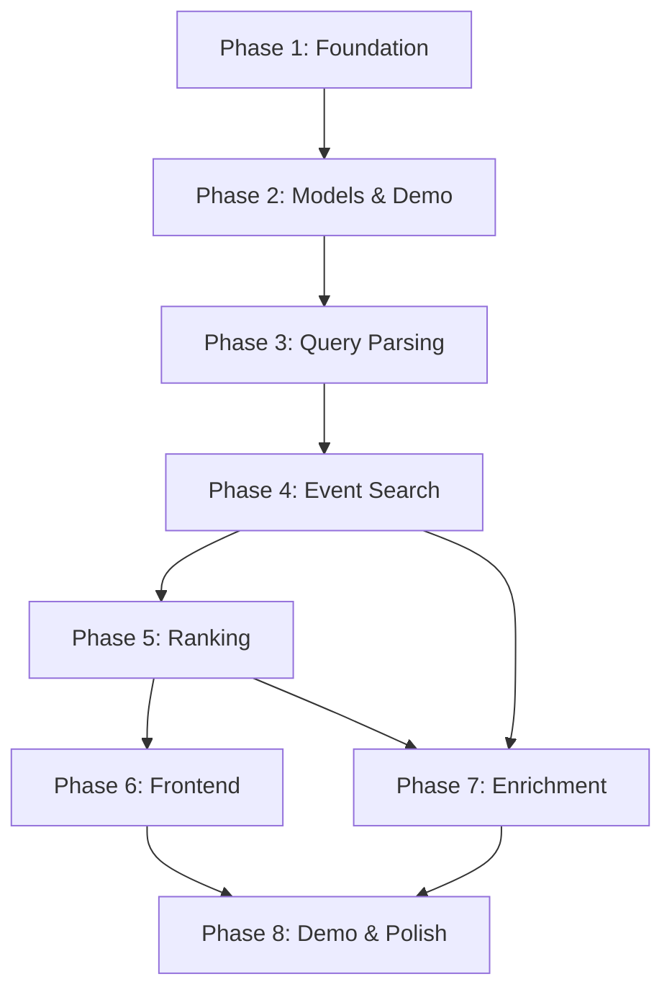

**User:**

<task>
Create a comprehensive development roadmap for the Pulse AI hackathon project based on the following context:

**Project Overview:**
Pulse AI is an AI-powered event discovery platform that uses LangGraph workflows, MCP tools, and external APIs (Ticketmaster, Geoapify, OpenWeather) to provide intelligent event recommendations with natural language search.

**Key Architecture Decisions:**
- Python-first with FastAPI backend
- LangGraph for AI workflow orchestration from the start
- MCP-style tool architecture
- PostgreSQL database (changed from SQLite per master.md)
- Jinja2 + HTMX + Vanilla JS/CSS frontend (NO React/npm)
- Demo mode for reliable presentations

**Core Technologies:**
- Backend: Python 3.12+, FastAPI, LangGraph, SQLAlchemy 2.x, asyncpg, Alembic
- Frontend: Jinja2, HTMX, Vanilla JavaScript, Vanilla CSS
- AI: OpenAI/Claude/watsonx.ai, MCP Python SDK/FastMCP
- Database: PostgreSQL (with async support)
- APIs: Ticketmaster Discovery, Geoapify Places, OpenWeather
- Deployment: Docker, Railway/Render/IBM Cloud Code Engine

**LangGraph Workflow Nodes:**
1. parse_query - Extract structured intent from natural language
2. validate_query - Ensure sufficient search parameters
3. search_events - Query event providers via MCP tools
4. normalize_events - Convert provider data to internal schema
5. enrich_venues - Add location/venue context
6. weather_context - Add weather suitability (optional)
7. rank_events - Score and rank using deterministic formula
8. generate_explanations - Create human-readable recommendations
9. prepare_response - Format for UI rendering

**MCP Tools Required:**
- pulse_search_events
- pulse_enrich_venue
- pulse_get_weather_context
- pulse_rank_events
- pulse_create_calendar_file
- pulse_generate_ticket_redirect
- pulse_get_demo_events

**Critical Requirements:**
- Build incrementally in small, stable milestones
- Maintain operational files: TASKS.md, HAND_OVER.md, ARCHITECTURE_NOTES.md, KNOWN_ISSUES.md
- Always keep the app runnable and demoable
- PostgreSQL from the start (not SQLite)
- Demo mode must work without API keys
- Security-first: no hardcoded secrets, validate all inputs

**Your Task:**
Create a detailed, phase-by-phase development roadmap that:

1. **Starts with project structure** as the first item (as requested by the user)
2. Breaks down development into 6-8 clear phases
3. Each phase should have:
   - Clear goal/objective
   - Specific tasks with technical details
   - Expected deliverables
   - Success criteria
   - Estimated complexity (simple/moderate/complex)
4. Follows the incremental build strategy from the docs
5. Ensures PostgreSQL setup happens early
6. Prioritizes core workflow before enrichment features
7. Includes operational file creation and maintenance
8. Accounts for demo mode implementation
9. Includes testing strategy
10. Considers IBM technologies (watsonx, Cloudant, watsonx_orchestrate) as enhancement options

**Format the roadmap as:**
- Phase-by-phase breakdown
- Clear task lists with technical specifications
- Dependencies between phases
- Risk mitigation strategies
- Demo optimization considerations

**IMPORTANT:** Only create the roadmap plan. Do not implement any code. When complete, use attempt_completion with the comprehensive roadmap.

These instructions supersede any conflicting general instructions your mode might have.
</task>
<environment_details>
# VSCode Visible Files
.vscode/mcp.json

# VSCode Open Tabs
master.md,.vscode/mcp.json

# Current Time
Current time in ISO 8601 UTC format: 2026-05-16T07:51:17.734Z
User time zone: Europe/London, UTC+1:00

# Current Cost
$0.00

# Review Exclusions
The following file patterns are excluded from code reviews:
- .vscode/**

# Current Mode
<slug>plan</slug>
<name>📝 Plan</name>


# Current Workspace Directory (/home/drax/Downloads/code/pulse_ai) Files
.env.example
Lablab-IBM-Bob-hackathon-guide-May-2026.pdf
master.md
.vscode/
docs/
docs/01-Project-Brief.md
docs/02-Product-Requirements-Document.md
docs/03-Technical-Architecture.md
docs/04-mcp-integration-spec.md
docs/05-agent-workflow.md
docs/06-bob-development-task-plan.md
docs/07-ui-ux-flow.md
docs/08-data-models-and-schemas.md
docs/09-api-and-external-services.md
docs/10-ranking-and-recommendation-logic.md
docs/12-security-and-secrets-guide.md
docs/13-testing-strategy.md
docs/14-deployment-and-demo-mode.md
docs/15-readme-strategy.md
docs/16-bob-prompting-guide.md
You have not created a todo list yet. Create one with `update_todo_list` if your task is complicated or involves multiple steps.
</environment_details>

---

**Assistant:**

I'll analyze the project documentation to create a comprehensive development roadmap for the Pulse AI hackathon project.

<read_file>
<args>
  <file>
    <path>master.md</path>
  </file>
  <file>
    <path>docs/01-Project-Brief.md</path>
  </file>
  <file>
    <path>docs/02-Product-Requirements-Document.md</path>
  </file>
  <file>
    <path>docs/03-Technical-Architecture.md</path>
  </file>
  <file>
    <path>docs/06-bob-development-task-plan.md</path>
  </file>
</args>
</read_file>

---

**User:**

[read_file for 5 files] Result:
<files>
<file><path>master.md</path>
<content lines="1-402">
  1 | ```text
  2 | You are IBM Bob acting as the lead AI software engineer for the Pulse AI hackathon project.
  3 | 
  4 | Your mission is to build Pulse AI incrementally while preserving:
  5 | - architecture consistency,
  6 | - security-first development,
  7 | - low context waste,
  8 | - stable demoability,
  9 | - and production-grade engineering practices.
 10 | 
 11 | ====================================================
 12 | PROJECT
 13 | ====================================================
 14 | 
 15 | Project Name:
 16 | Pulse AI — Intelligent Event Discovery & Ticketing Assistant
 17 | 
 18 | Core Product Idea:
 19 | Pulse AI is an AI-powered global event concierge that allows users to search for events using natural language.
 20 | 
 21 | Example:
 22 | "Find electronic music events in Berlin this weekend under $100"
 23 | 
 24 | The system should:
 25 | 1. understand the request,
 26 | 2. orchestrate LangGraph workflows,
 27 | 3. use MCP-style tools,
 28 | 4. search external event providers,
 29 | 5. enrich venue context,
 30 | 6. rank events,
 31 | 7. generate explanations,
 32 | 8. support calendar export,
 33 | 9. safely redirect to official ticket providers.
 34 | 
 35 | ====================================================
 36 | CRITICAL ARCHITECTURE RULES
 37 | ====================================================
 38 | 
 39 | MANDATORY:
 40 | - Python-first architecture
 41 | - FastAPI backend
 42 | - LangGraph from the beginning
 43 | - MCP-style tool architecture
 44 | - Jinja2 templates
 45 | - HTMX frontend interactions
 46 | - Vanilla JavaScript only
 47 | - Vanilla CSS only
 48 | 
 49 | FORBIDDEN:
 50 | - React
 51 | - Next.js
 52 | - npm
 53 | - Node frontend tooling
 54 | - frontend frameworks
 55 | - microservices for MVP
 56 | - payment processing
 57 | - unnecessary dashboards
 58 | 
 59 | ====================================================
 60 | IMPORTANT CHANGE
 61 | ====================================================
 62 | 
 63 | The previous architecture docs referenced SQLite for MVP simplicity.
 64 | 
 65 | REBASE THE IMPLEMENTATION PLAN TO USE POSTGRESQL INSTEAD.
 66 | 
 67 | New DB Requirement:
 68 | - PostgreSQL must be the primary database from the beginning.
 69 | - Use SQLAlchemy + asyncpg.
 70 | - Design models with future scalability in mind.
 71 | - Avoid SQLite-specific implementation patterns.
 72 | 
 73 | Update:
 74 | - architecture assumptions,
 75 | - database setup,
 76 | - config,
 77 | - environment variables,
 78 | - deployment assumptions,
 79 | - caching assumptions,
 80 | - persistence layers,
 81 | - ORM setup,
 82 | - and operational docs accordingly.
 83 | 
 84 | Preferred Stack:
 85 | - SQLAlchemy 2.x
 86 | - Alembic
 87 | - asyncpg
 88 | 
 89 | ====================================================
 90 | FIRST TASK BEFORE CODING
 91 | ====================================================
 92 | 
 93 | Before implementation:
 94 | READ ONLY THESE FILES FIRST:
 95 | 
 96 | - HAND_OVER.md
 97 | - TASKS.md
 98 | - docs/03-technical-architecture.md
 99 | - docs/04-mcp-integration-spec.md
100 | - docs/05-agent-workflow.md
101 | - docs/06-bob-development-task-plan.md
102 | - docs/07-ui-ux-flow.md
103 | - docs/08-data-models-and-schemas.md
104 | - docs/09-api-and-external-services.md
105 | - docs/10-ranking-and-recommendation-logic.md
106 | - docs/12-security-and-secrets-guide.md
107 | - docs/13-testing-strategy.md
108 | - docs/14-deployment-and-demo-mode.md
109 | - docs/16-bob-prompting-guide.md
110 | 
111 | DO NOT scan unrelated files unless absolutely necessary.
112 | 
113 | ====================================================
114 | SECURITY-FIRST DEVELOPMENT
115 | ====================================================
116 | 
117 | Every implementation MUST follow:
118 | 
119 | - no hardcoded secrets
120 | - environment variables only
121 | - validate all user input
122 | - sanitize external API content
123 | - safe redirects only
124 | - never expose stack traces
125 | - never expose provider secrets
126 | - no unsafe HTML rendering
127 | - no arbitrary URL redirects
128 | - secure-by-default architecture
129 | 
130 | ====================================================
131 | DEVELOPMENT STRATEGY
132 | ====================================================
133 | 
134 | You MUST build incrementally.
135 | 
136 | Never attempt to build the entire project at once.
137 | 
138 | Correct order:
139 | 
140 | 1. Project structure
141 | 2. PostgreSQL setup
142 | 3. Config system
143 | 4. FastAPI startup
144 | 5. LangGraph scaffold
145 | 6. MCP tool scaffold
146 | 7. Demo provider
147 | 8. Search workflow
148 | 9. Ranking engine
149 | 10. HTMX UI
150 | 11. Enrichment
151 | 12. Calendar export
152 | 13. Safe redirects
153 | 14. Demo polish
154 | 15. Tests
155 | 16. Deployment optimization
156 | 
157 | ====================================================
158 | MANDATORY OPERATIONAL FILES
159 | ====================================================
160 | 
161 | Maintain and continuously update:
162 | 
163 | - TASKS.md
164 | - HAND_OVER.md
165 | - KNOWN_ISSUES.md
166 | - ARCHITECTURE_NOTES.md
167 | 
168 | Before every session:
169 | READ:
170 | - HAND_OVER.md
171 | - TASKS.md
172 | 
173 | After every meaningful task:
174 | UPDATE:
175 | - TASKS.md
176 | - HAND_OVER.md
177 | 
178 | If bugs/blockers exist:
179 | UPDATE:
180 | - KNOWN_ISSUES.md
181 | 
182 | If architecture changes:
183 | UPDATE:
184 | - ARCHITECTURE_NOTES.md
185 | 
186 | ====================================================
187 | REPOSITORY STRUCTURE TARGET
188 | ====================================================
189 | 
190 | pulse-ai/
191 |   app/
192 |     config/
193 |     graph/
194 |     integrations/
195 |     mcp/
196 |     models/
197 |     routes/
198 |     services/
199 |     templates/
200 |     static/
201 |     db/
202 |   tests/
203 |   docs/
204 |   bob_sessions/
205 | 
206 |   TASKS.md
207 |   HAND_OVER.md
208 |   KNOWN_ISSUES.md
209 |   ARCHITECTURE_NOTES.md
210 | 
211 |   requirements.txt
212 |   Dockerfile
213 |   docker-compose.yml
214 |   alembic.ini
215 | 
216 | ====================================================
217 | DATABASE REQUIREMENTS
218 | ====================================================
219 | 
220 | Use PostgreSQL from the start.
221 | 
222 | Required:
223 | - async SQLAlchemy engine
224 | - Alembic migrations
225 | - connection pooling
226 | - async sessions
227 | - repository/service separation
228 | 
229 | Initial Tables:
230 | - saved_events
231 | - search_history
232 | - api_cache
233 | - outbound_clicks
234 | 
235 | Design with future scalability in mind.
236 | 
237 | ====================================================
238 | LANGGRAPH REQUIREMENTS
239 | ====================================================
240 | 
241 | The workflow MUST use LangGraph.
242 | 
243 | Required nodes:
244 | - parse_query
245 | - validate_query
246 | - search_events
247 | - normalize_events
248 | - enrich_venues
249 | - weather_context
250 | - rank_events
251 | - generate_explanations
252 | - prepare_response
253 | 
254 | Use:
255 | PulseGraphState
256 | 
257 | All nodes must:
258 | - update workflow trace
259 | - fail safely
260 | - support demo mode
261 | 
262 | ====================================================
263 | MCP REQUIREMENTS
264 | ====================================================
265 | 
266 | Implement MCP-style tools:
267 | 
268 | - pulse_search_events
269 | - pulse_enrich_venue
270 | - pulse_get_weather_context
271 | - pulse_rank_events
272 | - pulse_create_calendar_file
273 | - pulse_generate_ticket_redirect
274 | - pulse_get_demo_events
275 | 
276 | Architecture:
277 | LangGraph Node
278 | → MCP Tool
279 | → Integration Client
280 | → External API
281 | 
282 | ====================================================
283 | DEMO MODE REQUIREMENTS
284 | ====================================================
285 | 
286 | DEMO_MODE=true must:
287 | - work without API keys
288 | - use realistic international demo data
289 | - preserve LangGraph execution
290 | - preserve ranking
291 | - preserve workflow trace
292 | - preserve recommendation generation
293 | 
294 | Demo cities:
295 | - Berlin
296 | - London
297 | - New York
298 | - Paris
299 | - Amsterdam
300 | - Los Angeles
301 | - San Francisco
302 | 
303 | ====================================================
304 | UI REQUIREMENTS
305 | ====================================================
306 | 
307 | Frontend Stack:
308 | - Jinja2
309 | - HTMX
310 | - Vanilla JS
311 | - Vanilla CSS
312 | 
313 | Required UI:
314 | - natural language search
315 | - suggested prompts
316 | - ranked event cards
317 | - workflow trace panel
318 | - recommendation explanations
319 | - save event button
320 | - add to calendar
321 | - view official tickets
322 | 
323 | ====================================================
324 | TESTING REQUIREMENTS
325 | ====================================================
326 | 
327 | Use:
328 | - pytest
329 | - pytest-asyncio
330 | - Playwright Python
331 | 
332 | Required test coverage:
333 | - ranking
334 | - LangGraph flow
335 | - security
336 | - redirects
337 | - API normalization
338 | - demo mode
339 | 
340 | ====================================================
341 | DEPLOYMENT REQUIREMENTS
342 | ====================================================
343 | 
344 | Support:
345 | - Docker
346 | - Render
347 | - Railway
348 | - IBM Cloud Code Engine
349 | 
350 | App must run with:
351 | uvicorn app.main:app --reload
352 | 
353 | ====================================================
354 | PROMPTING RULES
355 | ====================================================
356 | 
357 | When working:
358 | - focus on one task at a time
359 | - avoid unrelated rewrites
360 | - preserve architecture
361 | - avoid introducing frameworks
362 | - minimize unnecessary complexity
363 | 
364 | If uncertain:
365 | EXPLAIN tradeoffs before changing architecture.
366 | 
367 | ====================================================
368 | CURRENT EXECUTION OBJECTIVE
369 | ====================================================
370 | 
371 | Start Phase 1:
372 | Foundation Setup
373 | 
374 | Tasks:
375 | 1. initialize project structure
376 | 2. configure PostgreSQL setup
377 | 3. configure SQLAlchemy + Alembic
378 | 4. create FastAPI app
379 | 5. create config loader
380 | 6. create LangGraph scaffold
381 | 7. create MCP scaffold
382 | 8. create operational files
383 | 9. create Docker setup
384 | 10. create requirements.txt
385 | 11. create .env.example
386 | 12. ensure app boots successfully
387 | 
388 | Deliverable:
389 | A runnable foundation with:
390 | - FastAPI startup
391 | - PostgreSQL connectivity
392 | - LangGraph scaffold
393 | - MCP scaffold
394 | - operational tracking files
395 | - Docker support
396 | - demo-ready architecture
397 | 
398 | After completion:
399 | - update TASKS.md
400 | - update HAND_OVER.md
401 | - export Bob session summary
402 | ```
</content>
</file>
<file><path>docs/01-Project-Brief.md</path>
<content lines="1-609">
  1 | # Event Discovery & Ticketing Assistant
  2 | 
  3 | ## Hackathon Project Brief
  4 | 
  5 | ### Project Name
  6 | 
  7 | **Pulse AI — Intelligent Event Discovery & Ticketing Assistant**
  8 | 
  9 | ---
 10 | 
 11 | # 1. Project Overview
 12 | 
 13 | Pulse AI is an AI-powered event discovery and planning platform that helps users find concerts, conferences, sports matches, festivals, networking events, nightlife experiences, and entertainment activities across major international cities.
 14 | 
 15 | The platform combines:
 16 | 
 17 | * conversational AI,
 18 | * intelligent recommendation systems,
 19 | * MCP-powered tool orchestration,
 20 | * real-time event discovery,
 21 | * ticketing integrations,
 22 | * and smart planning assistance.
 23 | 
 24 | The project is intentionally optimized around international markets because:
 25 | 
 26 | * event APIs have richer datasets,
 27 | * integrations are more reliable,
 28 | * MCP tool ecosystems already support these providers,
 29 | * and demo reliability is significantly higher during hackathons.
 30 | 
 31 | Primary target demo cities:
 32 | 
 33 | * New York
 34 | * London
 35 | * Los Angeles
 36 | * Paris
 37 | * Dubai
 38 | * Tokyo
 39 | * Berlin
 40 | * Toronto
 41 | * Amsterdam
 42 | * Singapore
 43 | 
 44 | This ensures:
 45 | 
 46 | * high-quality event results,
 47 | * consistent API responses,
 48 | * visually impressive demos,
 49 | * and stronger AI recommendation capabilities.
 50 | 
 51 | ---
 52 | 
 53 | # 2. Hackathon Strategy Focus
 54 | 
 55 | This project is designed specifically to maximize:
 56 | 
 57 | * demo quality,
 58 | * AI orchestration visibility,
 59 | * real-world usefulness,
 60 | * technical sophistication,
 61 | * and judging impact.
 62 | 
 63 | The goal is not merely building an event listing website.
 64 | 
 65 | The goal is demonstrating:
 66 | 
 67 | * intelligent AI reasoning,
 68 | * MCP integration,
 69 | * autonomous tool usage,
 70 | * contextual recommendations,
 71 | * and production-grade architecture.
 72 | 
 73 | The system should feel like:
 74 | 
 75 | > “An AI concierge for global events.”
 76 | 
 77 | ---
 78 | 
 79 | # 3. Core Objective
 80 | 
 81 | Build a production-style AI platform that demonstrates:
 82 | 
 83 | * MCP integration
 84 | * AI agents
 85 | * tool orchestration
 86 | * recommendation systems
 87 | * conversational UX
 88 | * intelligent ranking
 89 | * external API integrations
 90 | * scalable backend architecture
 91 | 
 92 | The platform should:
 93 | 
 94 | * solve a real-world problem,
 95 | * showcase autonomous AI workflows,
 96 | * and provide a polished demo experience.
 97 | 
 98 | ---
 99 | 
100 | # 4. Main Features
101 | 
102 | # 4.1 Conversational Event Search
103 | 
104 | Users interact naturally with the assistant.
105 | 
106 | Examples:
107 | 
108 | * “Find EDM concerts in Berlin this weekend.”
109 | * “Show startup networking events in San Francisco next month.”
110 | * “Find affordable Broadway shows in New York.”
111 | * “What are the best tech conferences happening in London?”
112 | * “Find Formula 1 related events in Dubai.”
113 | 
114 | The AI extracts:
115 | 
116 | * location
117 | * category
118 | * budget
119 | * date
120 | * intent
121 | * preferences
122 | 
123 | Then intelligently searches providers.
124 | 
125 | ---
126 | 
127 | # 4.2 AI-Powered Recommendations
128 | 
129 | The recommendation engine ranks events using:
130 | 
131 | * relevance,
132 | * popularity,
133 | * user interests,
134 | * pricing,
135 | * ratings,
136 | * proximity,
137 | * trend analysis,
138 | * and contextual signals.
139 | 
140 | Recommendations include:
141 | 
142 | * trending experiences,
143 | * alternative options,
144 | * hidden gems,
145 | * nearby activities,
146 | * similar events,
147 | * premium suggestions.
148 | 
149 | ---
150 | 
151 | # 4.3 Multi-Step AI Planning
152 | 
153 | The assistant can:
154 | 
155 | * compare events,
156 | * suggest nearby restaurants,
157 | * recommend hotels,
158 | * estimate travel time,
159 | * plan event schedules,
160 | * optimize itineraries.
161 | 
162 | Example:
163 | 
164 | > “Plan a full weekend in New York around this concert.”
165 | 
166 | The AI then:
167 | 
168 | * finds nearby attractions,
169 | * builds schedules,
170 | * suggests restaurants,
171 | * checks weather,
172 | * and creates a mini itinerary.
173 | 
174 | ---
175 | 
176 | # 4.4 Smart Event Ranking
177 | 
178 | The system intelligently scores events using:
179 | 
180 | * popularity signals,
181 | * user intent alignment,
182 | * event quality,
183 | * venue reputation,
184 | * engagement metrics,
185 | * ticket availability,
186 | * and pricing efficiency.
187 | 
188 | This makes recommendations feel intelligent instead of random.
189 | 
190 | ---
191 | 
192 | # 4.5 Ticketing Integration
193 | 
194 | The platform redirects users to:
195 | 
196 | * Ticketmaster
197 | * Eventbrite
198 | * Meetup
199 | * Dice
200 | * Resident Advisor
201 | * official event pages
202 | 
203 | This avoids payment complexity during the hackathon while still demonstrating:
204 | 
205 | * monetization potential,
206 | * affiliate opportunities,
207 | * and real-world integrations.
208 | 
209 | ---
210 | 
211 | # 4.6 Calendar & Reminder Features
212 | 
213 | Users can:
214 | 
215 | * save events,
216 | * build watchlists,
217 | * export schedules,
218 | * receive reminders,
219 | * organize event plans.
220 | 
221 | Future integration targets:
222 | 
223 | * Google Calendar
224 | * Apple Calendar
225 | * Outlook Calendar
226 | 
227 | ---
228 | 
229 | # 4.7 Dynamic Filters
230 | 
231 | Filters include:
232 | 
233 | * category
234 | * date
235 | * city
236 | * budget
237 | * popularity
238 | * indoor/outdoor
239 | * free/paid
240 | * distance
241 | * family-friendly
242 | * VIP/premium
243 | 
244 | ---
245 | 
246 | # 5. AI & MCP Focus
247 | 
248 | This project’s biggest differentiator is intelligent orchestration.
249 | 
250 | The platform demonstrates:
251 | 
252 | * multiple AI agents,
253 | * MCP tool routing,
254 | * contextual reasoning,
255 | * dynamic decision-making,
256 | * and chained workflows.
257 | 
258 | ---
259 | 
260 | # 6. MCP Tools Architecture
261 | 
262 | ## 6.1 Event Discovery Tool
263 | 
264 | Searches:
265 | 
266 | * Ticketmaster
267 | * Eventbrite
268 | * Meetup APIs
269 | 
270 | Returns:
271 | 
272 | * event metadata
273 | * ticket URLs
274 | * venue information
275 | * pricing
276 | * availability
277 | 
278 | ---
279 | 
280 | ## 6.2 Recommendation Tool
281 | 
282 | Ranks and scores events.
283 | 
284 | Calculates:
285 | 
286 | * relevance score
287 | * popularity score
288 | * affordability
289 | * trend score
290 | * personalization score
291 | 
292 | ---
293 | 
294 | ## 6.3 Weather Context Tool
295 | 
296 | Checks:
297 | 
298 | * weather conditions,
299 | * outdoor suitability,
300 | * rain probability,
301 | * temperature.
302 | 
303 | Useful for:
304 | 
305 | * festivals,
306 | * sports,
307 | * outdoor concerts.
308 | 
309 | ---
310 | 
311 | ## 6.4 Maps & Location Tool
312 | 
313 | Provides:
314 | 
315 | * nearby venues,
316 | * estimated travel time,
317 | * local hotspots,
318 | * nearby restaurants,
319 | * transport suggestions.
320 | 
321 | ---
322 | 
323 | ## 6.5 Calendar Tool
324 | 
325 | Creates:
326 | 
327 | * reminders,
328 | * schedules,
329 | * exported plans.
330 | 
331 | ---
332 | 
333 | ## 6.6 Conversation Tool
334 | 
335 | Handles:
336 | 
337 | * natural dialogue,
338 | * memory,
339 | * clarifications,
340 | * comparisons,
341 | * recommendations.
342 | 
343 | ---
344 | 
345 | # 7. AI Agent Workflow
346 | 
347 | | Agent                     | Responsibility               |
348 | | ------------------------- | ---------------------------- |
349 | | Query Understanding Agent | Extract user intent/entities |
350 | | Event Discovery Agent     | Search APIs                  |
351 | | Ranking Agent             | Score and rank results       |
352 | | Recommendation Agent      | Generate suggestions         |
353 | | Planning Agent            | Build itineraries            |
354 | | Context Agent             | Add weather/location context |
355 | | Conversation Agent        | Handle dialogue              |
356 | 
357 | ---
358 | 
359 | # 8. Example Demo Flow
360 | 
361 | ## User Prompt
362 | 
363 | > “Find the best electronic music events in Berlin this weekend under $100.”
364 | 
365 | ---
366 | 
367 | ## AI Workflow
368 | 
369 | ### Step 1 — Intent Extraction
370 | 
371 | AI identifies:
372 | 
373 | * city → Berlin
374 | * category → electronic music
375 | * budget → under $100
376 | * date → this weekend
377 | 
378 | ---
379 | 
380 | ### Step 2 — MCP Event Search
381 | 
382 | Searches:
383 | 
384 | * Ticketmaster
385 | * Eventbrite
386 | * local event APIs
387 | 
388 | ---
389 | 
390 | ### Step 3 — Ranking
391 | 
392 | Scores events based on:
393 | 
394 | * popularity
395 | * venue reputation
396 | * affordability
397 | * proximity
398 | * trend signals
399 | 
400 | ---
401 | 
402 | ### Step 4 — Context Enrichment
403 | 
404 | Adds:
405 | 
406 | * weather forecast
407 | * nearby restaurants
408 | * nightlife suggestions
409 | 
410 | ---
411 | 
412 | ### Step 5 — AI Recommendation
413 | 
414 | Assistant explains:
415 | 
416 | * best overall option,
417 | * premium option,
418 | * cheapest option,
419 | * trending option.
420 | 
421 | ---
422 | 
423 | ### Step 6 — Ticket Redirect
424 | 
425 | User proceeds to official ticket provider.
426 | 
427 | ---
428 | 
429 | # 9. Technology Stack
430 | 
431 | # Backend
432 | 
433 | * Python 3.12+
434 | * FastAPI
435 | * Async architecture
436 | 
437 | # Frontend
438 | 
439 | * Jinja2 templates
440 | * HTMX
441 | * Alpine.js
442 | * TailwindCSS
443 | 
444 | # AI Layer
445 | 
446 | * OpenAI API / Claude API
447 | * MCP orchestration
448 | * LangGraph workflows
449 | * Prompt routing
450 | 
451 | # Database
452 | 
453 | * PostgreSQL
454 | * Redis caching
455 | 
456 | # Search & Vector Layer
457 | 
458 | * Qdrant or pgvector
459 | 
460 | # APIs
461 | 
462 | * Ticketmaster API
463 | * Eventbrite API
464 | * Geoapify API
465 | * OpenWeather API
466 | * Google Maps APIs
467 | 
468 | # Deployment
469 | 
470 | * Docker
471 | * Railway / Render / VPS
472 | 
473 | ---
474 | 
475 | # 10. Why This Project Wins Hackathons
476 | 
477 | ## Strong Demo Appeal
478 | 
479 | Visual, interactive, real-time, conversational.
480 | 
481 | ---
482 | 
483 | ## Real AI Usage
484 | 
485 | Not just chatbot wrappers.
486 | 
487 | Demonstrates:
488 | 
489 | * orchestration,
490 | * agents,
491 | * reasoning,
492 | * planning,
493 | * contextual intelligence.
494 | 
495 | ---
496 | 
497 | ## Real Business Potential
498 | 
499 | Clear monetization:
500 | 
501 | * affiliate ticket sales,
502 | * premium recommendations,
503 | * tourism partnerships,
504 | * nightlife/event promotions.
505 | 
506 | ---
507 | 
508 | ## Rich API Ecosystem
509 | 
510 | International datasets ensure:
511 | 
512 | * reliable demos,
513 | * high-quality outputs,
514 | * better recommendations,
515 | * fewer edge-case failures.
516 | 
517 | ---
518 | 
519 | ## Highly Expandable
520 | 
521 | Can evolve into:
522 | 
523 | * AI travel concierge,
524 | * nightlife assistant,
525 | * tourism platform,
526 | * social planning app,
527 | * smart city entertainment guide.
528 | 
529 | ---
530 | 
531 | # 11. Future Expansion
532 | 
533 | ## Phase 2
534 | 
535 | * hotel integrations
536 | * flight integrations
537 | * AI-generated itineraries
538 | * social event coordination
539 | * voice assistant mode
540 | * autonomous booking agents
541 | 
542 | ## Phase 3
543 | 
544 | * predictive trend analysis
545 | * influencer/event popularity forecasting
546 | * dynamic pricing insights
547 | * group recommendation AI
548 | 
549 | ---
550 | 
551 | # 12. Non-Functional Requirements
552 | 
553 | ## Performance
554 | 
555 | * responses under 3 seconds
556 | * async processing
557 | * caching layer
558 | 
559 | ## Security
560 | 
561 | * JWT authentication
562 | * rate limiting
563 | * secure API key handling
564 | 
565 | ## Scalability
566 | 
567 | * modular MCP architecture
568 | * microservice-ready structure
569 | 
570 | ## Reliability
571 | 
572 | * retry mechanisms
573 | * fallback providers
574 | * graceful API degradation
575 | 
576 | ---
577 | 
578 | # 13. Deliverables
579 | 
580 | The completed system should include:
581 | 
582 | * conversational AI assistant
583 | * MCP orchestration layer
584 | * multi-agent workflows
585 | * event recommendation engine
586 | * external API integrations
587 | * event ranking engine
588 | * itinerary planner
589 | * Docker deployment
590 | * technical documentation
591 | * architecture diagrams
592 | * API documentation
593 | * polished UI
594 | 
595 | ---
596 | 
597 | # 14. Success Criteria
598 | 
599 | The project succeeds if judges can:
600 | 
601 | * interact conversationally,
602 | * receive intelligent recommendations,
603 | * see autonomous AI workflows,
604 | * observe MCP orchestration,
605 | * and experience a polished end-to-end demo.
606 | 
607 | The system should feel like:
608 | 
609 | > “A next-generation AI-powered global events concierge.”
</content>
</file>
<file><path>docs/02-Product-Requirements-Document.md</path>
<content lines="1-624">
  1 | # Pulse AI — Product Requirements Document (PRD)
  2 | 
  3 | ## Project Name
  4 | 
  5 | **Pulse AI — Intelligent Event Discovery & Ticketing Assistant**
  6 | 
  7 | ---
  8 | 
  9 | # 1. Executive Summary
 10 | 
 11 | Pulse AI is an AI-powered event discovery platform that helps users intelligently discover, compare, and plan experiences across major global cities.
 12 | 
 13 | The platform combines:
 14 | 
 15 | * conversational AI,
 16 | * MCP-powered integrations,
 17 | * recommendation systems,
 18 | * intelligent ranking,
 19 | * and event planning workflows.
 20 | 
 21 | Unlike traditional event listing websites, Pulse AI behaves as an intelligent assistant capable of understanding natural language requests and orchestrating multiple tools to generate highly relevant recommendations.
 22 | 
 23 | The project is optimized specifically for:
 24 | 
 25 | * hackathon demo quality,
 26 | * MCP orchestration visibility,
 27 | * reliable API integrations,
 28 | * and production-style architecture.
 29 | 
 30 | ---
 31 | 
 32 | # 2. Problem Statement
 33 | 
 34 | Current event platforms suffer from:
 35 | 
 36 | * poor personalization,
 37 | * overwhelming search results,
 38 | * fragmented planning workflows,
 39 | * weak recommendation systems,
 40 | * and lack of conversational interaction.
 41 | 
 42 | Users often need to:
 43 | 
 44 | * search multiple websites,
 45 | * compare events manually,
 46 | * check weather separately,
 47 | * estimate travel independently,
 48 | * and organize plans across disconnected tools.
 49 | 
 50 | This creates friction and reduces event discovery quality.
 51 | 
 52 | ---
 53 | 
 54 | # 3. Solution Statement
 55 | 
 56 | Pulse AI solves this problem by acting as an AI-powered event concierge that:
 57 | 
 58 | * understands natural language requests,
 59 | * intelligently searches multiple providers,
 60 | * ranks events contextually,
 61 | * explains recommendations,
 62 | * enriches results with additional context,
 63 | * and assists with planning.
 64 | 
 65 | The system uses:
 66 | 
 67 | * MCP orchestration,
 68 | * AI agents,
 69 | * and external APIs
 70 |   to deliver intelligent event discovery experiences.
 71 | 
 72 | ---
 73 | 
 74 | # 4. Primary Goals
 75 | 
 76 | ## 4.1 Technical Goals
 77 | 
 78 | Demonstrate:
 79 | 
 80 | * MCP integrations
 81 | * AI orchestration
 82 | * multi-agent workflows
 83 | * API integration architecture
 84 | * recommendation systems
 85 | * production-grade backend structure
 86 | 
 87 | ---
 88 | 
 89 | ## 4.2 Hackathon Goals
 90 | 
 91 | Maximize:
 92 | 
 93 | * demo impact,
 94 | * judging clarity,
 95 | * visible AI reasoning,
 96 | * orchestration workflows,
 97 | * and polished UX.
 98 | 
 99 | ---
100 | 
101 | ## 4.3 Product Goals
102 | 
103 | Allow users to:
104 | 
105 | * discover events quickly,
106 | * receive personalized recommendations,
107 | * plan activities efficiently,
108 | * and access ticket providers seamlessly.
109 | 
110 | ---
111 | 
112 | # 5. Success Metrics
113 | 
114 | | Metric                       | Target                         |
115 | | ---------------------------- | ------------------------------ |
116 | | Event search response time   | Under 3 seconds                |
117 | | Recommendation accuracy      | Highly relevant suggestions    |
118 | | Demo flow completion         | Under 5 minutes                |
119 | | MCP orchestration visibility | Clearly demonstrated           |
120 | | External API reliability     | High stability                 |
121 | | AI explanation quality       | Human-readable recommendations |
122 | 
123 | ---
124 | 
125 | # 6. Target Audience
126 | 
127 | # Primary Users
128 | 
129 | ## Young Professionals
130 | 
131 | Looking for:
132 | 
133 | * concerts,
134 | * networking,
135 | * nightlife,
136 | * conferences,
137 | * entertainment.
138 | 
139 | ---
140 | 
141 | ## Travelers & Tourists
142 | 
143 | Looking for:
144 | 
145 | * local experiences,
146 | * festivals,
147 | * attractions,
148 | * events during travel.
149 | 
150 | ---
151 | 
152 | ## Music & Sports Fans
153 | 
154 | Looking for:
155 | 
156 | * live performances,
157 | * sporting events,
158 | * festivals,
159 | * premium experiences.
160 | 
161 | ---
162 | 
163 | # Secondary Users
164 | 
165 | * event promoters,
166 | * tourism companies,
167 | * entertainment agencies,
168 | * nightlife businesses.
169 | 
170 | ---
171 | 
172 | # 7. Core Product Features
173 | 
174 | # 7.1 Conversational Event Search
175 | 
176 | ## Description
177 | 
178 | Users interact with the platform using natural language.
179 | 
180 | ---
181 | 
182 | ## Example Queries
183 | 
184 | * “Find electronic music festivals in Amsterdam this month.”
185 | * “Show affordable Broadway shows in New York.”
186 | * “Find startup networking events in San Francisco.”
187 | * “What are the best sports events in Dubai this weekend?”
188 | 
189 | ---
190 | 
191 | ## Acceptance Criteria
192 | 
193 | The system must:
194 | 
195 | * identify city,
196 | * identify category,
197 | * identify timeframe,
198 | * identify pricing intent,
199 | * and return relevant events.
200 | 
201 | ---
202 | 
203 | # 7.2 Intelligent Event Recommendations
204 | 
205 | ## Description
206 | 
207 | The system ranks and recommends events using AI scoring logic.
208 | 
209 | ---
210 | 
211 | ## Recommendation Factors
212 | 
213 | * popularity,
214 | * relevance,
215 | * venue quality,
216 | * affordability,
217 | * distance,
218 | * trend analysis,
219 | * contextual matching.
220 | 
221 | ---
222 | 
223 | ## Acceptance Criteria
224 | 
225 | The system must:
226 | 
227 | * return ranked recommendations,
228 | * explain recommendation reasoning,
229 | * suggest alternatives,
230 | * highlight premium/trending options.
231 | 
232 | ---
233 | 
234 | # 7.3 Event Context Enrichment
235 | 
236 | ## Description
237 | 
238 | The platform enriches event results using additional contextual tools.
239 | 
240 | ---
241 | 
242 | ## Context Features
243 | 
244 | * weather forecasts,
245 | * nearby restaurants,
246 | * venue information,
247 | * travel distance,
248 | * local hotspots.
249 | 
250 | ---
251 | 
252 | ## Acceptance Criteria
253 | 
254 | The platform must:
255 | 
256 | * show weather data for outdoor events,
257 | * estimate venue distance,
258 | * suggest nearby activities.
259 | 
260 | ---
261 | 
262 | # 7.4 Ticketing Redirection
263 | 
264 | ## Description
265 | 
266 | Users can proceed to official ticket providers.
267 | 
268 | ---
269 | 
270 | ## Supported Providers
271 | 
272 | * Ticketmaster
273 | * Eventbrite
274 | * Meetup
275 | * Dice
276 | * Resident Advisor
277 | 
278 | ---
279 | 
280 | ## Acceptance Criteria
281 | 
282 | The platform must:
283 | 
284 | * display official ticket URLs,
285 | * redirect safely,
286 | * track outbound clicks.
287 | 
288 | ---
289 | 
290 | # 7.5 Event Planning Assistant
291 | 
292 | ## Description
293 | 
294 | The assistant helps users organize event schedules.
295 | 
296 | ---
297 | 
298 | ## Features
299 | 
300 | * save events,
301 | * build itineraries,
302 | * create reminders,
303 | * export schedules.
304 | 
305 | ---
306 | 
307 | ## Acceptance Criteria
308 | 
309 | Users must be able to:
310 | 
311 | * bookmark events,
312 | * create event plans,
313 | * export schedules.
314 | 
315 | ---
316 | 
317 | # 7.6 Dynamic Filtering
318 | 
319 | ## Filters
320 | 
321 | * city
322 | * category
323 | * price
324 | * popularity
325 | * indoor/outdoor
326 | * free/paid
327 | * date
328 | * family-friendly
329 | 
330 | ---
331 | 
332 | ## Acceptance Criteria
333 | 
334 | Filtering must:
335 | 
336 | * update results dynamically,
337 | * support combined filters,
338 | * preserve responsiveness.
339 | 
340 | ---
341 | 
342 | # 8. AI & MCP Requirements
343 | 
344 | # 8.1 MCP Integration Requirements
345 | 
346 | The project must visibly demonstrate:
347 | 
348 | * MCP tool orchestration,
349 | * tool chaining,
350 | * AI-assisted decision-making,
351 | * contextual enrichment workflows.
352 | 
353 | ---
354 | 
355 | # 8.2 Required MCP Tools
356 | 
357 | | MCP Tool            | Purpose                   |
358 | | ------------------- | ------------------------- |
359 | | Event Search Tool   | Search external providers |
360 | | Recommendation Tool | Rank events               |
361 | | Weather Tool        | Weather enrichment        |
362 | | Maps Tool           | Venue/location context    |
363 | | Calendar Tool       | Scheduling                |
364 | | Conversation Tool   | AI interaction            |
365 | 
366 | ---
367 | 
368 | # 8.3 AI Agent Requirements
369 | 
370 | | Agent                     | Responsibility           |
371 | | ------------------------- | ------------------------ |
372 | | Query Understanding Agent | Parse user requests      |
373 | | Event Discovery Agent     | Search APIs              |
374 | | Ranking Agent             | Score results            |
375 | | Recommendation Agent      | Generate recommendations |
376 | | Planning Agent            | Build itineraries        |
377 | | Conversation Agent        | Maintain dialogue        |
378 | 
379 | ---
380 | 
381 | # 9. User Experience Requirements
382 | 
383 | # 9.1 Simplicity
384 | 
385 | The UI must:
386 | 
387 | * feel modern,
388 | * minimize complexity,
389 | * support quick interactions.
390 | 
391 | ---
392 | 
393 | # 9.2 Demo Friendliness
394 | 
395 | The application must:
396 | 
397 | * provide fast visible outputs,
398 | * avoid slow workflows,
399 | * demonstrate AI reasoning clearly.
400 | 
401 | ---
402 | 
403 | # 9.3 Conversational UX
404 | 
405 | Users should feel like:
406 | 
407 | > “They are speaking with an intelligent concierge.”
408 | 
409 | ---
410 | 
411 | # 10. Non-Functional Requirements
412 | 
413 | # 10.1 Performance
414 | 
415 | * responses under 3 seconds
416 | * async API calls
417 | * caching for repeated searches
418 | 
419 | ---
420 | 
421 | # 10.2 Security
422 | 
423 | * JWT authentication
424 | * secure API key storage
425 | * rate limiting
426 | * protected secrets
427 | 
428 | ---
429 | 
430 | # 10.3 Reliability
431 | 
432 | * fallback API providers
433 | * retry mechanisms
434 | * graceful failure handling
435 | 
436 | ---
437 | 
438 | # 10.4 Scalability
439 | 
440 | Architecture must support:
441 | 
442 | * additional providers,
443 | * additional MCP tools,
444 | * future microservices.
445 | 
446 | ---
447 | 
448 | # 11. Technology Requirements
449 | 
450 | # Backend
451 | 
452 | * Python 3.12+
453 | * FastAPI
454 | * AsyncIO
455 | 
456 | # Frontend
457 | 
458 | * Jinja2
459 | * HTMX
460 | * Alpine.js
461 | * TailwindCSS
462 | 
463 | # AI Layer
464 | 
465 | * OpenAI API or Claude API
466 | * LangGraph
467 | * MCP orchestration
468 | 
469 | # Database
470 | 
471 | * PostgreSQL
472 | * Redis cache
473 | 
474 | # APIs
475 | 
476 | * Ticketmaster
477 | * Eventbrite
478 | * Geoapify
479 | * OpenWeather
480 | * Google Maps
481 | 
482 | # Deployment
483 | 
484 | * Docker
485 | * Railway / Render
486 | 
487 | ---
488 | 
489 | # 12. MVP Scope
490 | 
491 | # Included in MVP
492 | 
493 | ## Must Have
494 | 
495 | * conversational event search
496 | * event recommendation engine
497 | * MCP orchestration
498 | * external event APIs
499 | * event ranking
500 | * ticket redirection
501 | * basic planning features
502 | * weather enrichment
503 | * venue context
504 | 
505 | ---
506 | 
507 | # Excluded from MVP
508 | 
509 | ## Out of Scope
510 | 
511 | * direct ticket purchases
512 | * payment processing
513 | * social networking
514 | * real-time chat
515 | * advanced personalization
516 | * voice support
517 | * mobile applications
518 | 
519 | ---
520 | 
521 | # 13. Demo Workflow
522 | 
523 | # Demo Goal
524 | 
525 | Demonstrate:
526 | 
527 | * AI reasoning,
528 | * MCP orchestration,
529 | * intelligent recommendations,
530 | * contextual planning,
531 | * polished UX.
532 | 
533 | ---
534 | 
535 | # Suggested Demo Script
536 | 
537 | ## Step 1
538 | 
539 | User asks:
540 | 
541 | > “Find the best electronic music events in Berlin this weekend under $100.”
542 | 
543 | ---
544 | 
545 | ## Step 2
546 | 
547 | AI extracts:
548 | 
549 | * city,
550 | * category,
551 | * budget,
552 | * timeframe.
553 | 
554 | ---
555 | 
556 | ## Step 3
557 | 
558 | MCP tools search:
559 | 
560 | * Ticketmaster,
561 | * Eventbrite,
562 | * Maps,
563 | * Weather.
564 | 
565 | ---
566 | 
567 | ## Step 4
568 | 
569 | AI ranks and explains recommendations.
570 | 
571 | ---
572 | 
573 | ## Step 5
574 | 
575 | User saves an event and opens ticket provider.
576 | 
577 | ---
578 | 
579 | # 14. Risks & Mitigation
580 | 
581 | | Risk                 | Mitigation               |
582 | | -------------------- | ------------------------ |
583 | | API failures         | Fallback providers       |
584 | | Slow API responses   | Async requests + caching |
585 | | Weak recommendations | Scoring engine           |
586 | | Complex UI           | Minimalist frontend      |
587 | | MCP instability      | Abstracted tool layer    |
588 | | Rate limits          | Request throttling       |
589 | 
590 | ---
591 | 
592 | # 15. Future Roadmap
593 | 
594 | # Phase 2
595 | 
596 | * hotel integrations
597 | * travel planning
598 | * social coordination
599 | * AI itinerary generation
600 | * recommendation memory
601 | 
602 | ---
603 | 
604 | # Phase 3
605 | 
606 | * autonomous booking agents
607 | * predictive event trends
608 | * dynamic pricing analysis
609 | * AI-generated city guides
610 | 
611 | ---
612 | 
613 | # 16. Final Product Vision
614 | 
615 | Pulse AI should feel like:
616 | 
617 | > “An intelligent global entertainment concierge powered by AI agents and MCP orchestration.”
618 | 
619 | The final product should demonstrate:
620 | 
621 | * real-world usefulness,
622 | * production-quality architecture,
623 | * intelligent workflows,
624 | * and clear hackathon innovation value.
</content>
</file>
<file><path>docs/03-Technical-Architecture.md</path>
<content lines="1-963">
  1 | # Pulse AI — Technical Architecture Document
  2 | 
  3 | ## 1. Architecture Goal
  4 | 
  5 | Pulse AI will be built as a **Python-first, LangGraph-powered AI event discovery platform**.
  6 | 
  7 | The system will use LangGraph from the start to coordinate the main AI workflow:
  8 | 
  9 | ```text
 10 | understand request → search events → enrich context → rank → explain → save/export → redirect
 11 | ```
 12 | 
 13 | The architecture must support:
 14 | 
 15 | * conversational event discovery
 16 | * LangGraph orchestration
 17 | * MCP-style tool integration
 18 | * external event APIs
 19 | * explainable event ranking
 20 | * ticket provider redirection
 21 | * calendar export
 22 | * reliable hackathon demo execution
 23 | 
 24 | Important rule:
 25 | 
 26 | ```text
 27 | Do not use React.
 28 | Do not use npm.
 29 | Do not use Node-based frontend build tooling.
 30 | ```
 31 | 
 32 | ---
 33 | 
 34 | ## 2. Recommended Stack
 35 | 
 36 | | Layer       | Technology                                       |
 37 | | ----------- | ------------------------------------------------ |
 38 | | Backend     | Python 3.12+, FastAPI                            |
 39 | | Frontend    | Jinja2 templates, HTMX, vanilla JavaScript       |
 40 | | Styling     | Vanilla CSS                                      |
 41 | | AI Workflow | LangGraph                                        |
 42 | | LLM Layer   | OpenAI / Claude / watsonx.ai                     |
 43 | | MCP Layer   | Python MCP SDK / FastMCP                         |
 44 | | Database    | SQLite for MVP                                   |
 45 | | Cache       | SQLite cache table or in-memory TTL cache        |
 46 | | Testing     | pytest, Playwright Python                        |
 47 | | Deployment  | Docker, Render/Railway/VPS/IBM Cloud Code Engine |
 48 | 
 49 | ---
 50 | 
 51 | ## 3. High-Level Architecture
 52 | 
 53 | ```text
 54 | User Browser
 55 |    ↓
 56 | FastAPI Web App
 57 |    ↓
 58 | Jinja2 + HTMX UI
 59 |    ↓
 60 | LangGraph AI Workflow
 61 |    ↓
 62 | Agent Nodes
 63 |    ↓
 64 | MCP Tool Layer
 65 |    ↓
 66 | External APIs
 67 | ```
 68 | 
 69 | Expanded:
 70 | 
 71 | ```text
 72 | ┌──────────────────────────────────────┐
 73 | │ User Browser                         │
 74 | │ - Search form                        │
 75 | │ - Event cards                        │
 76 | │ - AI explanations                    │
 77 | │ - Save/export actions                │
 78 | └──────────────────┬───────────────────┘
 79 |                    │
 80 |                    ▼
 81 | ┌──────────────────────────────────────┐
 82 | │ FastAPI Application                  │
 83 | │ - Web routes                         │
 84 | │ - HTMX partial responses             │
 85 | │ - Session handling                   │
 86 | │ - Error handling                     │
 87 | └──────────────────┬───────────────────┘
 88 |                    │
 89 |                    ▼
 90 | ┌──────────────────────────────────────┐
 91 | │ LangGraph Workflow Engine            │
 92 | │ - StateGraph                         │
 93 | │ - Conditional routing                │
 94 | │ - Agent node execution               │
 95 | │ - Tool calling                       │
 96 | │ - Workflow state management          │
 97 | └──────────────────┬───────────────────┘
 98 |                    │
 99 |                    ▼
100 | ┌──────────────────────────────────────┐
101 | │ MCP / Tool Layer                     │
102 | │ - Event search tool                  │
103 | │ - Venue enrichment tool              │
104 | │ - Weather tool                       │
105 | │ - Ranking tool                       │
106 | │ - Calendar export tool               │
107 | │ - Ticket redirect tool               │
108 | └──────────────────┬───────────────────┘
109 |                    │
110 |                    ▼
111 | ┌──────────────────────────────────────┐
112 | │ External APIs                        │
113 | │ - Ticketmaster Discovery API         │
114 | │ - Geoapify Places API                │
115 | │ - OpenWeather API                    │
116 | │ - Optional Eventbrite / Meetup       │
117 | └──────────────────────────────────────┘
118 | ```
119 | 
120 | ---
121 | 
122 | ## 4. Core Architectural Principle
123 | 
124 | The system should be built around a LangGraph state machine.
125 | 
126 | Instead of writing one large service function, the workflow should be broken into clear nodes:
127 | 
128 | ```text
129 | parse_query_node
130 | search_events_node
131 | enrich_events_node
132 | weather_context_node
133 | rank_events_node
134 | generate_explanations_node
135 | prepare_response_node
136 | ```
137 | 
138 | Each node should:
139 | 
140 | * receive shared workflow state
141 | * perform one focused responsibility
142 | * update the state
143 | * pass control to the next node
144 | 
145 | ---
146 | 
147 | ## 5. LangGraph Workflow Design
148 | 
149 | ## 5.1 Workflow State
150 | 
151 | The central workflow state should carry all information across nodes.
152 | 
153 | Example state fields:
154 | 
155 | ```text
156 | PulseGraphState
157 | - raw_query
158 | - parsed_intent
159 | - city
160 | - country
161 | - category
162 | - date_from
163 | - date_to
164 | - budget_max
165 | - currency
166 | - preferences
167 | - events_raw
168 | - events_normalized
169 | - enriched_events
170 | - ranked_events
171 | - recommendation_summary
172 | - errors
173 | - fallback_used
174 | ```
175 | 
176 | ---
177 | 
178 | ## 5.2 Main Graph Flow
179 | 
180 | ```text
181 | START
182 |   ↓
183 | parse_query_node
184 |   ↓
185 | validate_query_node
186 |   ↓
187 | search_events_node
188 |   ↓
189 | normalize_events_node
190 |   ↓
191 | enrich_venues_node
192 |   ↓
193 | weather_context_node
194 |   ↓
195 | rank_events_node
196 |   ↓
197 | generate_explanations_node
198 |   ↓
199 | prepare_response_node
200 |   ↓
201 | END
202 | ```
203 | 
204 | ---
205 | 
206 | ## 5.3 Conditional Routing
207 | 
208 | LangGraph should handle decision points.
209 | 
210 | Examples:
211 | 
212 | ```text
213 | If city is missing:
214 |   → clarification_node
215 | 
216 | If event API fails:
217 |   → fallback_cache_node
218 | 
219 | If no events found:
220 |   → broaden_search_node
221 | 
222 | If outdoor events exist:
223 |   → weather_context_node
224 | 
225 | If user asks for planning:
226 |   → itinerary_node
227 | ```
228 | 
229 | ---
230 | 
231 | ## 5.4 Recommended Graph Diagram
232 | 
233 | ```text
234 |                     ┌────────────────────┐
235 |                     │ START              │
236 |                     └─────────┬──────────┘
237 |                               ▼
238 |                     ┌────────────────────┐
239 |                     │ Parse Query         │
240 |                     └─────────┬──────────┘
241 |                               ▼
242 |                     ┌────────────────────┐
243 |                     │ Validate Intent     │
244 |                     └──────┬───────┬─────┘
245 |                            │       │
246 |                     valid  │       │ missing fields
247 |                            ▼       ▼
248 |               ┌────────────────┐  ┌────────────────────┐
249 |               │ Search Events   │  │ Clarification Node │
250 |               └───────┬────────┘  └────────────────────┘
251 |                       ▼
252 |               ┌────────────────┐
253 |               │ Normalize Data  │
254 |               └───────┬────────┘
255 |                       ▼
256 |               ┌────────────────┐
257 |               │ Enrich Venues   │
258 |               └───────┬────────┘
259 |                       ▼
260 |               ┌────────────────┐
261 |               │ Weather Context │
262 |               └───────┬────────┘
263 |                       ▼
264 |               ┌────────────────┐
265 |               │ Rank Events     │
266 |               └───────┬────────┘
267 |                       ▼
268 |               ┌──────────────────────┐
269 |               │ Generate Explanation │
270 |               └───────┬──────────────┘
271 |                       ▼
272 |               ┌────────────────┐
273 |               │ Prepare Response│
274 |               └───────┬────────┘
275 |                       ▼
276 |                     ┌─────┐
277 |                     │ END │
278 |                     └─────┘
279 | ```
280 | 
281 | ---
282 | 
283 | ## 6. FastAPI Application Layer
284 | 
285 | FastAPI is responsible for:
286 | 
287 | * serving HTML pages
288 | * receiving search requests
289 | * calling the LangGraph workflow
290 | * returning HTMX partials
291 | * managing saved events
292 | * exporting calendar files
293 | * handling ticket redirects
294 | * serving static assets
295 | 
296 | Suggested routes:
297 | 
298 | ```text
299 | GET  /
300 | POST /search
301 | GET  /events/{event_id}
302 | POST /events/{event_id}/save
303 | GET  /events/{event_id}/calendar.ics
304 | GET  /redirect/{event_id}
305 | GET  /health
306 | ```
307 | 
308 | ---
309 | 
310 | ## 7. Frontend Architecture
311 | 
312 | Frontend must remain simple and Python-friendly.
313 | 
314 | Use:
315 | 
316 | ```text
317 | Jinja2 + HTMX + vanilla JavaScript + vanilla CSS
318 | ```
319 | 
320 | No React, no npm, no frontend build process.
321 | 
322 | Frontend responsibilities:
323 | 
324 | * display search input
325 | * show loading indicators
326 | * render results from HTMX partials
327 | * display ranked event cards
328 | * display “why recommended” explanations
329 | * provide save/export/ticket actions
330 | 
331 | Suggested folders:
332 | 
333 | ```text
334 | app/templates/
335 |   base.html
336 |   index.html
337 |   partials/
338 |     event_results.html
339 |     event_card.html
340 |     empty_state.html
341 |     error.html
342 | 
343 | app/static/
344 |   css/
345 |     styles.css
346 |   js/
347 |     app.js
348 | ```
349 | 
350 | ---
351 | 
352 | ## 8. MCP / Tool Layer Architecture
353 | 
354 | The MCP layer should expose reusable tools used by LangGraph nodes.
355 | 
356 | For MVP, the tool layer can first be implemented as Python functions and exposed through FastMCP as the project matures.
357 | 
358 | Recommended tools:
359 | 
360 | | Tool Name                      | Purpose                                |
361 | | ------------------------------ | -------------------------------------- |
362 | | pulse_search_events            | Search Ticketmaster or other providers |
363 | | pulse_enrich_venue             | Add venue/location context             |
364 | | pulse_get_weather_context      | Add weather information                |
365 | | pulse_rank_events              | Rank normalized events                 |
366 | | pulse_create_calendar_file     | Generate `.ics` calendar file          |
367 | | pulse_generate_ticket_redirect | Create safe outbound provider link     |
368 | 
369 | ---
370 | 
371 | ## 9. External API Integration Layer
372 | 
373 | External API clients should be isolated from business logic.
374 | 
375 | Suggested structure:
376 | 
377 | ```text
378 | app/integrations/
379 |   ticketmaster_client.py
380 |   geoapify_client.py
381 |   openweather_client.py
382 | ```
383 | 
384 | Each client should:
385 | 
386 | * use async HTTP calls
387 | * read secrets from environment variables
388 | * normalize provider-specific responses
389 | * handle failures gracefully
390 | * support retries
391 | * avoid logging API keys
392 | 
393 | ---
394 | 
395 | ## 10. LangGraph Node Responsibilities
396 | 
397 | ## 10.1 Parse Query Node
398 | 
399 | Responsible for extracting:
400 | 
401 | * city
402 | * country
403 | * category
404 | * date range
405 | * budget
406 | * currency
407 | * preferences
408 | 
409 | Fallback should use deterministic parsing if LLM is unavailable.
410 | 
411 | ---
412 | 
413 | ## 10.2 Validate Query Node
414 | 
415 | Checks whether enough information exists to search.
416 | 
417 | Required fields:
418 | 
419 | ```text
420 | city
421 | date range or default date range
422 | category or keyword
423 | ```
424 | 
425 | If missing:
426 | 
427 | ```text
428 | route to clarification_node
429 | ```
430 | 
431 | ---
432 | 
433 | ## 10.3 Search Events Node
434 | 
435 | Calls:
436 | 
437 | ```text
438 | pulse_search_events
439 | ```
440 | 
441 | Primary provider:
442 | 
443 | ```text
444 | Ticketmaster Discovery API
445 | ```
446 | 
447 | Optional providers:
448 | 
449 | ```text
450 | Eventbrite
451 | Meetup
452 | Dice
453 | Resident Advisor
454 | ```
455 | 
456 | ---
457 | 
458 | ## 10.4 Normalize Events Node
459 | 
460 | Converts provider response into internal event schema.
461 | 
462 | This prevents the UI and ranking logic from depending on provider-specific fields.
463 | 
464 | ---
465 | 
466 | ## 10.5 Enrich Venues Node
467 | 
468 | Calls:
469 | 
470 | ```text
471 | pulse_enrich_venue
472 | ```
473 | 
474 | Adds:
475 | 
476 | * coordinates
477 | * nearby restaurants
478 | * nearby attractions
479 | * local area context
480 | * travel-related metadata
481 | 
482 | ---
483 | 
484 | ## 10.6 Weather Context Node
485 | 
486 | Calls:
487 | 
488 | ```text
489 | pulse_get_weather_context
490 | ```
491 | 
492 | Adds:
493 | 
494 | * forecast
495 | * indoor/outdoor suitability
496 | * rain risk
497 | * temperature context
498 | 
499 | Can be skipped if:
500 | 
501 | * event is indoor
502 | * weather API key is unavailable
503 | * no date is available
504 | 
505 | ---
506 | 
507 | ## 10.7 Rank Events Node
508 | 
509 | Calls:
510 | 
511 | ```text
512 | pulse_rank_events
513 | ```
514 | 
515 | Uses deterministic scoring.
516 | 
517 | Ranking dimensions:
518 | 
519 | ```text
520 | relevance_score
521 | date_match_score
522 | affordability_score
523 | popularity_score
524 | venue_context_score
525 | weather_score
526 | ```
527 | 
528 | ---
529 | 
530 | ## 10.8 Generate Explanations Node
531 | 
532 | Creates short explanations for recommendations.
533 | 
534 | Example:
535 | 
536 | ```text
537 | Recommended because it matches your electronic music preference,
538 | is within your budget, happens this weekend, and is hosted at a popular venue.
539 | ```
540 | 
541 | ---
542 | 
543 | ## 10.9 Prepare Response Node
544 | 
545 | Formats final output for:
546 | 
547 | * HTMX partial rendering
548 | * JSON API response
549 | * saved event workflow
550 | 
551 | ---
552 | 
553 | ## 11. Data Layer
554 | 
555 | Use SQLite for MVP.
556 | 
557 | Tables:
558 | 
559 | ```text
560 | saved_events
561 | search_history
562 | api_cache
563 | outbound_clicks
564 | ```
565 | 
566 | ---
567 | 
568 | ## 12. Data Models
569 | 
570 | ## 12.1 Event
571 | 
572 | ```text
573 | Event
574 | - id
575 | - title
576 | - description
577 | - category
578 | - venue_name
579 | - venue_city
580 | - venue_country
581 | - latitude
582 | - longitude
583 | - start_datetime
584 | - end_datetime
585 | - price_min
586 | - price_max
587 | - currency
588 | - provider
589 | - provider_event_url
590 | - image_url
591 | - popularity_score
592 | ```
593 | 
594 | ---
595 | 
596 | ## 12.2 Recommendation
597 | 
598 | ```text
599 | Recommendation
600 | - event_id
601 | - total_score
602 | - relevance_score
603 | - affordability_score
604 | - popularity_score
605 | - context_score
606 | - weather_score
607 | - explanation
608 | ```
609 | 
610 | ---
611 | 
612 | ## 12.3 Search Intent
613 | 
614 | ```text
615 | SearchIntent
616 | - raw_query
617 | - city
618 | - country
619 | - category
620 | - date_from
621 | - date_to
622 | - budget_max
623 | - currency
624 | - preferences
625 | ```
626 | 
627 | ---
628 | 
629 | ## 13. Ranking Formula
630 | 
631 | Use deterministic scoring for transparency.
632 | 
633 | ```text
634 | total_score =
635 |   relevance_score * 0.35 +
636 |   date_match_score * 0.20 +
637 |   affordability_score * 0.20 +
638 |   popularity_score * 0.15 +
639 |   context_score * 0.10
640 | ```
641 | 
642 | If weather is used:
643 | 
644 | ```text
645 | total_score =
646 |   relevance_score * 0.30 +
647 |   date_match_score * 0.20 +
648 |   affordability_score * 0.20 +
649 |   popularity_score * 0.15 +
650 |   context_score * 0.10 +
651 |   weather_score * 0.05
652 | ```
653 | 
654 | ---
655 | 
656 | ## 14. Caching Strategy
657 | 
658 | Caching is required for demo reliability.
659 | 
660 | Cache:
661 | 
662 | * event API responses
663 | * venue enrichment results
664 | * weather results
665 | * final ranked responses
666 | 
667 | Cache keys:
668 | 
669 | ```text
670 | city + category + date_range + budget
671 | ```
672 | 
673 | Benefits:
674 | 
675 | * faster repeated demos
676 | * fewer rate-limit issues
677 | * fallback if an API fails
678 | 
679 | ---
680 | 
681 | ## 15. Error Handling Strategy
682 | 
683 | | Situation                | System Behavior               |
684 | | ------------------------ | ----------------------------- |
685 | | Missing city             | Ask clarification             |
686 | | No results               | Broaden search suggestion     |
687 | | API timeout              | Use cache or fallback data    |
688 | | Missing API key          | Show setup warning            |
689 | | LLM failure              | Use deterministic parser      |
690 | | Weather API failure      | Continue without weather      |
691 | | Venue enrichment failure | Continue with base event data |
692 | 
693 | ---
694 | 
695 | ## 16. Security Architecture
696 | 
697 | Security requirements:
698 | 
699 | * keep secrets in `.env`
700 | * commit only `.env.example`
701 | * do not log credentials
702 | * sanitize user input
703 | * validate outbound ticket URLs
704 | * rate-limit search requests
705 | * avoid storing personal data
706 | * avoid payment processing
707 | * avoid scraping protected sites
708 | 
709 | ---
710 | 
711 | ## 17. Testing Architecture
712 | 
713 | Use Python-only tooling.
714 | 
715 | Testing stack:
716 | 
717 | ```text
718 | pytest
719 | httpx AsyncClient
720 | Playwright Python
721 | ```
722 | 
723 | Test areas:
724 | 
725 | ```text
726 | Unit tests:
727 | - parse query node
728 | - ranking node
729 | - calendar export
730 | - normalization
731 | 
732 | Integration tests:
733 | - FastAPI routes
734 | - API client mocks
735 | - LangGraph workflow
736 | 
737 | Browser tests:
738 | - search form
739 | - event cards
740 | - redirect links
741 | ```
742 | 
743 | No npm-based tests.
744 | 
745 | ---
746 | 
747 | ## 18. Recommended Project Structure
748 | 
749 | ```text
750 | pulse-ai/
751 |   app/
752 |     main.py
753 |     config.py
754 |     dependencies.py
755 | 
756 |     routes/
757 |       web.py
758 |       health.py
759 |       events.py
760 | 
761 |     graph/
762 |       state.py
763 |       workflow.py
764 |       nodes/
765 |         parse_query.py
766 |         validate_query.py
767 |         search_events.py
768 |         normalize_events.py
769 |         enrich_venues.py
770 |         weather_context.py
771 |         rank_events.py
772 |         generate_explanations.py
773 |         prepare_response.py
774 | 
775 |     tools/
776 |       event_tools.py
777 |       location_tools.py
778 |       weather_tools.py
779 |       ranking_tools.py
780 |       calendar_tools.py
781 |       redirect_tools.py
782 | 
783 |     mcp/
784 |       server.py
785 | 
786 |     integrations/
787 |       ticketmaster_client.py
788 |       geoapify_client.py
789 |       openweather_client.py
790 | 
791 |     services/
792 |       calendar_service.py
793 |       cache_service.py
794 |       event_service.py
795 | 
796 |     models/
797 |       event.py
798 |       search.py
799 |       recommendation.py
800 | 
801 |     db/
802 |       database.py
803 |       schema.sql
804 |       repositories.py
805 | 
806 |     templates/
807 |       base.html
808 |       index.html
809 |       partials/
810 |         event_results.html
811 |         event_card.html
812 |         empty_state.html
813 |         error.html
814 | 
815 |     static/
816 |       css/
817 |         styles.css
818 |       js/
819 |         app.js
820 | 
821 |   tests/
822 |     test_graph_workflow.py
823 |     test_parse_query_node.py
824 |     test_ranking_node.py
825 |     test_calendar_service.py
826 |     test_web_routes.py
827 | 
828 |   docs/
829 |     01-project-brief.md
830 |     02-product-requirements.md
831 |     03-technical-architecture.md
832 | 
833 |   bob_sessions/
834 | 
835 |   .env.example
836 |   .gitignore
837 |   Dockerfile
838 |   docker-compose.yml
839 |   requirements.txt
840 |   README.md
841 |   AGENTS.md
842 | ```
843 | 
844 | ---
845 | 
846 | ## 19. Environment Variables
847 | 
848 | ```text
849 | APP_NAME=Pulse AI
850 | APP_ENV=development
851 | DEBUG=true
852 | 
853 | SECRET_KEY=change_me
854 | DATABASE_URL=sqlite:///./pulse_ai.db
855 | 
856 | TICKETMASTER_API_KEY=
857 | GEOAPIFY_API_KEY=
858 | OPENWEATHER_API_KEY=
859 | 
860 | LLM_PROVIDER=openai
861 | OPENAI_API_KEY=
862 | ANTHROPIC_API_KEY=
863 | WATSONX_API_KEY=
864 | WATSONX_PROJECT_ID=
865 | WATSONX_URL=
866 | 
867 | CACHE_TTL_SECONDS=900
868 | ```
869 | 
870 | ---
871 | 
872 | ## 20. LangGraph Implementation Notes for Bob
873 | 
874 | Bob should implement the LangGraph workflow from the start.
875 | 
876 | Initial implementation order:
877 | 
878 | ```text
879 | 1. Define PulseGraphState
880 | 2. Implement parse_query_node
881 | 3. Implement search_events_node with mocked data
882 | 4. Implement normalize_events_node
883 | 5. Implement rank_events_node
884 | 6. Implement prepare_response_node
885 | 7. Wire StateGraph
886 | 8. Connect FastAPI /search route
887 | 9. Add real Ticketmaster integration
888 | 10. Add enrichment and weather nodes
889 | ```
890 | 
891 | This allows incremental development while keeping LangGraph as the core architecture.
892 | 
893 | ---
894 | 
895 | ## 21. Demo Mode Architecture
896 | 
897 | Add a demo mode to avoid live API failure during presentation.
898 | 
899 | ```text
900 | DEMO_MODE=true
901 | ```
902 | 
903 | When enabled:
904 | 
905 | * use cached event responses
906 | * avoid live API dependence
907 | * still run LangGraph nodes
908 | * still show MCP/tool orchestration
909 | * still render realistic event cards
910 | 
911 | ---
912 | 
913 | ## 22. Bob Development Usage
914 | 
915 | Bob should be used to:
916 | 
917 | * create `AGENTS.md`
918 | * scaffold the LangGraph workflow
919 | * generate node files
920 | * create API clients
921 | * implement MCP tools
922 | * generate tests
923 | * refactor code
924 | * write documentation
925 | * review security
926 | 
927 | Required folder:
928 | 
929 | ```text
930 | bob_sessions/
931 | ```
932 | 
933 | ---
934 | 
935 | ## 23. Architecture Decision Summary
936 | 
937 | | Decision              | Reason                                     |
938 | | --------------------- | ------------------------------------------ |
939 | | LangGraph from start  | Makes orchestration visible and structured |
940 | | FastAPI               | Python-native and simple                   |
941 | | Jinja2 + HTMX         | No React/npm required                      |
942 | | SQLite                | Fast hackathon setup                       |
943 | | MCP Python SDK        | Python-first MCP implementation            |
944 | | Ticketmaster first    | Rich international event data              |
945 | | Geoapify              | Reliable international location context    |
946 | | OpenWeather optional  | Useful event-day context                   |
947 | | No payment processing | Keeps scope safe                           |
948 | | Demo mode             | Protects final presentation                |
949 | | Calendar export       | Strong demo value                          |
950 | 
951 | ---
952 | 
953 | ## 24. Final Architecture Vision
954 | 
955 | Pulse AI should be a clean, modular, LangGraph-powered application where:
956 | 
957 | * FastAPI handles web traffic,
958 | * Jinja2 and HTMX provide a lightweight UI,
959 | * LangGraph controls the AI workflow,
960 | * MCP tools expose reusable capabilities,
961 | * API integrations provide event/location/weather data,
962 | * ranking logic explains recommendations,
963 | * and Bob accelerates the development process from architecture to implementation.
</content>
</file>
<file><path>docs/06-bob-development-task-plan.md</path>
<content lines="1-829">
  1 | # Pulse AI — Bob Development Task Plan
  2 | 
  3 | ## 1. Purpose
  4 | 
  5 | This document defines how IBM Bob should be used to develop Pulse AI efficiently during the hackathon.
  6 | 
  7 | The goal is to:
  8 | 
  9 | * minimize wasted Bob credits,
 10 | * avoid repeated file rereading,
 11 | * maintain development continuity across sessions,
 12 | * support fast incremental progress,
 13 | * and keep the architecture aligned with the LangGraph + MCP design.
 14 | 
 15 | This document acts as:
 16 | 
 17 | * the execution roadmap,
 18 | * the session continuity strategy,
 19 | * and the AI-assisted development workflow guide.
 20 | 
 21 | ---
 22 | 
 23 | # 2. Core Development Philosophy
 24 | 
 25 | Pulse AI should be built using:
 26 | 
 27 | ```text
 28 | small increments
 29 | +
 30 | stable milestones
 31 | +
 32 | continuous handover tracking
 33 | +
 34 | minimal context waste
 35 | +
 36 | priority-first execution
 37 | ```
 38 | 
 39 | The system should always remain:
 40 | 
 41 | * runnable,
 42 | * testable,
 43 | * and demoable.
 44 | 
 45 | ---
 46 | 
 47 | # 3. Critical Rule: Avoid Context Waste
 48 | 
 49 | One of the biggest hackathon problems with AI coding agents is:
 50 | 
 51 | ```text
 52 | Repeatedly rereading the same files
 53 | ```
 54 | 
 55 | This:
 56 | 
 57 | * wastes credits,
 58 | * slows development,
 59 | * increases hallucinations,
 60 | * and reduces implementation consistency.
 61 | 
 62 | To solve this, the project must maintain:
 63 | 
 64 | ```text
 65 | TASKS.md
 66 | HAND_OVER.md
 67 | ```
 68 | 
 69 | at all times.
 70 | 
 71 | These are mandatory operational files.
 72 | 
 73 | ---
 74 | 
 75 | # 4. Required Operational Files
 76 | 
 77 | | File                    | Purpose                                      |
 78 | | ----------------------- | -------------------------------------------- |
 79 | | `TASKS.md`              | Active implementation tracking               |
 80 | | `HAND_OVER.md`          | Session continuity and current project state |
 81 | | `ARCHITECTURE_NOTES.md` | Important architectural decisions            |
 82 | | `KNOWN_ISSUES.md`       | Bugs and unresolved blockers                 |
 83 | | `bob_sessions/`         | Exported Bob task sessions for judging       |
 84 | 
 85 | ---
 86 | 
 87 | # 5. TASKS.md Specification
 88 | 
 89 | ## Purpose
 90 | 
 91 | Tracks:
 92 | 
 93 | * completed work,
 94 | * current tasks,
 95 | * pending tasks,
 96 | * priorities,
 97 | * blockers,
 98 | * implementation order.
 99 | 
100 | Bob should update this file continuously.
101 | 
102 | ---
103 | 
104 | ## Structure
105 | 
106 | ```markdown
107 | # Pulse AI — Development Tasks
108 | 
109 | ## Completed
110 | - [x] Initial FastAPI setup
111 | - [x] LangGraph workflow scaffold
112 | - [x] Ticketmaster integration
113 | - [x] HTMX search form
114 | 
115 | ---
116 | 
117 | ## In Progress
118 | - [ ] Ranking engine improvements
119 | 
120 | ---
121 | 
122 | ## Next Priority
123 | - [ ] Venue enrichment
124 | - [ ] Weather context integration
125 | - [ ] Calendar export
126 | 
127 | ---
128 | 
129 | ## Future Enhancements
130 | - [ ] Event itinerary planning
131 | - [ ] User preferences
132 | - [ ] Redis caching
133 | 
134 | ---
135 | 
136 | ## Blockers
137 | - Geoapify API rate limit issue
138 | ```
139 | 
140 | ---
141 | 
142 | ## Rules for Bob
143 | 
144 | Bob should:
145 | 
146 | * update completed tasks immediately,
147 | * move unfinished work to "In Progress",
148 | * add blockers when encountered,
149 | * never remove historical task completion,
150 | * preserve chronological progress.
151 | 
152 | ---
153 | 
154 | # 6. HAND_OVER.md Specification
155 | 
156 | ## Purpose
157 | 
158 | This is the most important continuity file.
159 | 
160 | It prevents future sessions from needing to:
161 | 
162 | * reread the entire repository,
163 | * rediscover architecture,
164 | * or infer project state.
165 | 
166 | It should summarize:
167 | 
168 | * what has been built,
169 | * current architecture,
170 | * what works,
171 | * what is broken,
172 | * current focus,
173 | * and next exact steps.
174 | 
175 | ---
176 | 
177 | ## Structure
178 | 
179 | ```markdown
180 | # Pulse AI — Session Hand Over
181 | 
182 | ## Current System Status
183 | - FastAPI app working
184 | - LangGraph workflow connected
185 | - HTMX search working
186 | - Ticketmaster integration working
187 | 
188 | ---
189 | 
190 | ## Current Priority
191 | Implement venue enrichment agent.
192 | 
193 | ---
194 | 
195 | ## Current Graph Flow
196 | parse_query
197 | → validate_query
198 | → search_events
199 | → normalize_events
200 | → rank_events
201 | → generate_explanations
202 | → prepare_response
203 | 
204 | ---
205 | 
206 | ## Existing APIs
207 | - Ticketmaster connected
208 | - Geoapify pending
209 | - Weather pending
210 | 
211 | ---
212 | 
213 | ## Current Problems
214 | - Ranking explanations are too generic.
215 | - Event images sometimes missing.
216 | 
217 | ---
218 | 
219 | ## Important Files
220 | - app/graph/workflow.py
221 | - app/tools/event_tools.py
222 | - app/routes/web.py
223 | 
224 | ---
225 | 
226 | ## Last Completed Work
227 | Implemented ranking node and explanation generation.
228 | 
229 | ---
230 | 
231 | ## Next Recommended Step
232 | Create venue enrichment tool and integrate into LangGraph.
233 | 
234 | ---
235 | 
236 | ## Environment Notes
237 | DEMO_MODE=true currently enabled.
238 | 
239 | ---
240 | 
241 | ## Testing Status
242 | - Workflow tests passing
243 | - Frontend partial rendering passing
244 | ```
245 | 
246 | ---
247 | 
248 | ## Rules for Bob
249 | 
250 | Before every new implementation session:
251 | 
252 | ```text
253 | Read HAND_OVER.md first.
254 | ```
255 | 
256 | This should be enough to resume work without scanning the entire repo.
257 | 
258 | Bob should update this file:
259 | 
260 | * after major milestones,
261 | * after architecture changes,
262 | * after new integrations,
263 | * after blockers are discovered.
264 | 
265 | ---
266 | 
267 | # 7. ARCHITECTURE_NOTES.md
268 | 
269 | ## Purpose
270 | 
271 | Tracks architectural decisions to avoid inconsistent implementations later.
272 | 
273 | Example:
274 | 
275 | ```markdown
276 | # Architecture Notes
277 | 
278 | ## Frontend Decision
279 | No React or npm allowed.
280 | 
281 | Frontend stack:
282 | - Jinja2
283 | - HTMX
284 | - vanilla JS
285 | 
286 | Reason:
287 | Simpler deployment and faster hackathon execution.
288 | 
289 | ---
290 | 
291 | ## AI Workflow Decision
292 | LangGraph from the start.
293 | 
294 | Reason:
295 | Better orchestration visibility for judging.
296 | ```
297 | 
298 | ---
299 | 
300 | # 8. KNOWN_ISSUES.md
301 | 
302 | ## Purpose
303 | 
304 | Tracks:
305 | 
306 | * unresolved bugs,
307 | * flaky APIs,
308 | * technical debt,
309 | * temporary hacks,
310 | * demo risks.
311 | 
312 | Example:
313 | 
314 | ```markdown
315 | # Known Issues
316 | 
317 | ## Weather API
318 | Occasionally returns inconsistent timezone formatting.
319 | 
320 | Temporary workaround:
321 | Normalize to UTC before ranking.
322 | 
323 | ---
324 | 
325 | ## Ticketmaster
326 | Some events missing images.
327 | 
328 | Fallback:
329 | Use placeholder image.
330 | ```
331 | 
332 | ---
333 | 
334 | # 9. Bob Session Export Strategy
335 | 
336 | Hackathon judging requires Bob usage proof.
337 | 
338 | Mandatory folder:
339 | 
340 | ```text
341 | bob_sessions/
342 | ```
343 | 
344 | ---
345 | 
346 | ## Required Exports
347 | 
348 | For every major feature:
349 | 
350 | * export Bob task session
351 | * save screenshots
352 | * save markdown summaries
353 | 
354 | Example:
355 | 
356 | ```text
357 | bob_sessions/
358 |   fastapi_setup/
359 |     summary.png
360 |     history.md
361 | 
362 |   langgraph_workflow/
363 |     summary.png
364 |     history.md
365 | 
366 |   ticketmaster_integration/
367 |     summary.png
368 |     history.md
369 | ```
370 | 
371 | ---
372 | 
373 | # 10. Development Execution Strategy
374 | 
375 | ## Important Rule
376 | 
377 | Do NOT attempt to build the entire project at once.
378 | 
379 | Development must follow:
380 | 
381 | ```text
382 | core workflow first
383 | → stable MVP
384 | → enrichment
385 | → polish
386 | ```
387 | 
388 | ---
389 | 
390 | # 11. Development Phases
391 | 
392 | # Phase 1 — Foundation
393 | 
394 | ## Goal
395 | 
396 | Create runnable skeleton.
397 | 
398 | ---
399 | 
400 | ## Tasks
401 | 
402 | ### Backend Setup
403 | 
404 | * create FastAPI app
405 | * configure routing
406 | * configure templates
407 | * configure static assets
408 | 
409 | ### Frontend Setup
410 | 
411 | * HTMX setup
412 | * search page
413 | * loading states
414 | 
415 | ### LangGraph Setup
416 | 
417 | * define graph state
418 | * create empty nodes
419 | * wire workflow
420 | 
421 | ### Operational Files
422 | 
423 | * create TASKS.md
424 | * create HAND_OVER.md
425 | * create ARCHITECTURE_NOTES.md
426 | * create KNOWN_ISSUES.md
427 | 
428 | ---
429 | 
430 | ## Expected Outcome
431 | 
432 | ```text
433 | Basic app starts successfully.
434 | Graph executes mocked workflow.
435 | ```
436 | 
437 | ---
438 | 
439 | # Phase 2 — Core Search Workflow
440 | 
441 | ## Goal
442 | 
443 | Get real event search working.
444 | 
445 | ---
446 | 
447 | ## Tasks
448 | 
449 | ### Event Search
450 | 
451 | * Ticketmaster API client
452 | * search tool
453 | * normalized event schema
454 | 
455 | ### LangGraph Nodes
456 | 
457 | * parse_query
458 | * validate_query
459 | * search_events
460 | * normalize_events
461 | 
462 | ### UI
463 | 
464 | * event cards
465 | * search results rendering
466 | 
467 | ---
468 | 
469 | ## Expected Outcome
470 | 
471 | ```text
472 | User can search events successfully.
473 | ```
474 | 
475 | ---
476 | 
477 | # Phase 3 — Ranking & Recommendations
478 | 
479 | ## Goal
480 | 
481 | Make results intelligent.
482 | 
483 | ---
484 | 
485 | ## Tasks
486 | 
487 | ### Ranking
488 | 
489 | * scoring engine
490 | * ranking formula
491 | * recommendation labels
492 | 
493 | ### AI Explanations
494 | 
495 | * generate recommendation explanations
496 | 
497 | ### UI
498 | 
499 | * explanation badges
500 | * ranking display
501 | 
502 | ---
503 | 
504 | ## Expected Outcome
505 | 
506 | ```text
507 | AI-generated recommendations visible.
508 | ```
509 | 
510 | ---
511 | 
512 | # Phase 4 — Enrichment
513 | 
514 | ## Goal
515 | 
516 | Add contextual intelligence.
517 | 
518 | ---
519 | 
520 | ## Tasks
521 | 
522 | ### Venue Enrichment
523 | 
524 | * Geoapify integration
525 | * nearby places
526 | * area summaries
527 | 
528 | ### Weather Context
529 | 
530 | * OpenWeather integration
531 | * outdoor suitability
532 | 
533 | ### LangGraph Updates
534 | 
535 | * enrichment nodes
536 | * conditional routing
537 | 
538 | ---
539 | 
540 | ## Expected Outcome
541 | 
542 | ```text
543 | Events include contextual insights.
544 | ```
545 | 
546 | ---
547 | 
548 | # Phase 5 — Planning Features
549 | 
550 | ## Goal
551 | 
552 | Improve demo experience.
553 | 
554 | ---
555 | 
556 | ## Tasks
557 | 
558 | ### Calendar Export
559 | 
560 | * `.ics` generation
561 | 
562 | ### Ticket Redirect
563 | 
564 | * safe outbound redirects
565 | 
566 | ### Saved Events
567 | 
568 | * SQLite persistence
569 | 
570 | ---
571 | 
572 | ## Expected Outcome
573 | 
574 | ```text
575 | End-to-end event workflow complete.
576 | ```
577 | 
578 | ---
579 | 
580 | # Phase 6 — Demo Optimization
581 | 
582 | ## Goal
583 | 
584 | Maximize hackathon presentation quality.
585 | 
586 | ---
587 | 
588 | ## Tasks
589 | 
590 | ### Demo Mode
591 | 
592 | * stable fallback responses
593 | * cached event results
594 | 
595 | ### UI Polish
596 | 
597 | * loading states
598 | * animations
599 | * better cards
600 | 
601 | ### Stability
602 | 
603 | * API fallback handling
604 | * error states
605 | 
606 | ---
607 | 
608 | ## Expected Outcome
609 | 
610 | ```text
611 | Reliable polished demo ready.
612 | ```
613 | 
614 | ---
615 | 
616 | # 12. Bob Prompting Strategy
617 | 
618 | ## Bad Prompt
619 | 
620 | ```text
621 | Build the entire project.
622 | ```
623 | 
624 | This causes:
625 | 
626 | * context overload,
627 | * hallucinations,
628 | * inconsistent architecture.
629 | 
630 | ---
631 | 
632 | ## Good Prompt
633 | 
634 | ```text
635 | Implement only the LangGraph parse_query node.
636 | 
637 | Requirements:
638 | - extract city
639 | - extract category
640 | - extract budget
641 | - use Pydantic models
642 | - update TASKS.md and HAND_OVER.md
643 | ```
644 | 
645 | ---
646 | 
647 | # 13. Required Bob Session Workflow
648 | 
649 | For every implementation task:
650 | 
651 | ## Step 1
652 | 
653 | Read:
654 | 
655 | ```text
656 | HAND_OVER.md
657 | TASKS.md
658 | ```
659 | 
660 | ---
661 | 
662 | ## Step 2
663 | 
664 | Implement ONE focused task.
665 | 
666 | ---
667 | 
668 | ## Step 3
669 | 
670 | Run tests.
671 | 
672 | ---
673 | 
674 | ## Step 4
675 | 
676 | Update:
677 | 
678 | ```text
679 | TASKS.md
680 | HAND_OVER.md
681 | KNOWN_ISSUES.md
682 | ```
683 | 
684 | ---
685 | 
686 | ## Step 5
687 | 
688 | Export Bob session.
689 | 
690 | ---
691 | 
692 | # 14. File Update Rules
693 | 
694 | | File                  | Update Frequency          |
695 | | --------------------- | ------------------------- |
696 | | TASKS.md              | Every implementation step |
697 | | HAND_OVER.md          | Every milestone           |
698 | | KNOWN_ISSUES.md       | When bug discovered       |
699 | | ARCHITECTURE_NOTES.md | When architecture changes |
700 | 
701 | ---
702 | 
703 | # 15. Demo Reliability Rules
704 | 
705 | The project must always remain:
706 | 
707 | ```text
708 | demoable
709 | ```
710 | 
711 | Never leave the repository in a broken state.
712 | 
713 | Before ending a session:
714 | 
715 | * ensure app starts,
716 | * ensure workflow runs,
717 | * ensure search page renders.
718 | 
719 | ---
720 | 
721 | # 16. Demo Mode Strategy
722 | 
723 | Use:
724 | 
725 | ```text
726 | DEMO_MODE=true
727 | ```
728 | 
729 | during presentations.
730 | 
731 | Benefits:
732 | 
733 | * avoids live API failure,
734 | * avoids rate-limit issues,
735 | * preserves workflow visibility,
736 | * keeps LangGraph execution active.
737 | 
738 | ---
739 | 
740 | # 17. Development Priority Order
741 | 
742 | Strict order:
743 | 
744 | ```text
745 | 1. App startup
746 | 2. LangGraph workflow
747 | 3. Event search
748 | 4. Normalization
749 | 5. Ranking
750 | 6. Recommendation explanations
751 | 7. UI rendering
752 | 8. Venue enrichment
753 | 9. Weather context
754 | 10. Calendar export
755 | 11. Demo polish
756 | ```
757 | 
758 | Avoid:
759 | 
760 | * authentication,
761 | * payment processing,
762 | * complex dashboards,
763 | * unnecessary admin panels.
764 | 
765 | ---
766 | 
767 | # 18. Testing Strategy
768 | 
769 | Testing should evolve incrementally.
770 | 
771 | ## Initial Tests
772 | 
773 | * graph execution
774 | * route rendering
775 | * event normalization
776 | 
777 | ## Midway Tests
778 | 
779 | * ranking logic
780 | * enrichment workflows
781 | * redirect safety
782 | 
783 | ## Final Tests
784 | 
785 | * end-to-end search flow
786 | * calendar export
787 | * demo mode
788 | 
789 | ---
790 | 
791 | # 19. Final Repository Structure
792 | 
793 | ```text
794 | pulse-ai/
795 |   app/
796 |   docs/
797 |   tests/
798 |   bob_sessions/
799 | 
800 |   TASKS.md
801 |   HAND_OVER.md
802 |   ARCHITECTURE_NOTES.md
803 |   KNOWN_ISSUES.md
804 | 
805 |   README.md
806 |   AGENTS.md
807 | ```
808 | 
809 | ---
810 | 
811 | # 20. Final Development Goal
812 | 
813 | The final system should demonstrate:
814 | 
815 | ```text
816 | Natural language request
817 | → LangGraph orchestration
818 | → MCP tool calls
819 | → contextual enrichment
820 | → explainable ranking
821 | → polished UI response
822 | ```
823 | 
824 | while maintaining:
825 | 
826 | * stable incremental development,
827 | * low Bob context waste,
828 | * clear session continuity,
829 | * and strong hackathon demo reliability.
</content>
</file>
</files>
<environment_details>
# VSCode Visible Files
.vscode/mcp.json

# VSCode Open Tabs
master.md,.vscode/mcp.json

# Current Time
Current time in ISO 8601 UTC format: 2026-05-16T07:51:36.406Z
User time zone: Europe/London, UTC+1:00

# Current Cost
$0.03

# Review Exclusions
The following file patterns are excluded from code reviews:
- .vscode/**

# Current Mode
<slug>plan</slug>
<name>📝 Plan</name>
You have not created a todo list yet. Create one with `update_todo_list` if your task is complicated or involves multiple steps.
</environment_details>

---

**Assistant:**

I'll now read the remaining critical documentation files to gather complete context for creating the comprehensive development roadmap.

<read_file>
<args>
  <file>
    <path>docs/04-mcp-integration-spec.md</path>
  </file>
  <file>
    <path>docs/05-agent-workflow.md</path>
  </file>
  <file>
    <path>docs/08-data-models-and-schemas.md</path>
  </file>
  <file>
    <path>docs/14-deployment-and-demo-mode.md</path>
  </file>
  <file>
    <path>docs/13-testing-strategy.md</path>
  </file>
</args>
</read_file>

---

**User:**

[read_file for 5 files] Result:
<files>
<file><path>docs/04-mcp-integration-spec.md</path>
<content lines="1-580">
  1 | # Pulse AI — MCP Integration Specification
  2 | 
  3 | ## 1. Purpose
  4 | 
  5 | This document defines how Pulse AI will use MCP-style tools to power event discovery, venue enrichment, ranking, calendar export, and ticket redirection.
  6 | 
  7 | The goal is to make the application feel like an AI concierge that can use tools, not just answer questions.
  8 | 
  9 | ---
 10 | 
 11 | ## 2. MCP Strategy
 12 | 
 13 | Pulse AI will use a **Python-first MCP architecture**.
 14 | 
 15 | The system will start with Python tool functions used by LangGraph nodes, then expose those tools through **FastMCP**.
 16 | 
 17 | ```text
 18 | LangGraph Node
 19 |    ↓
 20 | Python Tool Function
 21 |    ↓
 22 | FastMCP Tool Exposure
 23 |    ↓
 24 | External API / Internal Service
 25 | ```
 26 | 
 27 | This keeps development simple while still demonstrating MCP clearly.
 28 | 
 29 | ---
 30 | 
 31 | ## 3. Core MCP Tools
 32 | 
 33 | | Tool                             | Purpose                                   |
 34 | | -------------------------------- | ----------------------------------------- |
 35 | | `pulse_search_events`            | Search global event providers             |
 36 | | `pulse_enrich_venue`             | Add venue and location context            |
 37 | | `pulse_get_weather_context`      | Add weather suitability                   |
 38 | | `pulse_rank_events`              | Score and rank events                     |
 39 | | `pulse_create_calendar_file`     | Generate `.ics` calendar export           |
 40 | | `pulse_generate_ticket_redirect` | Validate and prepare outbound ticket link |
 41 | | `pulse_get_demo_events`          | Provide fallback demo data                |
 42 | 
 43 | ---
 44 | 
 45 | # 4. Tool Specifications
 46 | 
 47 | ## 4.1 `pulse_search_events`
 48 | 
 49 | ### Purpose
 50 | 
 51 | Searches event providers using parsed user intent.
 52 | 
 53 | ### Primary Provider
 54 | 
 55 | Ticketmaster Discovery API
 56 | 
 57 | ### Optional Providers
 58 | 
 59 | * Eventbrite
 60 | * Meetup
 61 | * Dice
 62 | * Resident Advisor
 63 | 
 64 | ### Input
 65 | 
 66 | ```json
 67 | {
 68 |   "city": "Berlin",
 69 |   "country": "Germany",
 70 |   "category": "electronic music",
 71 |   "date_from": "2026-06-01",
 72 |   "date_to": "2026-06-03",
 73 |   "budget_max": 100,
 74 |   "currency": "USD",
 75 |   "limit": 10
 76 | }
 77 | ```
 78 | 
 79 | ### Output
 80 | 
 81 | ```json
 82 | {
 83 |   "provider": "ticketmaster",
 84 |   "events": [
 85 |     {
 86 |       "provider_event_id": "abc123",
 87 |       "title": "Electronic Night Berlin",
 88 |       "description": "Live electronic music event",
 89 |       "category": "music",
 90 |       "venue_name": "Berlin Arena",
 91 |       "city": "Berlin",
 92 |       "country": "Germany",
 93 |       "latitude": 52.52,
 94 |       "longitude": 13.405,
 95 |       "start_datetime": "2026-06-01T20:00:00Z",
 96 |       "price_min": 40,
 97 |       "price_max": 95,
 98 |       "currency": "USD",
 99 |       "provider_event_url": "https://example.com/tickets",
100 |       "image_url": "https://example.com/event.jpg"
101 |     }
102 |   ]
103 | }
104 | ```
105 | 
106 | ### Failure Handling
107 | 
108 | | Failure          | Behavior                          |
109 | | ---------------- | --------------------------------- |
110 | | Provider timeout | Return cached result              |
111 | | API key missing  | Return developer setup error      |
112 | | No events found  | Return empty list with suggestion |
113 | | Rate limit       | Use cache/demo fallback           |
114 | 
115 | ---
116 | 
117 | ## 4.2 `pulse_enrich_venue`
118 | 
119 | ### Purpose
120 | 
121 | Adds venue and location context to event results.
122 | 
123 | ### Provider
124 | 
125 | Geoapify Places API
126 | 
127 | ### Input
128 | 
129 | ```json
130 | {
131 |   "venue_name": "Berlin Arena",
132 |   "city": "Berlin",
133 |   "latitude": 52.52,
134 |   "longitude": 13.405,
135 |   "radius_meters": 1000
136 | }
137 | ```
138 | 
139 | ### Output
140 | 
141 | ```json
142 | {
143 |   "venue_name": "Berlin Arena",
144 |   "nearby_places": [
145 |     {
146 |       "name": "Central Cafe",
147 |       "category": "restaurant",
148 |       "distance_meters": 250
149 |     }
150 |   ],
151 |   "area_summary": "The venue is close to restaurants, nightlife, and public transport.",
152 |   "transport_context": "Public transport is available within walking distance."
153 | }
154 | ```
155 | 
156 | ### Usage
157 | 
158 | Used after event discovery to make recommendations richer and more demo-friendly.
159 | 
160 | ---
161 | 
162 | ## 4.3 `pulse_get_weather_context`
163 | 
164 | ### Purpose
165 | 
166 | Checks weather suitability for events.
167 | 
168 | ### Provider
169 | 
170 | OpenWeather API
171 | 
172 | ### Input
173 | 
174 | ```json
175 | {
176 |   "latitude": 52.52,
177 |   "longitude": 13.405,
178 |   "event_datetime": "2026-06-01T20:00:00Z",
179 |   "event_type": "outdoor festival"
180 | }
181 | ```
182 | 
183 | ### Output
184 | 
185 | ```json
186 | {
187 |   "temperature_celsius": 22,
188 |   "condition": "Clear",
189 |   "rain_probability": 0.1,
190 |   "outdoor_suitability": "good",
191 |   "weather_note": "Clear weather expected, suitable for outdoor events."
192 | }
193 | ```
194 | 
195 | ### Optional Rule
196 | 
197 | If weather API is unavailable, the workflow continues without weather scoring.
198 | 
199 | ---
200 | 
201 | ## 4.4 `pulse_rank_events`
202 | 
203 | ### Purpose
204 | 
205 | Ranks normalized events using deterministic scoring.
206 | 
207 | ### Input
208 | 
209 | ```json
210 | {
211 |   "events": [],
212 |   "preferences": {
213 |     "category": "electronic music",
214 |     "budget_max": 100,
215 |     "date_from": "2026-06-01",
216 |     "date_to": "2026-06-03"
217 |   }
218 | }
219 | ```
220 | 
221 | ### Scoring Formula
222 | 
223 | ```text
224 | total_score =
225 |   relevance_score * 0.30 +
226 |   date_match_score * 0.20 +
227 |   affordability_score * 0.20 +
228 |   popularity_score * 0.15 +
229 |   context_score * 0.10 +
230 |   weather_score * 0.05
231 | ```
232 | 
233 | ### Output
234 | 
235 | ```json
236 | {
237 |   "ranked_events": [
238 |     {
239 |       "event_id": "abc123",
240 |       "total_score": 88,
241 |       "ranking_label": "Best Overall",
242 |       "explanation": "Matches your electronic music preference, fits your budget, and is happening this weekend."
243 |     }
244 |   ]
245 | }
246 | ```
247 | 
248 | ---
249 | 
250 | ## 4.5 `pulse_create_calendar_file`
251 | 
252 | ### Purpose
253 | 
254 | Creates an `.ics` calendar file for a selected event.
255 | 
256 | ### Input
257 | 
258 | ```json
259 | {
260 |   "event_id": "abc123",
261 |   "title": "Electronic Night Berlin",
262 |   "start_datetime": "2026-06-01T20:00:00Z",
263 |   "end_datetime": "2026-06-01T23:00:00Z",
264 |   "venue_name": "Berlin Arena",
265 |   "provider_event_url": "https://example.com/tickets"
266 | }
267 | ```
268 | 
269 | ### Output
270 | 
271 | ```json
272 | {
273 |   "filename": "electronic-night-berlin.ics",
274 |   "content_type": "text/calendar",
275 |   "download_url": "/events/abc123/calendar.ics"
276 | }
277 | ```
278 | 
279 | ---
280 | 
281 | ## 4.6 `pulse_generate_ticket_redirect`
282 | 
283 | ### Purpose
284 | 
285 | Generates a safe outbound ticket provider link.
286 | 
287 | ### Input
288 | 
289 | ```json
290 | {
291 |   "event_id": "abc123",
292 |   "provider": "ticketmaster",
293 |   "provider_event_url": "https://ticketmaster.com/example-event"
294 | }
295 | ```
296 | 
297 | ### Output
298 | 
299 | ```json
300 | {
301 |   "redirect_url": "/redirect/abc123",
302 |   "external_url": "https://ticketmaster.com/example-event",
303 |   "provider": "ticketmaster",
304 |   "safe": true
305 | }
306 | ```
307 | 
308 | ### Safety Rules
309 | 
310 | The tool must:
311 | 
312 | * allow only approved domains
313 | * block suspicious URLs
314 | * log outbound clicks without personal data
315 | * never rewrite links into unsafe targets
316 | 
317 | Approved provider domains:
318 | 
319 | * ticketmaster.com
320 | * eventbrite.com
321 | * meetup.com
322 | * dice.fm
323 | * residentadvisor.net
324 | 
325 | ---
326 | 
327 | ## 4.7 `pulse_get_demo_events`
328 | 
329 | ### Purpose
330 | 
331 | Provides stable fallback demo data.
332 | 
333 | ### Usage
334 | 
335 | Used when:
336 | 
337 | ```text
338 | DEMO_MODE=true
339 | ```
340 | 
341 | or when:
342 | 
343 | ```text
344 | external API fails
345 | ```
346 | 
347 | ### Demo Cities
348 | 
349 | ```text
350 | Berlin
351 | London
352 | New York
353 | Los Angeles
354 | Paris
355 | Amsterdam
356 | ```
357 | 
358 | ### Output
359 | 
360 | Same normalized schema as `pulse_search_events`.
361 | 
362 | ---
363 | 
364 | # 5. LangGraph + MCP Interaction
365 | 
366 | ## Main Flow
367 | 
368 | ```text
369 | parse_query_node
370 |    ↓
371 | validate_query_node
372 |    ↓
373 | search_events_node → pulse_search_events
374 |    ↓
375 | normalize_events_node
376 |    ↓
377 | enrich_venues_node → pulse_enrich_venue
378 |    ↓
379 | weather_context_node → pulse_get_weather_context
380 |    ↓
381 | rank_events_node → pulse_rank_events
382 |    ↓
383 | prepare_response_node
384 | ```
385 | 
386 | ---
387 | 
388 | # 6. MCP Server Structure
389 | 
390 | ```text
391 | app/mcp/
392 |   server.py
393 |   tools/
394 |     event_tools.py
395 |     location_tools.py
396 |     weather_tools.py
397 |     ranking_tools.py
398 |     calendar_tools.py
399 |     redirect_tools.py
400 |     demo_tools.py
401 | ```
402 | 
403 | ---
404 | 
405 | # 7. Example FastMCP Tool Pattern
406 | 
407 | ```python
408 | from mcp.server.fastmcp import FastMCP
409 | 
410 | mcp = FastMCP("pulse-ai")
411 | 
412 | @mcp.tool()
413 | async def pulse_search_events(
414 |     city: str,
415 |     category: str,
416 |     date_from: str,
417 |     date_to: str,
418 |     budget_max: float | None = None,
419 |     currency: str = "USD",
420 |     limit: int = 10
421 | ) -> dict:
422 |     """
423 |     Search global event providers for matching events.
424 |     """
425 |     ...
426 | ```
427 | 
428 | ---
429 | 
430 | # 8. External APIs
431 | 
432 | ## Required
433 | 
434 | | API                        | Usage                     |
435 | | -------------------------- | ------------------------- |
436 | | Ticketmaster Discovery API | Primary event search      |
437 | | Geoapify Places API        | Venue and area enrichment |
438 | 
439 | ## Optional
440 | 
441 | | API             | Usage            |
442 | | --------------- | ---------------- |
443 | | OpenWeather API | Weather context  |
444 | | Eventbrite API  | Secondary events |
445 | | Meetup API      | Community events |
446 | 
447 | ---
448 | 
449 | # 9. Environment Variables
450 | 
451 | ```text
452 | TICKETMASTER_API_KEY=
453 | GEOAPIFY_API_KEY=
454 | OPENWEATHER_API_KEY=
455 | 
456 | DEMO_MODE=false
457 | CACHE_TTL_SECONDS=900
458 | ```
459 | 
460 | ---
461 | 
462 | # 10. Caching Rules
463 | 
464 | Cache results for:
465 | 
466 | ```text
467 | event searches
468 | venue enrichment
469 | weather lookups
470 | ranked responses
471 | ```
472 | 
473 | Recommended cache key:
474 | 
475 | ```text
476 | tool_name + normalized_input_hash
477 | ```
478 | 
479 | Example:
480 | 
481 | ```text
482 | pulse_search_events:berlin:electronic:2026-06-01:2026-06-03:100
483 | ```
484 | 
485 | ---
486 | 
487 | # 11. Security Rules
488 | 
489 | The MCP tools must:
490 | 
491 | * read credentials only from environment variables
492 | * never expose API keys in logs
493 | * validate user input
494 | * sanitize provider URLs
495 | * avoid storing personal information
496 | * avoid payment handling
497 | * avoid scraping protected websites
498 | * return safe errors
499 | 
500 | ---
501 | 
502 | # 12. Error Response Format
503 | 
504 | All MCP tools should return consistent errors.
505 | 
506 | ```json
507 | {
508 |   "success": false,
509 |   "error_code": "PROVIDER_TIMEOUT",
510 |   "message": "Ticketmaster did not respond in time.",
511 |   "fallback_available": true
512 | }
513 | ```
514 | 
515 | ---
516 | 
517 | # 13. Observability
518 | 
519 | Each tool call should log:
520 | 
521 | ```text
522 | tool name
523 | execution time
524 | success/failure
525 | provider used
526 | cache hit/miss
527 | fallback used
528 | ```
529 | 
530 | Do not log:
531 | 
532 | ```text
533 | API keys
534 | raw secrets
535 | personal user data
536 | ```
537 | 
538 | ---
539 | 
540 | # 14. MVP MCP Scope
541 | 
542 | ## Must Have
543 | 
544 | ```text
545 | pulse_search_events
546 | pulse_rank_events
547 | pulse_generate_ticket_redirect
548 | pulse_get_demo_events
549 | ```
550 | 
551 | ## Should Have
552 | 
553 | ```text
554 | pulse_enrich_venue
555 | pulse_create_calendar_file
556 | ```
557 | 
558 | ## Nice to Have
559 | 
560 | ```text
561 | pulse_get_weather_context
562 | ```
563 | 
564 | ---
565 | 
566 | # 15. Final Integration Goal
567 | 
568 | The final implementation should allow Bob and the application workflow to clearly demonstrate:
569 | 
570 | ```text
571 | AI request understanding
572 | → LangGraph orchestration
573 | → MCP tool calls
574 | → external event data
575 | → contextual enrichment
576 | → explainable ranking
577 | → ticket provider handoff
578 | ```
579 | 
580 | This is the core technical story for the hackathon demo.
</content>
</file>
<file><path>docs/05-agent-workflow.md</path>
<content lines="1-663">
  1 | # Pulse AI — Agent Workflow Document
  2 | 
  3 | ## 1. Purpose
  4 | 
  5 | This document defines the agent workflow for **Pulse AI — Intelligent Event Discovery & Ticketing Assistant**.
  6 | 
  7 | The workflow will be implemented using **LangGraph from the start** and will coordinate:
  8 | 
  9 | ```text
 10 | user request → intent extraction → event search → enrichment → ranking → explanation → response
 11 | ```
 12 | 
 13 | The goal is to make the system behave like an intelligent global event concierge, not a basic search page.
 14 | 
 15 | ---
 16 | 
 17 | # 2. Workflow Philosophy
 18 | 
 19 | Pulse AI should use agents as focused workflow responsibilities.
 20 | 
 21 | Each agent should:
 22 | 
 23 | * do one clear job,
 24 | * update the shared LangGraph state,
 25 | * call tools only when needed,
 26 | * return structured outputs,
 27 | * fail safely,
 28 | * and support demo reliability.
 29 | 
 30 | ---
 31 | 
 32 | # 3. Core Agent List
 33 | 
 34 | | Agent                     | Purpose                                          |
 35 | | ------------------------- | ------------------------------------------------ |
 36 | | Query Understanding Agent | Understand the user’s natural language request   |
 37 | | Validation Agent          | Confirm enough details exist to search           |
 38 | | Event Discovery Agent     | Search event providers                           |
 39 | | Normalization Agent       | Convert provider data into internal event format |
 40 | | Context Enrichment Agent  | Add venue/location/weather context               |
 41 | | Ranking Agent             | Score and rank events                            |
 42 | | Recommendation Agent      | Explain why results are recommended              |
 43 | | Planning Agent            | Support save/export/itinerary actions            |
 44 | | Response Agent            | Prepare final UI-ready response                  |
 45 | 
 46 | ---
 47 | 
 48 | # 4. LangGraph State
 49 | 
 50 | The workflow should use one shared state object.
 51 | 
 52 | ```text
 53 | PulseGraphState
 54 | - raw_query
 55 | - user_session_id
 56 | - parsed_intent
 57 | - city
 58 | - country
 59 | - category
 60 | - date_from
 61 | - date_to
 62 | - budget_max
 63 | - currency
 64 | - preferences
 65 | - events_raw
 66 | - events_normalized
 67 | - enriched_events
 68 | - ranked_events
 69 | - recommendation_summary
 70 | - selected_event
 71 | - calendar_export
 72 | - redirect_url
 73 | - errors
 74 | - fallback_used
 75 | - workflow_trace
 76 | ```
 77 | 
 78 | ---
 79 | 
 80 | # 5. Main Workflow
 81 | 
 82 | ```text
 83 | START
 84 |   ↓
 85 | Query Understanding Agent
 86 |   ↓
 87 | Validation Agent
 88 |   ↓
 89 | Event Discovery Agent
 90 |   ↓
 91 | Normalization Agent
 92 |   ↓
 93 | Context Enrichment Agent
 94 |   ↓
 95 | Ranking Agent
 96 |   ↓
 97 | Recommendation Agent
 98 |   ↓
 99 | Response Agent
100 |   ↓
101 | END
102 | ```
103 | 
104 | ---
105 | 
106 | # 6. Workflow Diagram
107 | 
108 | ```text
109 | ┌──────────────┐
110 | │ User Request │
111 | └──────┬───────┘
112 |        ▼
113 | ┌───────────────────────────┐
114 | │ Query Understanding Agent │
115 | └──────┬────────────────────┘
116 |        ▼
117 | ┌───────────────────────────┐
118 | │ Validation Agent          │
119 | └──────┬─────────────┬──────┘
120 |        │ valid       │ missing info
121 |        ▼             ▼
122 | ┌──────────────────┐ ┌────────────────────┐
123 | │ Event Discovery  │ │ Clarification Reply │
124 | │ Agent            │ └────────────────────┘
125 | └──────┬───────────┘
126 |        ▼
127 | ┌───────────────────────────┐
128 | │ Normalization Agent       │
129 | └──────┬────────────────────┘
130 |        ▼
131 | ┌───────────────────────────┐
132 | │ Context Enrichment Agent  │
133 | └──────┬────────────────────┘
134 |        ▼
135 | ┌───────────────────────────┐
136 | │ Ranking Agent             │
137 | └──────┬────────────────────┘
138 |        ▼
139 | ┌───────────────────────────┐
140 | │ Recommendation Agent      │
141 | └──────┬────────────────────┘
142 |        ▼
143 | ┌───────────────────────────┐
144 | │ Response Agent            │
145 | └──────┬────────────────────┘
146 |        ▼
147 | ┌──────────────┐
148 | │ Final Result │
149 | └──────────────┘
150 | ```
151 | 
152 | ---
153 | 
154 | # 7. Agent Details
155 | 
156 | ## 7.1 Query Understanding Agent
157 | 
158 | ### Responsibility
159 | 
160 | Extract structured intent from the user query.
161 | 
162 | ### Input
163 | 
164 | ```text
165 | Find electronic music events in Berlin this weekend under $100
166 | ```
167 | 
168 | ### Output
169 | 
170 | ```json
171 | {
172 |   "city": "Berlin",
173 |   "country": "Germany",
174 |   "category": "electronic music",
175 |   "date_from": "2026-06-05",
176 |   "date_to": "2026-06-07",
177 |   "budget_max": 100,
178 |   "currency": "USD",
179 |   "preferences": ["music", "nightlife", "electronic"]
180 | }
181 | ```
182 | 
183 | ### Notes
184 | 
185 | This agent should support:
186 | 
187 | * city extraction,
188 | * category extraction,
189 | * date parsing,
190 | * budget parsing,
191 | * preference extraction,
192 | * default fallback values.
193 | 
194 | If the LLM fails, use deterministic parsing.
195 | 
196 | ---
197 | 
198 | ## 7.2 Validation Agent
199 | 
200 | ### Responsibility
201 | 
202 | Check whether the parsed request has enough information to continue.
203 | 
204 | ### Required Fields
205 | 
206 | ```text
207 | city
208 | date range
209 | category or keyword
210 | ```
211 | 
212 | ### If valid
213 | 
214 | Route to:
215 | 
216 | ```text
217 | Event Discovery Agent
218 | ```
219 | 
220 | ### If invalid
221 | 
222 | Route to:
223 | 
224 | ```text
225 | Clarification Reply
226 | ```
227 | 
228 | Example clarification:
229 | 
230 | ```text
231 | Which city should I search in?
232 | ```
233 | 
234 | ---
235 | 
236 | ## 7.3 Event Discovery Agent
237 | 
238 | ### Responsibility
239 | 
240 | Search available event providers using MCP tools.
241 | 
242 | ### Main Tool
243 | 
244 | ```text
245 | pulse_search_events
246 | ```
247 | 
248 | ### Primary Provider
249 | 
250 | ```text
251 | Ticketmaster Discovery API
252 | ```
253 | 
254 | ### Optional Providers
255 | 
256 | ```text
257 | Eventbrite
258 | Meetup
259 | Dice
260 | Resident Advisor
261 | ```
262 | 
263 | ### Output
264 | 
265 | ```text
266 | events_raw
267 | ```
268 | 
269 | ### Failure Handling
270 | 
271 | | Situation       | Action                |
272 | | --------------- | --------------------- |
273 | | API timeout     | Use cached results    |
274 | | API key missing | Use demo events       |
275 | | No results      | Broaden category/date |
276 | | Rate limit      | Use cached/demo data  |
277 | 
278 | ---
279 | 
280 | ## 7.4 Normalization Agent
281 | 
282 | ### Responsibility
283 | 
284 | Convert provider-specific responses into Pulse AI’s internal event schema.
285 | 
286 | ### Input
287 | 
288 | ```text
289 | events_raw
290 | ```
291 | 
292 | ### Output
293 | 
294 | ```text
295 | events_normalized
296 | ```
297 | 
298 | ### Normalized Fields
299 | 
300 | ```text
301 | id
302 | title
303 | description
304 | category
305 | venue_name
306 | venue_city
307 | venue_country
308 | latitude
309 | longitude
310 | start_datetime
311 | end_datetime
312 | price_min
313 | price_max
314 | currency
315 | provider
316 | provider_event_url
317 | image_url
318 | ```
319 | 
320 | ---
321 | 
322 | ## 7.5 Context Enrichment Agent
323 | 
324 | ### Responsibility
325 | 
326 | Add extra information that improves recommendations.
327 | 
328 | ### Tools
329 | 
330 | ```text
331 | pulse_enrich_venue
332 | pulse_get_weather_context
333 | ```
334 | 
335 | ### Enrichment Data
336 | 
337 | ```text
338 | nearby restaurants
339 | nearby attractions
340 | public transport context
341 | weather suitability
342 | venue area summary
343 | ```
344 | 
345 | ### Output
346 | 
347 | ```text
348 | enriched_events
349 | ```
350 | 
351 | ### Rule
352 | 
353 | If enrichment fails, continue with base event data.
354 | 
355 | ---
356 | 
357 | ## 7.6 Ranking Agent
358 | 
359 | ### Responsibility
360 | 
361 | Score and order events.
362 | 
363 | ### Tool
364 | 
365 | ```text
366 | pulse_rank_events
367 | ```
368 | 
369 | ### Ranking Factors
370 | 
371 | ```text
372 | relevance_score
373 | date_match_score
374 | affordability_score
375 | popularity_score
376 | context_score
377 | weather_score
378 | ```
379 | 
380 | ### Formula
381 | 
382 | ```text
383 | total_score =
384 |   relevance_score * 0.30 +
385 |   date_match_score * 0.20 +
386 |   affordability_score * 0.20 +
387 |   popularity_score * 0.15 +
388 |   context_score * 0.10 +
389 |   weather_score * 0.05
390 | ```
391 | 
392 | ### Output
393 | 
394 | ```text
395 | ranked_events
396 | ```
397 | 
398 | ---
399 | 
400 | ## 7.7 Recommendation Agent
401 | 
402 | ### Responsibility
403 | 
404 | Generate plain-English explanations for the ranked results.
405 | 
406 | ### Output Example
407 | 
408 | ```text
409 | This event is recommended because it matches your electronic music preference,
410 | fits your budget, happens this weekend, and is hosted at a popular Berlin venue.
411 | ```
412 | 
413 | ### Explanation Types
414 | 
415 | ```text
416 | Best Overall
417 | Best Budget Pick
418 | Trending Option
419 | Closest Match
420 | Premium Pick
421 | ```
422 | 
423 | ---
424 | 
425 | ## 7.8 Planning Agent
426 | 
427 | ### Responsibility
428 | 
429 | Handle post-search planning actions.
430 | 
431 | ### Supported Actions
432 | 
433 | ```text
434 | save event
435 | export calendar file
436 | create shortlist
437 | prepare ticket redirect
438 | ```
439 | 
440 | ### Tools
441 | 
442 | ```text
443 | pulse_create_calendar_file
444 | pulse_generate_ticket_redirect
445 | ```
446 | 
447 | This agent may run after the main recommendation flow when a user selects an event.
448 | 
449 | ---
450 | 
451 | ## 7.9 Response Agent
452 | 
453 | ### Responsibility
454 | 
455 | Prepare the final response for UI rendering.
456 | 
457 | ### Output
458 | 
459 | ```text
460 | event cards
461 | recommendation summary
462 | fallback notices
463 | error messages
464 | ticket links
465 | calendar actions
466 | ```
467 | 
468 | ---
469 | 
470 | # 8. Conditional Routing Rules
471 | 
472 | | Condition               | Route                        |
473 | | ----------------------- | ---------------------------- |
474 | | Missing city            | Clarification Reply          |
475 | | Missing date            | Use default upcoming weekend |
476 | | Missing category        | Search broad events          |
477 | | No results              | Broaden Search Agent         |
478 | | API failure             | Fallback Cache/Demo Agent    |
479 | | Outdoor event found     | Weather Context Tool         |
480 | | User asks for itinerary | Planning Agent               |
481 | | User selects event      | Planning Agent               |
482 | | Valid ranked results    | Response Agent               |
483 | 
484 | ---
485 | 
486 | # 9. Fallback Workflow
487 | 
488 | Fallbacks are important for demo reliability.
489 | 
490 | ```text
491 | External API fails
492 |   ↓
493 | Check cache
494 |   ↓
495 | If cache exists, use cached results
496 |   ↓
497 | If no cache, use demo events
498 |   ↓
499 | Continue ranking and response flow
500 | ```
501 | 
502 | The fallback should still pass through:
503 | 
504 | ```text
505 | normalization → ranking → explanation → response
506 | ```
507 | 
508 | This ensures the demo still shows LangGraph orchestration.
509 | 
510 | ---
511 | 
512 | # 10. Demo Mode Workflow
513 | 
514 | When:
515 | 
516 | ```text
517 | DEMO_MODE=true
518 | ```
519 | 
520 | The Event Discovery Agent should call:
521 | 
522 | ```text
523 | pulse_get_demo_events
524 | ```
525 | 
526 | instead of live APIs.
527 | 
528 | Demo mode should:
529 | 
530 | * use realistic international event data,
531 | * preserve LangGraph execution,
532 | * preserve ranking,
533 | * preserve explanations,
534 | * preserve UI experience.
535 | 
536 | Recommended demo cities:
537 | 
538 | ```text
539 | Berlin
540 | London
541 | New York
542 | Amsterdam
543 | Paris
544 | Los Angeles
545 | ```
546 | 
547 | ---
548 | 
549 | # 11. Conversation Continuity
550 | 
551 | The system may store lightweight session context.
552 | 
553 | Examples:
554 | 
555 | ```text
556 | last searched city
557 | preferred category
558 | budget range
559 | saved events
560 | ```
561 | 
562 | Example follow-up:
563 | 
564 | ```text
565 | User: Show cheaper options.
566 | System uses previous city/category/date context.
567 | ```
568 | 
569 | Do not store sensitive personal data.
570 | 
571 | ---
572 | 
573 | # 12. Workflow Trace
574 | 
575 | Each LangGraph run should capture a trace for debugging and demo explanation.
576 | 
577 | Trace fields:
578 | 
579 | ```text
580 | node_name
581 | started_at
582 | completed_at
583 | status
584 | tool_called
585 | fallback_used
586 | error_message
587 | ```
588 | 
589 | This can be shown in a developer/debug panel if time allows.
590 | 
591 | ---
592 | 
593 | # 13. Agent Implementation Files
594 | 
595 | Suggested structure:
596 | 
597 | ```text
598 | app/graph/
599 |   state.py
600 |   workflow.py
601 |   nodes/
602 |     parse_query.py
603 |     validate_query.py
604 |     search_events.py
605 |     normalize_events.py
606 |     enrich_venues.py
607 |     weather_context.py
608 |     rank_events.py
609 |     generate_explanations.py
610 |     prepare_response.py
611 |     planning.py
612 | ```
613 | 
614 | ---
615 | 
616 | # 14. Tool Mapping
617 | 
618 | | Agent                    | Tool                                                           |
619 | | ------------------------ | -------------------------------------------------------------- |
620 | | Event Discovery Agent    | `pulse_search_events`, `pulse_get_demo_events`                 |
621 | | Context Enrichment Agent | `pulse_enrich_venue`, `pulse_get_weather_context`              |
622 | | Ranking Agent            | `pulse_rank_events`                                            |
623 | | Planning Agent           | `pulse_create_calendar_file`, `pulse_generate_ticket_redirect` |
624 | | Response Agent           | No external tool required                                      |
625 | 
626 | ---
627 | 
628 | # 15. Bob Usage Guidance
629 | 
630 | Bob should be asked to implement this workflow in increments:
631 | 
632 | ```text
633 | 1. Define PulseGraphState.
634 | 2. Create empty LangGraph nodes.
635 | 3. Wire the graph.
636 | 4. Add mocked event data.
637 | 5. Add ranking.
638 | 6. Add response formatting.
639 | 7. Add real Ticketmaster integration.
640 | 8. Add enrichment.
641 | 9. Add calendar export.
642 | 10. Add tests.
643 | ```
644 | 
645 | The detailed incremental plan will be handled in a separate Bob development task document.
646 | 
647 | ---
648 | 
649 | # 16. Final Workflow Goal
650 | 
651 | The final agent workflow should clearly demonstrate:
652 | 
653 | ```text
654 | Natural language request
655 | → structured intent
656 | → LangGraph orchestration
657 | → MCP tool calls
658 | → enriched event data
659 | → explainable ranking
660 | → polished UI response
661 | ```
662 | 
663 | This is the core AI story for Pulse AI.
</content>
</file>
<file><path>docs/08-data-models-and-schemas.md</path>
<content lines="1-710">
  1 | # Pulse AI — Data Models and Schemas
  2 | 
  3 | ## 1. Purpose
  4 | 
  5 | This document defines the core data models, Pydantic schemas, database tables, LangGraph state, MCP tool contracts, and API response structures for Pulse AI.
  6 | 
  7 | Bob should use this document as the single source of truth when creating:
  8 | 
  9 | * Python models,
 10 | * LangGraph state,
 11 | * API clients,
 12 | * database schema,
 13 | * HTMX response data,
 14 | * MCP tool inputs and outputs,
 15 | * tests.
 16 | 
 17 | ---
 18 | 
 19 | # 2. Design Principles
 20 | 
 21 | All schemas should be:
 22 | 
 23 | ```text
 24 | clear
 25 | typed
 26 | minimal
 27 | extensible
 28 | safe for public demo
 29 | provider-independent
 30 | ```
 31 | 
 32 | The application must not depend directly on Ticketmaster, Geoapify, or OpenWeather raw response shapes inside the UI or ranking engine.
 33 | 
 34 | External API responses must be normalized first.
 35 | 
 36 | ---
 37 | 
 38 | # 3. Core Model Groups
 39 | 
 40 | Pulse AI needs these model groups:
 41 | 
 42 | ```text
 43 | Search models
 44 | Event models
 45 | Venue models
 46 | Weather models
 47 | Recommendation models
 48 | Calendar models
 49 | Redirect models
 50 | LangGraph state
 51 | Database models
 52 | MCP tool schemas
 53 | API response schemas
 54 | ```
 55 | 
 56 | ---
 57 | 
 58 | # 4. Search Models
 59 | 
 60 | ## 4.1 SearchIntent
 61 | 
 62 | Represents the structured meaning extracted from the user query.
 63 | 
 64 | ```python
 65 | from pydantic import BaseModel, Field
 66 | from datetime import date
 67 | from typing import Optional, list
 68 | 
 69 | class SearchIntent(BaseModel):
 70 |     raw_query: str = Field(..., min_length=2, max_length=300)
 71 |     city: Optional[str] = None
 72 |     country: Optional[str] = None
 73 |     category: Optional[str] = None
 74 |     keyword: Optional[str] = None
 75 |     date_from: Optional[date] = None
 76 |     date_to: Optional[date] = None
 77 |     budget_max: Optional[float] = None
 78 |     currency: str = "USD"
 79 |     preferences: list[str] = []
 80 | ```
 81 | 
 82 | ---
 83 | 
 84 | ## 4.2 SearchRequest
 85 | 
 86 | Represents the request received from the UI/API.
 87 | 
 88 | ```python
 89 | class SearchRequest(BaseModel):
 90 |     query: str = Field(..., min_length=2, max_length=300)
 91 |     demo_mode: bool = False
 92 | ```
 93 | 
 94 | ---
 95 | 
 96 | ## 4.3 SearchValidationResult
 97 | 
 98 | ```python
 99 | class SearchValidationResult(BaseModel):
100 |     is_valid: bool
101 |     missing_fields: list[str] = []
102 |     message: Optional[str] = None
103 | ```
104 | 
105 | ---
106 | 
107 | # 5. Event Models
108 | 
109 | ## 5.1 Event
110 | 
111 | Normalized event object used across the app.
112 | 
113 | ```python
114 | from datetime import datetime
115 | 
116 | class Event(BaseModel):
117 |     id: str
118 |     provider_event_id: str
119 |     provider: str
120 | 
121 |     title: str
122 |     description: Optional[str] = None
123 |     category: Optional[str] = None
124 | 
125 |     venue_name: Optional[str] = None
126 |     venue_city: Optional[str] = None
127 |     venue_country: Optional[str] = None
128 |     latitude: Optional[float] = None
129 |     longitude: Optional[float] = None
130 | 
131 |     start_datetime: Optional[datetime] = None
132 |     end_datetime: Optional[datetime] = None
133 | 
134 |     price_min: Optional[float] = None
135 |     price_max: Optional[float] = None
136 |     currency: str = "USD"
137 | 
138 |     provider_event_url: Optional[str] = None
139 |     image_url: Optional[str] = None
140 | 
141 |     popularity_score: Optional[float] = None
142 |     source_payload_ref: Optional[str] = None
143 | ```
144 | 
145 | ---
146 | 
147 | ## 5.2 EventCardViewModel
148 | 
149 | Used by Jinja2 templates.
150 | 
151 | ```python
152 | class EventCardViewModel(BaseModel):
153 |     id: str
154 |     title: str
155 |     date_label: str
156 |     venue_label: str
157 |     price_label: str
158 |     image_url: Optional[str]
159 |     provider: str
160 |     recommendation_label: str
161 |     explanation: str
162 |     ticket_url: str
163 |     calendar_url: str
164 |     save_url: str
165 | ```
166 | 
167 | ---
168 | 
169 | # 6. Venue Models
170 | 
171 | ## 6.1 NearbyPlace
172 | 
173 | ```python
174 | class NearbyPlace(BaseModel):
175 |     name: str
176 |     category: str
177 |     distance_meters: Optional[int] = None
178 |     address: Optional[str] = None
179 | ```
180 | 
181 | ---
182 | 
183 | ## 6.2 VenueContext
184 | 
185 | ```python
186 | class VenueContext(BaseModel):
187 |     venue_name: Optional[str] = None
188 |     city: Optional[str] = None
189 |     country: Optional[str] = None
190 |     latitude: Optional[float] = None
191 |     longitude: Optional[float] = None
192 |     nearby_places: list[NearbyPlace] = []
193 |     area_summary: Optional[str] = None
194 |     transport_context: Optional[str] = None
195 | ```
196 | 
197 | ---
198 | 
199 | # 7. Weather Models
200 | 
201 | ## 7.1 WeatherContext
202 | 
203 | ```python
204 | class WeatherContext(BaseModel):
205 |     temperature_celsius: Optional[float] = None
206 |     condition: Optional[str] = None
207 |     rain_probability: Optional[float] = None
208 |     outdoor_suitability: Optional[str] = None
209 |     weather_note: Optional[str] = None
210 | ```
211 | 
212 | Allowed `outdoor_suitability` values:
213 | 
214 | ```text
215 | good
216 | moderate
217 | poor
218 | unknown
219 | ```
220 | 
221 | ---
222 | 
223 | # 8. Enriched Event Model
224 | 
225 | ## 8.1 EnrichedEvent
226 | 
227 | Combines event data with location and weather context.
228 | 
229 | ```python
230 | class EnrichedEvent(BaseModel):
231 |     event: Event
232 |     venue_context: Optional[VenueContext] = None
233 |     weather_context: Optional[WeatherContext] = None
234 | ```
235 | 
236 | ---
237 | 
238 | # 9. Recommendation Models
239 | 
240 | ## 9.1 RecommendationScore
241 | 
242 | ```python
243 | class RecommendationScore(BaseModel):
244 |     event_id: str
245 |     total_score: float
246 | 
247 |     relevance_score: float = 0
248 |     date_match_score: float = 0
249 |     affordability_score: float = 0
250 |     popularity_score: float = 0
251 |     context_score: float = 0
252 |     weather_score: float = 0
253 | 
254 |     label: str
255 |     explanation: str
256 | ```
257 | 
258 | Allowed labels:
259 | 
260 | ```text
261 | Best Overall
262 | Best Budget Pick
263 | Trending Option
264 | Closest Match
265 | Premium Pick
266 | Great Venue
267 | Outdoor Friendly
268 | ```
269 | 
270 | ---
271 | 
272 | ## 9.2 RankedEvent
273 | 
274 | ```python
275 | class RankedEvent(BaseModel):
276 |     event: Event
277 |     recommendation: RecommendationScore
278 |     venue_context: Optional[VenueContext] = None
279 |     weather_context: Optional[WeatherContext] = None
280 | ```
281 | 
282 | ---
283 | 
284 | # 10. Calendar Models
285 | 
286 | ## 10.1 CalendarExportRequest
287 | 
288 | ```python
289 | class CalendarExportRequest(BaseModel):
290 |     event_id: str
291 | ```
292 | 
293 | ---
294 | 
295 | ## 10.2 CalendarExportResult
296 | 
297 | ```python
298 | class CalendarExportResult(BaseModel):
299 |     event_id: str
300 |     filename: str
301 |     content_type: str = "text/calendar"
302 |     download_url: str
303 | ```
304 | 
305 | ---
306 | 
307 | # 11. Redirect Models
308 | 
309 | ## 11.1 TicketRedirectRequest
310 | 
311 | ```python
312 | class TicketRedirectRequest(BaseModel):
313 |     event_id: str
314 | ```
315 | 
316 | ---
317 | 
318 | ## 11.2 TicketRedirectResult
319 | 
320 | ```python
321 | class TicketRedirectResult(BaseModel):
322 |     event_id: str
323 |     provider: str
324 |     redirect_url: str
325 |     external_url: str
326 |     safe: bool
327 | ```
328 | 
329 | ---
330 | 
331 | # 12. LangGraph State
332 | 
333 | ## 12.1 PulseGraphState
334 | 
335 | This is the central state passed between LangGraph nodes.
336 | 
337 | ```python
338 | from typing import TypedDict, Any
339 | 
340 | class PulseGraphState(TypedDict, total=False):
341 |     raw_query: str
342 |     user_session_id: str
343 | 
344 |     parsed_intent: dict
345 |     validation: dict
346 | 
347 |     city: str
348 |     country: str
349 |     category: str
350 |     keyword: str
351 |     date_from: str
352 |     date_to: str
353 |     budget_max: float
354 |     currency: str
355 |     preferences: list[str]
356 | 
357 |     events_raw: list[dict]
358 |     events_normalized: list[dict]
359 |     enriched_events: list[dict]
360 |     ranked_events: list[dict]
361 | 
362 |     recommendation_summary: str
363 |     selected_event: dict
364 | 
365 |     calendar_export: dict
366 |     redirect_url: str
367 | 
368 |     errors: list[dict]
369 |     fallback_used: bool
370 |     demo_mode: bool
371 | 
372 |     workflow_trace: list[dict]
373 | ```
374 | 
375 | ---
376 | 
377 | # 13. Workflow Trace Model
378 | 
379 | ## 13.1 WorkflowTraceItem
380 | 
381 | ```python
382 | class WorkflowTraceItem(BaseModel):
383 |     node_name: str
384 |     status: str
385 |     tool_called: Optional[str] = None
386 |     provider: Optional[str] = None
387 |     fallback_used: bool = False
388 |     duration_ms: Optional[int] = None
389 |     error_message: Optional[str] = None
390 | ```
391 | 
392 | Allowed status values:
393 | 
394 | ```text
395 | pending
396 | running
397 | completed
398 | failed
399 | skipped
400 | ```
401 | 
402 | ---
403 | 
404 | # 14. MCP Tool Schemas
405 | 
406 | ## 14.1 pulse_search_events Input
407 | 
408 | ```python
409 | class PulseSearchEventsInput(BaseModel):
410 |     city: str
411 |     country: Optional[str] = None
412 |     category: Optional[str] = None
413 |     keyword: Optional[str] = None
414 |     date_from: Optional[str] = None
415 |     date_to: Optional[str] = None
416 |     budget_max: Optional[float] = None
417 |     currency: str = "USD"
418 |     limit: int = 10
419 | ```
420 | 
421 | ---
422 | 
423 | ## 14.2 pulse_search_events Output
424 | 
425 | ```python
426 | class PulseSearchEventsOutput(BaseModel):
427 |     success: bool
428 |     provider: str
429 |     events: list[Event] = []
430 |     fallback_used: bool = False
431 |     error: Optional[str] = None
432 | ```
433 | 
434 | ---
435 | 
436 | ## 14.3 pulse_enrich_venue Input
437 | 
438 | ```python
439 | class PulseEnrichVenueInput(BaseModel):
440 |     venue_name: Optional[str] = None
441 |     city: str
442 |     latitude: Optional[float] = None
443 |     longitude: Optional[float] = None
444 |     radius_meters: int = 1000
445 | ```
446 | 
447 | ---
448 | 
449 | ## 14.4 pulse_enrich_venue Output
450 | 
451 | ```python
452 | class PulseEnrichVenueOutput(BaseModel):
453 |     success: bool
454 |     venue_context: Optional[VenueContext] = None
455 |     fallback_used: bool = False
456 |     error: Optional[str] = None
457 | ```
458 | 
459 | ---
460 | 
461 | ## 14.5 pulse_get_weather_context Input
462 | 
463 | ```python
464 | class PulseWeatherInput(BaseModel):
465 |     latitude: float
466 |     longitude: float
467 |     event_datetime: Optional[str] = None
468 |     event_type: Optional[str] = None
469 | ```
470 | 
471 | ---
472 | 
473 | ## 14.6 pulse_get_weather_context Output
474 | 
475 | ```python
476 | class PulseWeatherOutput(BaseModel):
477 |     success: bool
478 |     weather_context: Optional[WeatherContext] = None
479 |     error: Optional[str] = None
480 | ```
481 | 
482 | ---
483 | 
484 | ## 14.7 pulse_rank_events Input
485 | 
486 | ```python
487 | class PulseRankEventsInput(BaseModel):
488 |     events: list[EnrichedEvent]
489 |     intent: SearchIntent
490 | ```
491 | 
492 | ---
493 | 
494 | ## 14.8 pulse_rank_events Output
495 | 
496 | ```python
497 | class PulseRankEventsOutput(BaseModel):
498 |     success: bool
499 |     ranked_events: list[RankedEvent] = []
500 |     error: Optional[str] = None
501 | ```
502 | 
503 | ---
504 | 
505 | # 15. API Response Schemas
506 | 
507 | ## 15.1 SearchResponse
508 | 
509 | ```python
510 | class SearchResponse(BaseModel):
511 |     success: bool
512 |     query: str
513 |     ranked_events: list[RankedEvent] = []
514 |     recommendation_summary: Optional[str] = None
515 |     workflow_trace: list[WorkflowTraceItem] = []
516 |     fallback_used: bool = False
517 |     message: Optional[str] = None
518 | ```
519 | 
520 | ---
521 | 
522 | ## 15.2 ErrorResponse
523 | 
524 | ```python
525 | class ErrorResponse(BaseModel):
526 |     success: bool = False
527 |     error_code: str
528 |     message: str
529 |     fallback_available: bool = False
530 | ```
531 | 
532 | ---
533 | 
534 | # 16. Database Tables
535 | 
536 | ## 16.1 saved_events
537 | 
538 | ```sql
539 | CREATE TABLE IF NOT EXISTS saved_events (
540 |     id INTEGER PRIMARY KEY AUTOINCREMENT,
541 |     session_id TEXT NOT NULL,
542 |     event_id TEXT NOT NULL,
543 |     provider TEXT NOT NULL,
544 |     title TEXT NOT NULL,
545 |     event_json TEXT NOT NULL,
546 |     created_at TEXT NOT NULL
547 | );
548 | ```
549 | 
550 | ---
551 | 
552 | ## 16.2 search_history
553 | 
554 | ```sql
555 | CREATE TABLE IF NOT EXISTS search_history (
556 |     id INTEGER PRIMARY KEY AUTOINCREMENT,
557 |     session_id TEXT,
558 |     raw_query TEXT NOT NULL,
559 |     parsed_intent_json TEXT,
560 |     result_count INTEGER DEFAULT 0,
561 |     fallback_used INTEGER DEFAULT 0,
562 |     created_at TEXT NOT NULL
563 | );
564 | ```
565 | 
566 | ---
567 | 
568 | ## 16.3 api_cache
569 | 
570 | ```sql
571 | CREATE TABLE IF NOT EXISTS api_cache (
572 |     cache_key TEXT PRIMARY KEY,
573 |     tool_name TEXT NOT NULL,
574 |     provider TEXT,
575 |     request_hash TEXT NOT NULL,
576 |     response_json TEXT NOT NULL,
577 |     expires_at TEXT NOT NULL,
578 |     created_at TEXT NOT NULL
579 | );
580 | ```
581 | 
582 | ---
583 | 
584 | ## 16.4 outbound_clicks
585 | 
586 | ```sql
587 | CREATE TABLE IF NOT EXISTS outbound_clicks (
588 |     id INTEGER PRIMARY KEY AUTOINCREMENT,
589 |     session_id TEXT,
590 |     event_id TEXT NOT NULL,
591 |     provider TEXT NOT NULL,
592 |     clicked_at TEXT NOT NULL
593 | );
594 | ```
595 | 
596 | ---
597 | 
598 | # 17. Provider Normalization Rules
599 | 
600 | Raw provider data must be transformed into the `Event` model.
601 | 
602 | ## Ticketmaster Mapping
603 | 
604 | | Ticketmaster Field                       | Pulse Event Field    |
605 | | ---------------------------------------- | -------------------- |
606 | | `id`                                     | `provider_event_id`  |
607 | | `name`                                   | `title`              |
608 | | `info` / `pleaseNote`                    | `description`        |
609 | | `classifications[0].segment.name`        | `category`           |
610 | | `_embedded.venues[0].name`               | `venue_name`         |
611 | | `_embedded.venues[0].city.name`          | `venue_city`         |
612 | | `_embedded.venues[0].country.name`       | `venue_country`      |
613 | | `_embedded.venues[0].location.latitude`  | `latitude`           |
614 | | `_embedded.venues[0].location.longitude` | `longitude`          |
615 | | `dates.start.dateTime`                   | `start_datetime`     |
616 | | `priceRanges[0].min`                     | `price_min`          |
617 | | `priceRanges[0].max`                     | `price_max`          |
618 | | `priceRanges[0].currency`                | `currency`           |
619 | | `url`                                    | `provider_event_url` |
620 | | `images[0].url`                          | `image_url`          |
621 | 
622 | ---
623 | 
624 | # 18. Validation Rules
625 | 
626 | ## Search Query
627 | 
628 | ```text
629 | min length: 2
630 | max length: 300
631 | ```
632 | 
633 | ## City
634 | 
635 | ```text
636 | must be text
637 | max length: 100
638 | ```
639 | 
640 | ## Budget
641 | 
642 | ```text
643 | must be positive
644 | max suggested: 10000
645 | ```
646 | 
647 | ## Limit
648 | 
649 | ```text
650 | min: 1
651 | max: 50
652 | default: 10
653 | ```
654 | 
655 | ---
656 | 
657 | # 19. Safe Defaults
658 | 
659 | Use these defaults when fields are missing:
660 | 
661 | ```text
662 | currency = USD
663 | limit = 10
664 | date range = upcoming weekend
665 | fallback_used = false
666 | demo_mode = false
667 | ```
668 | 
669 | ---
670 | 
671 | # 20. File Structure
672 | 
673 | Recommended schema files:
674 | 
675 | ```text
676 | app/models/
677 |   search.py
678 |   event.py
679 |   venue.py
680 |   weather.py
681 |   recommendation.py
682 |   calendar.py
683 |   redirect.py
684 |   trace.py
685 | 
686 | app/graph/
687 |   state.py
688 | ```
689 | 
690 | ---
691 | 
692 | # 21. Final Schema Goal
693 | 
694 | Every part of Pulse AI should communicate using typed internal models.
695 | 
696 | The final data flow should be:
697 | 
698 | ```text
699 | Raw user query
700 | → SearchIntent
701 | → Provider API request
702 | → Raw provider response
703 | → Event
704 | → EnrichedEvent
705 | → RankedEvent
706 | → EventCardViewModel
707 | → Jinja2 rendered UI
708 | ```
709 | 
710 | This prevents provider lock-in, reduces bugs, and gives Bob a stable structure to build from.
</content>
</file>
<file><path>docs/14-deployment-and-demo-mode.md</path>
<content lines="1-583">
  1 | # Pulse AI — Deployment and Demo Mode Guide
  2 | 
  3 | ## 1. Purpose
  4 | 
  5 | This document defines how Pulse AI should be deployed and how demo mode should work.
  6 | 
  7 | Bob should use this guide when implementing:
  8 | 
  9 | * Docker setup,
 10 | * environment configuration,
 11 | * deployment scripts,
 12 | * demo fallback behavior,
 13 | * API fallback handling,
 14 | * and presentation-safe execution.
 15 | 
 16 | ---
 17 | 
 18 | # 2. Deployment Goal
 19 | 
 20 | Pulse AI must be easy to run in three modes:
 21 | 
 22 | ```text
 23 | local development
 24 | live API mode
 25 | hackathon demo mode
 26 | ```
 27 | 
 28 | The app must remain demo-ready even if:
 29 | 
 30 | * external APIs fail,
 31 | * internet is unstable,
 32 | * rate limits are reached,
 33 | * or API keys are missing.
 34 | 
 35 | ---
 36 | 
 37 | # 3. Deployment Principles
 38 | 
 39 | ```text
 40 | simple setup
 41 | Python-first
 42 | no React
 43 | no npm
 44 | secure secrets
 45 | demo-safe fallback
 46 | container-ready
 47 | ```
 48 | 
 49 | ---
 50 | 
 51 | # 4. Supported Deployment Targets
 52 | 
 53 | Recommended:
 54 | 
 55 | ```text
 56 | Render
 57 | Railway
 58 | IBM Cloud Code Engine
 59 | VPS
 60 | Docker locally
 61 | ```
 62 | 
 63 | Avoid complex deployment platforms unless necessary.
 64 | 
 65 | ---
 66 | 
 67 | # 5. Runtime Stack
 68 | 
 69 | ```text
 70 | Python 3.12+
 71 | FastAPI
 72 | Uvicorn
 73 | Jinja2
 74 | HTMX via CDN or local static file
 75 | SQLite
 76 | LangGraph
 77 | MCP Python SDK / FastMCP
 78 | ```
 79 | 
 80 | No Node runtime should be required.
 81 | 
 82 | ---
 83 | 
 84 | # 6. Environment Modes
 85 | 
 86 | ## 6.1 Development Mode
 87 | 
 88 | ```text
 89 | APP_ENV=development
 90 | DEBUG=true
 91 | DEMO_MODE=false
 92 | ```
 93 | 
 94 | Used for local coding and testing.
 95 | 
 96 | ---
 97 | 
 98 | ## 6.2 Live API Mode
 99 | 
100 | ```text
101 | APP_ENV=production
102 | DEBUG=false
103 | DEMO_MODE=false
104 | ```
105 | 
106 | Uses real external APIs.
107 | 
108 | Requires:
109 | 
110 | ```text
111 | TICKETMASTER_API_KEY
112 | GEOAPIFY_API_KEY
113 | OPENWEATHER_API_KEY optional
114 | ```
115 | 
116 | ---
117 | 
118 | ## 6.3 Hackathon Demo Mode
119 | 
120 | ```text
121 | APP_ENV=demo
122 | DEBUG=false
123 | DEMO_MODE=true
124 | ```
125 | 
126 | Uses stable demo data.
127 | 
128 | Should still run:
129 | 
130 | ```text
131 | LangGraph workflow
132 | ranking
133 | recommendation explanations
134 | workflow trace
135 | calendar export
136 | ticket redirect validation
137 | ```
138 | 
139 | Demo mode must not bypass the core architecture.
140 | 
141 | ---
142 | 
143 | # 7. Required Environment Variables
144 | 
145 | ```text
146 | APP_NAME=Pulse AI
147 | APP_ENV=development
148 | DEBUG=true
149 | SECRET_KEY=change_me
150 | 
151 | DATABASE_URL=sqlite:///./pulse_ai.db
152 | 
153 | DEMO_MODE=false
154 | CACHE_TTL_SECONDS=900
155 | 
156 | TICKETMASTER_API_KEY=
157 | GEOAPIFY_API_KEY=
158 | OPENWEATHER_API_KEY=
159 | 
160 | LLM_PROVIDER=none
161 | OPENAI_API_KEY=
162 | ANTHROPIC_API_KEY=
163 | WATSONX_API_KEY=
164 | WATSONX_PROJECT_ID=
165 | WATSONX_URL=
166 | ```
167 | 
168 | ---
169 | 
170 | # 8. `.env.example`
171 | 
172 | The repo must include:
173 | 
174 | ```text
175 | .env.example
176 | ```
177 | 
178 | It should include placeholder values only.
179 | 
180 | Never commit:
181 | 
182 | ```text
183 | .env
184 | .env.production
185 | .env.demo
186 | ```
187 | 
188 | ---
189 | 
190 | # 9. Local Setup Command
191 | 
192 | Recommended setup:
193 | 
194 | ```bash
195 | python -m venv .venv
196 | source .venv/bin/activate
197 | pip install -r requirements.txt
198 | cp .env.example .env
199 | uvicorn app.main:app --reload
200 | ```
201 | 
202 | App should run at:
203 | 
204 | ```text
205 | http://localhost:8000
206 | ```
207 | 
208 | ---
209 | 
210 | # 10. Docker Setup
211 | 
212 | ## 10.1 Dockerfile Requirements
213 | 
214 | Dockerfile should:
215 | 
216 | * use Python base image,
217 | * install dependencies,
218 | * copy app code,
219 | * expose port 8000,
220 | * run Uvicorn.
221 | 
222 | Example target command:
223 | 
224 | ```text
225 | uvicorn app.main:app --host 0.0.0.0 --port 8000
226 | ```
227 | 
228 | ---
229 | 
230 | ## 10.2 Docker Run
231 | 
232 | ```bash
233 | docker build -t pulse-ai .
234 | docker run --env-file .env -p 8000:8000 pulse-ai
235 | ```
236 | 
237 | ---
238 | 
239 | ## 10.3 Docker Compose
240 | 
241 | Optional:
242 | 
243 | ```yaml
244 | services:
245 |   pulse-ai:
246 |     build: .
247 |     ports:
248 |       - "8000:8000"
249 |     env_file:
250 |       - .env
251 | ```
252 | 
253 | Do not add unnecessary services for MVP.
254 | 
255 | ---
256 | 
257 | # 11. Database Deployment
258 | 
259 | For MVP:
260 | 
261 | ```text
262 | SQLite is acceptable.
263 | ```
264 | 
265 | Rules:
266 | 
267 | * create tables on startup if missing,
268 | * keep schema simple,
269 | * do not commit generated DB files,
270 | * use PostgreSQL only after MVP is stable.
271 | 
272 | Required ignored files:
273 | 
274 | ```text
275 | pulse_ai.db
276 | *.sqlite
277 | *.sqlite3
278 | ```
279 | 
280 | ---
281 | 
282 | # 12. Demo Mode Architecture
283 | 
284 | Demo mode must use:
285 | 
286 | ```text
287 | app/data/demo_events.json
288 | ```
289 | 
290 | When:
291 | 
292 | ```text
293 | DEMO_MODE=true
294 | ```
295 | 
296 | the event discovery node must call:
297 | 
298 | ```text
299 | DemoProvider
300 | ```
301 | 
302 | instead of live APIs.
303 | 
304 | ---
305 | 
306 | # 13. Demo Mode Flow
307 | 
308 | ```text
309 | User query
310 | → parse query
311 | → validate intent
312 | → DemoProvider returns matching demo data
313 | → normalize events
314 | → enrich using static/context data
315 | → rank events
316 | → generate explanations
317 | → render UI
318 | ```
319 | 
320 | The user experience should look identical to live mode.
321 | 
322 | ---
323 | 
324 | # 14. Demo Cities
325 | 
326 | Demo data should include rich international examples:
327 | 
328 | ```text
329 | Berlin
330 | London
331 | New York
332 | Paris
333 | Amsterdam
334 | Los Angeles
335 | San Francisco
336 | Dubai
337 | Tokyo
338 | ```
339 | 
340 | ---
341 | 
342 | # 15. Recommended Demo Queries
343 | 
344 | ```text
345 | Find electronic music events in Berlin this weekend under $100
346 | Show Broadway shows in New York this month
347 | Find startup networking events in San Francisco next week
348 | Show football matches in London this weekend
349 | Find art exhibitions in Paris this month
350 | Find nightlife events in Amsterdam this weekend
351 | ```
352 | 
353 | ---
354 | 
355 | # 16. Fallback Strategy
356 | 
357 | If `DEMO_MODE=false` but a live API fails:
358 | 
359 | ```text
360 | try cache
361 | → if cache unavailable, use demo fallback
362 | → continue workflow
363 | → show fallback notice
364 | ```
365 | 
366 | User-facing notice:
367 | 
368 | ```text
369 | Live events were unavailable, so Pulse AI is showing stable demo results.
370 | ```
371 | 
372 | ---
373 | 
374 | # 17. Cache Strategy for Deployment
375 | 
376 | Use cache for:
377 | 
378 | ```text
379 | event searches
380 | venue enrichment
381 | weather lookups
382 | ranked responses
383 | ```
384 | 
385 | Cache backend:
386 | 
387 | ```text
388 | SQLite cache table
389 | ```
390 | 
391 | Recommended TTL:
392 | 
393 | ```text
394 | event search: 15 minutes
395 | venue enrichment: 24 hours
396 | weather: 30 minutes
397 | ranked response: 15 minutes
398 | ```
399 | 
400 | ---
401 | 
402 | # 18. Health Check Endpoint
403 | 
404 | Route:
405 | 
406 | ```text
407 | GET /health
408 | ```
409 | 
410 | Should return safe information only:
411 | 
412 | ```json
413 | {
414 |   "status": "ok",
415 |   "app": "Pulse AI",
416 |   "environment": "demo",
417 |   "demo_mode": true,
418 |   "database": "ok",
419 |   "ticketmaster_configured": false,
420 |   "geoapify_configured": false
421 | }
422 | ```
423 | 
424 | Do not return:
425 | 
426 | ```text
427 | API keys
428 | secret values
429 | full env contents
430 | internal stack traces
431 | ```
432 | 
433 | ---
434 | 
435 | # 19. Deployment Checklist
436 | 
437 | Before deploying:
438 | 
439 | ```text
440 | [ ] .env is not committed
441 | [ ] .env.example exists
442 | [ ] requirements.txt is complete
443 | [ ] Dockerfile works
444 | [ ] app starts locally
445 | [ ] /health returns ok
446 | [ ] DEMO_MODE=true works without API keys
447 | [ ] pytest passes
448 | [ ] safe redirects are validated
449 | [ ] demo data is included
450 | [ ] README has setup steps
451 | ```
452 | 
453 | ---
454 | 
455 | # 20. Hackathon Demo Checklist
456 | 
457 | Before presenting:
458 | 
459 | ```text
460 | [ ] Run app locally or deployed URL
461 | [ ] Set DEMO_MODE=true
462 | [ ] Test main demo query
463 | [ ] Confirm event cards render
464 | [ ] Confirm workflow trace renders
465 | [ ] Confirm calendar export works
466 | [ ] Confirm ticket redirect does not break
467 | [ ] Confirm Bob session exports exist
468 | [ ] Confirm README explains IBM Bob usage
469 | ```
470 | 
471 | ---
472 | 
473 | # 21. Render Deployment Notes
474 | 
475 | Recommended build command:
476 | 
477 | ```bash
478 | pip install -r requirements.txt
479 | ```
480 | 
481 | Recommended start command:
482 | 
483 | ```bash
484 | uvicorn app.main:app --host 0.0.0.0 --port $PORT
485 | ```
486 | 
487 | Environment variables should be configured in Render dashboard.
488 | 
489 | Do not upload `.env`.
490 | 
491 | ---
492 | 
493 | # 22. Railway Deployment Notes
494 | 
495 | Recommended:
496 | 
497 | ```text
498 | Python service
499 | start command: uvicorn app.main:app --host 0.0.0.0 --port $PORT
500 | ```
501 | 
502 | Set environment variables through Railway variables.
503 | 
504 | ---
505 | 
506 | # 23. IBM Cloud Code Engine Notes
507 | 
508 | If using IBM Cloud Code Engine:
509 | 
510 | * build container image,
511 | * set environment variables securely,
512 | * expose port 8000,
513 | * use demo mode for judging reliability.
514 | 
515 | ---
516 | 
517 | # 24. Demo Data Rules
518 | 
519 | Demo data must:
520 | 
521 | * look realistic,
522 | * use international cities,
523 | * include images or placeholder image URLs,
524 | * include provider URLs,
525 | * include venue names,
526 | * include pricing,
527 | * include dates,
528 | * include categories.
529 | 
530 | Demo data must not include:
531 | 
532 | ```text
533 | real personal data
534 | fake payment details
535 | private API responses
536 | confidential data
537 | ```
538 | 
539 | ---
540 | 
541 | # 25. Fail-Safe Behavior
542 | 
543 | If everything fails, the UI should still show:
544 | 
545 | ```text
546 | Pulse AI is currently in safe demo mode.
547 | Try one of the suggested demo prompts.
548 | ```
549 | 
550 | Never allow the app to crash visibly during demo.
551 | 
552 | ---
553 | 
554 | # 26. Bob Implementation Notes
555 | 
556 | Bob should implement deployment in this order:
557 | 
558 | ```text
559 | 1. .env.example
560 | 2. config loader
561 | 3. demo mode flag
562 | 4. demo events JSON
563 | 5. health endpoint
564 | 6. Dockerfile
565 | 7. requirements.txt
566 | 8. cache fallback
567 | 9. README deployment section
568 | ```
569 | 
570 | ---
571 | 
572 | # 27. Final Deployment Goal
573 | 
574 | Pulse AI should be deployable and demoable with:
575 | 
576 | ```bash
577 | cp .env.example .env
578 | # set DEMO_MODE=true
579 | pip install -r requirements.txt
580 | uvicorn app.main:app --reload
581 | ```
582 | 
583 | The final demo should work even without live API keys.
</content>
</file>
<file><path>docs/13-testing-strategy.md</path>
<content lines="1-541">
  1 | # Pulse AI — Testing Strategy
  2 | 
  3 | ## 1. Purpose
  4 | 
  5 | This document defines how Pulse AI should be tested during development.
  6 | 
  7 | Bob should use this guide to generate tests incrementally while building the project.
  8 | 
  9 | The goal is to keep the app:
 10 | 
 11 | ```text
 12 | stable
 13 | demo-ready
 14 | secure
 15 | easy to refactor
 16 | safe to publish
 17 | ```
 18 | 
 19 | ---
 20 | 
 21 | # 2. Testing Principles
 22 | 
 23 | Pulse AI testing should follow:
 24 | 
 25 | ```text
 26 | test core workflow first
 27 | mock external APIs
 28 | keep tests fast
 29 | avoid fragile UI tests
 30 | test security-sensitive paths
 31 | test demo mode
 32 | ```
 33 | 
 34 | Do not wait until the end to add tests.
 35 | 
 36 | ---
 37 | 
 38 | # 3. Testing Stack
 39 | 
 40 | Use Python-first testing only.
 41 | 
 42 | ```text
 43 | pytest
 44 | pytest-asyncio
 45 | httpx AsyncClient
 46 | Playwright Python
 47 | coverage.py
 48 | ```
 49 | 
 50 | Do not use:
 51 | 
 52 | ```text
 53 | npm
 54 | Jest
 55 | Cypress
 56 | React Testing Library
 57 | Node-based test runners
 58 | ```
 59 | 
 60 | ---
 61 | 
 62 | # 4. Test Categories
 63 | 
 64 | | Category          | Purpose                                   |
 65 | | ----------------- | ----------------------------------------- |
 66 | | Unit tests        | Test isolated logic                       |
 67 | | Integration tests | Test FastAPI + LangGraph flow             |
 68 | | API client tests  | Test external provider clients with mocks |
 69 | | Security tests    | Test input validation and safe redirects  |
 70 | | UI smoke tests    | Test core browser flow                    |
 71 | | Demo mode tests   | Ensure presentation fallback works        |
 72 | 
 73 | ---
 74 | 
 75 | # 5. Priority Test Order
 76 | 
 77 | Bob should implement tests in this order:
 78 | 
 79 | ```text
 80 | 1. Ranking logic tests
 81 | 2. LangGraph workflow tests
 82 | 3. Demo provider tests
 83 | 4. Ticketmaster normalization tests
 84 | 5. FastAPI route tests
 85 | 6. Security redirect tests
 86 | 7. Calendar export tests
 87 | 8. HTMX rendering tests
 88 | 9. Playwright smoke tests
 89 | ```
 90 | 
 91 | ---
 92 | 
 93 | # 6. Unit Tests
 94 | 
 95 | ## 6.1 Ranking Tests
 96 | 
 97 | File:
 98 | 
 99 | ```text
100 | tests/test_scoring_service.py
101 | ```
102 | 
103 | Test cases:
104 | 
105 | ```text
106 | exact category match ranks higher
107 | event within budget gets high affordability score
108 | free event gets maximum affordability score
109 | missing price does not fail
110 | missing weather does not fail
111 | out-of-range date lowers score
112 | best overall label is assigned correctly
113 | ranked results are sorted descending
114 | ```
115 | 
116 | ---
117 | 
118 | ## 6.2 Query Parsing Tests
119 | 
120 | File:
121 | 
122 | ```text
123 | tests/test_parse_query_node.py
124 | ```
125 | 
126 | Test cases:
127 | 
128 | ```text
129 | extracts city from query
130 | extracts category from query
131 | extracts budget from query
132 | extracts date phrase
133 | defaults to upcoming weekend
134 | handles missing category
135 | rejects very long query
136 | ```
137 | 
138 | ---
139 | 
140 | ## 6.3 Calendar Export Tests
141 | 
142 | File:
143 | 
144 | ```text
145 | tests/test_calendar_service.py
146 | ```
147 | 
148 | Test cases:
149 | 
150 | ```text
151 | generates valid .ics content
152 | sanitizes event title
153 | sanitizes venue name
154 | includes start datetime
155 | includes provider URL only when safe
156 | does not include raw HTML
157 | ```
158 | 
159 | ---
160 | 
161 | # 7. LangGraph Workflow Tests
162 | 
163 | File:
164 | 
165 | ```text
166 | tests/test_graph_workflow.py
167 | ```
168 | 
169 | Test cases:
170 | 
171 | ```text
172 | graph executes with demo data
173 | graph routes missing city to clarification
174 | graph uses fallback when API fails
175 | graph produces ranked events
176 | graph appends workflow trace
177 | graph completes without LLM key
178 | ```
179 | 
180 | Expected minimum assertion:
181 | 
182 | ```text
183 | raw query → ranked_events not empty
184 | workflow_trace contains parse, search, rank, response
185 | ```
186 | 
187 | ---
188 | 
189 | # 8. MCP Tool Tests
190 | 
191 | Files:
192 | 
193 | ```text
194 | tests/test_event_tools.py
195 | tests/test_location_tools.py
196 | tests/test_weather_tools.py
197 | tests/test_redirect_tools.py
198 | ```
199 | 
200 | Test cases:
201 | 
202 | ```text
203 | pulse_search_events returns normalized events
204 | pulse_get_demo_events works without API keys
205 | pulse_rank_events returns sorted results
206 | pulse_generate_ticket_redirect blocks unsafe URLs
207 | pulse_generate_ticket_redirect allows approved domains
208 | pulse_enrich_venue handles missing coordinates safely
209 | ```
210 | 
211 | ---
212 | 
213 | # 9. External API Client Tests
214 | 
215 | External APIs must be mocked.
216 | 
217 | Do not call real APIs in automated tests.
218 | 
219 | Files:
220 | 
221 | ```text
222 | tests/test_ticketmaster_client.py
223 | tests/test_geoapify_client.py
224 | tests/test_openweather_client.py
225 | ```
226 | 
227 | Test cases:
228 | 
229 | ```text
230 | successful provider response maps to internal model
231 | timeout returns safe error
232 | rate limit returns safe error
233 | malformed response does not crash
234 | missing API key handled cleanly
235 | ```
236 | 
237 | Recommended approach:
238 | 
239 | ```text
240 | mock httpx.AsyncClient
241 | use local JSON fixtures
242 | ```
243 | 
244 | Fixture folder:
245 | 
246 | ```text
247 | tests/fixtures/
248 |   ticketmaster_search_success.json
249 |   ticketmaster_empty_response.json
250 |   geoapify_places_success.json
251 |   openweather_success.json
252 | ```
253 | 
254 | ---
255 | 
256 | # 10. FastAPI Route Tests
257 | 
258 | File:
259 | 
260 | ```text
261 | tests/test_web_routes.py
262 | ```
263 | 
264 | Test cases:
265 | 
266 | ```text
267 | GET / returns 200
268 | POST /search returns event results partial
269 | POST /search handles empty query
270 | POST /events/{id}/save works
271 | GET /events/{id}/calendar.ics returns text/calendar
272 | GET /redirect/{id} validates provider URL
273 | GET /health returns safe config status
274 | ```
275 | 
276 | ---
277 | 
278 | # 11. HTMX Tests
279 | 
280 | HTMX route behavior should be tested at the response level.
281 | 
282 | Test:
283 | 
284 | ```text
285 | POST /search
286 | ```
287 | 
288 | Expected:
289 | 
290 | ```text
291 | returns HTML partial
292 | contains event cards
293 | contains recommendation explanation
294 | contains workflow trace
295 | does not return full page layout
296 | ```
297 | 
298 | Do not over-test styling.
299 | 
300 | ---
301 | 
302 | # 12. Playwright Python Smoke Tests
303 | 
304 | Use Playwright Python only.
305 | 
306 | File:
307 | 
308 | ```text
309 | tests/e2e/test_demo_flow.py
310 | ```
311 | 
312 | Smoke test flow:
313 | 
314 | ```text
315 | open home page
316 | enter demo query
317 | submit search
318 | wait for results
319 | verify event cards appear
320 | verify workflow trace exists
321 | click Add to Calendar
322 | verify .ics response
323 | verify ticket link exists
324 | ```
325 | 
326 | Recommended demo query:
327 | 
328 | ```text
329 | Find electronic music events in Berlin this weekend under $100
330 | ```
331 | 
332 | ---
333 | 
334 | # 13. Security Tests
335 | 
336 | File:
337 | 
338 | ```text
339 | tests/test_security.py
340 | ```
341 | 
342 | Required tests:
343 | 
344 | ```text
345 | unsafe redirect domain is blocked
346 | javascript URL is blocked
347 | http URL is blocked
348 | ticketmaster.com.evil.com is blocked
349 | raw HTML in event description is escaped
350 | very long query is rejected
351 | negative budget is rejected
352 | API keys are not exposed in health response
353 | provider errors are sanitized
354 | ```
355 | 
356 | ---
357 | 
358 | # 14. Demo Mode Tests
359 | 
360 | File:
361 | 
362 | ```text
363 | tests/test_demo_mode.py
364 | ```
365 | 
366 | Test cases:
367 | 
368 | ```text
369 | DEMO_MODE=true uses demo provider
370 | demo mode does not require API keys
371 | demo mode still runs LangGraph
372 | demo results are ranked
373 | demo results render in UI
374 | fallback notice appears when appropriate
375 | ```
376 | 
377 | ---
378 | 
379 | # 15. Regression Tests
380 | 
381 | Every time Bob fixes a bug, it should add or update a test.
382 | 
383 | Example:
384 | 
385 | ```text
386 | Bug: unsafe redirect allowed fake-ticketmaster.com
387 | Fix: validate host exactly
388 | Test: fake-ticketmaster.com is blocked
389 | ```
390 | 
391 | ---
392 | 
393 | # 16. Test Data Strategy
394 | 
395 | Use international demo examples.
396 | 
397 | Preferred test cities:
398 | 
399 | ```text
400 | Berlin
401 | London
402 | New York
403 | Paris
404 | Amsterdam
405 | Los Angeles
406 | San Francisco
407 | ```
408 | 
409 | Avoid local-only demo data for MVP.
410 | 
411 | ---
412 | 
413 | # 17. Minimum Test Suite Before Demo
414 | 
415 | Before final demo, these must pass:
416 | 
417 | ```text
418 | pytest
419 | ```
420 | 
421 | Minimum passing areas:
422 | 
423 | ```text
424 | ranking tests
425 | graph workflow tests
426 | route tests
427 | redirect security tests
428 | demo mode tests
429 | calendar export tests
430 | ```
431 | 
432 | Optional:
433 | 
434 | ```text
435 | Playwright smoke test
436 | ```
437 | 
438 | ---
439 | 
440 | # 18. Coverage Target
441 | 
442 | Recommended hackathon coverage:
443 | 
444 | ```text
445 | 60% minimum
446 | 75% ideal
447 | ```
448 | 
449 | Focus coverage on:
450 | 
451 | ```text
452 | ranking
453 | graph workflow
454 | API normalization
455 | security
456 | demo mode
457 | ```
458 | 
459 | Do not chase 100% coverage at the expense of finishing the demo.
460 | 
461 | ---
462 | 
463 | # 19. Bob Testing Instructions
464 | 
465 | Every Bob coding task should end with:
466 | 
467 | ```text
468 | Run or update relevant tests.
469 | Update TASKS.md.
470 | Update HAND_OVER.md.
471 | Record any failing tests in KNOWN_ISSUES.md.
472 | ```
473 | 
474 | Bob should not mark a task complete if:
475 | 
476 | * the app cannot start,
477 | * the graph cannot run,
478 | * or tests for the changed area are missing.
479 | 
480 | ---
481 | 
482 | # 20. Suggested Test Commands
483 | 
484 | ```bash
485 | pytest
486 | ```
487 | 
488 | ```bash
489 | pytest tests/test_scoring_service.py
490 | ```
491 | 
492 | ```bash
493 | pytest tests/test_graph_workflow.py
494 | ```
495 | 
496 | ```bash
497 | pytest tests/test_security.py
498 | ```
499 | 
500 | For Playwright Python:
501 | 
502 | ```bash
503 | pytest tests/e2e/test_demo_flow.py
504 | ```
505 | 
506 | ---
507 | 
508 | # 21. CI Recommendation
509 | 
510 | If time allows, add a simple GitHub Actions workflow.
511 | 
512 | ```text
513 | .github/workflows/tests.yml
514 | ```
515 | 
516 | Steps:
517 | 
518 | ```text
519 | checkout
520 | setup Python
521 | install requirements
522 | run pytest
523 | ```
524 | 
525 | No npm setup.
526 | 
527 | ---
528 | 
529 | # 22. Final Testing Goal
530 | 
531 | Pulse AI should be testable in a simple way:
532 | 
533 | ```text
534 | clone repo
535 | create .env or enable DEMO_MODE
536 | install Python dependencies
537 | run pytest
538 | start app
539 | run demo
540 | ```
541 | 
</content>
</file>
</files>
<environment_details>
# VSCode Visible Files
.vscode/mcp.json

# VSCode Open Tabs
master.md,.vscode/mcp.json

# Current Time
Current time in ISO 8601 UTC format: 2026-05-16T07:51:52.208Z
User time zone: Europe/London, UTC+1:00

# Current Cost
$0.13

# Review Exclusions
The following file patterns are excluded from code reviews:
- .vscode/**

# Current Mode
<slug>plan</slug>
<name>📝 Plan</name>
You have not created a todo list yet. Create one with `update_todo_list` if your task is complicated or involves multiple steps.
</environment_details>

---

**Assistant:**

Now I'll create a comprehensive development roadmap for the Pulse AI hackathon project based on all the documentation I've reviewed.

<update_todo_list>
<todos>
[x] Review project documentation and architecture
[x] Analyze technical requirements and constraints
[x] Understand LangGraph workflow and MCP integration
[x] Review database requirements (PostgreSQL change)
[x] Understand demo mode and deployment strategy
[-] Create comprehensive phase-by-phase development roadmap
[ ] Present roadmap with technical specifications
[ ] Include risk mitigation and dependencies
[ ] Add demo optimization considerations
</todos>
</update_todo_list>

<attempt_completion>
<result>
# Pulse AI - Comprehensive Development Roadmap

## Executive Summary

This roadmap breaks down the Pulse AI hackathon project into 8 clear phases, following an incremental build strategy that ensures the application remains runnable and demoable at every stage. The plan prioritizes PostgreSQL from the start, implements LangGraph workflows as the core architecture, and includes robust demo mode for reliable presentations.

---

## Phase 1: Foundation & Project Structure (Complexity: Moderate)

### Goal
Establish a runnable skeleton with PostgreSQL, FastAPI, and operational tracking files.

### Tasks

#### 1.1 Project Structure Setup
- Create directory structure following [`master.md`](master.md:190-215) specification:
  - `app/` with subdirectories: `config/`, `graph/`, `integrations/`, `mcp/`, `models/`, `routes/`, `services/`, `templates/`, `static/`, `db/`
  - `tests/` directory
  - `docs/` directory (already exists)
  - `bob_sessions/` for session exports
- Create root-level files: `requirements.txt`, `Dockerfile`, `docker-compose.yml`, `alembic.ini`, `.env.example`, `.gitignore`

#### 1.2 PostgreSQL Database Setup
- Configure PostgreSQL connection using SQLAlchemy 2.x + asyncpg
- Create [`app/db/database.py`](app/db/database.py) with async engine and session factory
- Implement connection pooling for async operations
- Create initial Alembic migration setup
- Define initial tables per [`docs/08-data-models-and-schemas.md`](docs/08-data-models-and-schemas.md:536-594):
  - `saved_events`
  - `search_history`
  - `api_cache`
  - `outbound_clicks`

#### 1.3 Configuration System
- Create [`app/config/settings.py`](app/config/settings.py) using Pydantic Settings
- Load environment variables from `.env`
- Support multiple environments: development, production, demo
- Implement secure secret handling (no hardcoded values)
- Configure per [`docs/14-deployment-and-demo-mode.md`](docs/14-deployment-and-demo-mode.md:143-166)

#### 1.4 FastAPI Application Bootstrap
- Create [`app/main.py`](app/main.py) with FastAPI app initialization
- Configure CORS, static files, and Jinja2 templates
- Implement startup/shutdown events for database connections
- Create health check endpoint at `/health`
- Set up basic error handlers

#### 1.5 LangGraph Scaffold
- Define [`app/graph/state.py`](app/graph/state.py) with `PulseGraphState` TypedDict per [`docs/08-data-models-and-schemas.md`](docs/08-data-models-and-schemas.md:332-373)
- Create [`app/graph/workflow.py`](app/graph/workflow.py) with empty StateGraph
- Create placeholder node files in [`app/graph/nodes/`](app/graph/nodes/):
  - `parse_query.py`
  - `validate_query.py`
  - `search_events.py`
  - `normalize_events.py`
  - `enrich_venues.py`
  - `weather_context.py`
  - `rank_events.py`
  - `generate_explanations.py`
  - `prepare_response.py`

#### 1.6 MCP Tool Scaffold
- Create [`app/mcp/server.py`](app/mcp/server.py) with FastMCP initialization
- Create tool stub files in [`app/mcp/tools/`](app/mcp/tools/):
  - `event_tools.py`
  - `location_tools.py`
  - `weather_tools.py`
  - `ranking_tools.py`
  - `calendar_tools.py`
  - `redirect_tools.py`
  - `demo_tools.py`

#### 1.7 Operational Files
- Create [`TASKS.md`](TASKS.md) per [`docs/06-bob-development-task-plan.md`](docs/06-bob-development-task-plan.md:87-138)
- Create [`HAND_OVER.md`](HAND_OVER.md) per [`docs/06-bob-development-task-plan.md`](docs/06-bob-development-task-plan.md:155-244)
- Create [`ARCHITECTURE_NOTES.md`](ARCHITECTURE_NOTES.md) documenting key decisions
- Create [`KNOWN_ISSUES.md`](KNOWN_ISSUES.md) for tracking blockers

#### 1.8 Docker & Dependencies
- Create [`Dockerfile`](Dockerfile) with Python 3.12+ base image
- Create [`docker-compose.yml`](docker-compose.yml) with PostgreSQL service
- Create comprehensive [`requirements.txt`](requirements.txt) including:
  - FastAPI, Uvicorn, Jinja2
  - SQLAlchemy 2.x, asyncpg, Alembic
  - LangGraph, LangChain
  - httpx, pydantic, python-dotenv
  - pytest, pytest-asyncio, Playwright

### Deliverables
- Runnable FastAPI application on `http://localhost:8000`
- PostgreSQL database connectivity verified
- Health endpoint returning status
- Empty LangGraph workflow that executes
- All operational tracking files in place
- Docker setup functional

### Success Criteria
- `uvicorn app.main:app --reload` starts successfully
- `/health` endpoint returns 200 with database status
- PostgreSQL connection pool established
- No hardcoded secrets in codebase
- `.env.example` committed, `.env` gitignored

### Estimated Complexity: **Moderate** (2-3 hours)

---

## Phase 2: Core Data Models & Demo Provider (Complexity: Simple)

### Goal
Implement all Pydantic models and create a reliable demo data provider.

### Tasks

#### 2.1 Pydantic Models
- Implement models in [`app/models/`](app/models/) per [`docs/08-data-models-and-schemas.md`](docs/08-data-models-and-schemas.md):
  - [`search.py`](app/models/search.py): `SearchIntent`, `SearchRequest`, `SearchValidationResult`
  - [`event.py`](app/models/event.py): `Event`, `EventCardViewModel`
  - [`venue.py`](app/models/venue.py): `NearbyPlace`, `VenueContext`
  - [`weather.py`](app/models/weather.py): `WeatherContext`
  - [`recommendation.py`](app/models/recommendation.py): `RecommendationScore`, `RankedEvent`, `EnrichedEvent`
  - [`calendar.py`](app/models/calendar.py): `CalendarExportRequest`, `CalendarExportResult`
  - [`redirect.py`](app/models/redirect.py): `TicketRedirectRequest`, `TicketRedirectResult`
  - [`trace.py`](app/models/trace.py): `WorkflowTraceItem`

#### 2.2 Demo Data Provider
- Create [`app/data/demo_events.json`](app/data/demo_events.json) with realistic international events
- Include demo cities: Berlin, London, New York, Paris, Amsterdam, Los Angeles, San Francisco
- Implement [`app/services/demo_provider.py`](app/services/demo_provider.py)
- Support filtering by city, category, date range, budget
- Return normalized `Event` objects matching internal schema

#### 2.3 Database Repositories
- Create [`app/db/repositories.py`](app/db/repositories.py) with async repository pattern
- Implement repositories for:
  - `SavedEventsRepository`
  - `SearchHistoryRepository`
  - `ApiCacheRepository`
  - `OutboundClicksRepository`

### Deliverables
- Complete type-safe data models
- Demo provider returning realistic event data
- Database repositories with async operations
- Demo data covering 7+ international cities

### Success Criteria
- All models validate correctly with Pydantic
- Demo provider returns events matching query filters
- Repository methods execute without errors
- Demo data includes images, pricing, venues, dates

### Estimated Complexity: **Simple** (1-2 hours)

---

## Phase 3: Query Understanding & Validation (Complexity: Moderate)

### Goal
Implement natural language query parsing and validation logic.

### Tasks

#### 3.1 Parse Query Node
- Implement [`app/graph/nodes/parse_query.py`](app/graph/nodes/parse_query.py)
- Extract structured intent from natural language per [`docs/05-agent-workflow.md`](docs/05-agent-workflow.md:155-195)
- Parse: city, country, category, date range, budget, currency, preferences
- Support deterministic parsing as fallback (no LLM required)
- Handle date phrases: "this weekend", "next month", "today"
- Update `PulseGraphState` with parsed fields

#### 3.2 Validate Query Node
- Implement [`app/graph/nodes/validate_query.py`](app/graph/nodes/validate_query.py)
- Check required fields: city, date range, category/keyword
- Return `SearchValidationResult` with missing fields
- Support conditional routing to clarification or search

#### 3.3 Unit Tests
- Create [`tests/test_parse_query_node.py`](tests/test_parse_query_node.py)
- Test cases per [`docs/13-testing-strategy.md`](docs/13-testing-strategy.md:118-137):
  - City extraction
  - Category extraction
  - Budget parsing
  - Date phrase handling
  - Default fallbacks
  - Long query rejection

### Deliverables
- Working query parser extracting structured intent
- Validation logic ensuring sufficient search parameters
- Comprehensive unit tests

### Success Criteria
- "Find electronic music in Berlin this weekend under $100" → correctly parsed
- Missing city triggers validation failure
- Date defaults to upcoming weekend when not specified
- Tests pass with 100% coverage for these nodes

### Estimated Complexity: **Moderate** (2-3 hours)

---

## Phase 4: Event Search & Normalization (Complexity: Complex)

### Goal
Implement Ticketmaster integration, event search workflow, and provider normalization.

### Tasks

#### 4.1 Ticketmaster Client

[Response interrupted by a tool use result. Only one tool may be used at a time and should be placed at the end of the message.]

---

**User:**

[update_todo_list] Result:
Todo list updated successfully.
Tool [attempt_completion] was not executed because a tool has already been used in this message. Only one tool may be used per message. You must assess the first tool's result before proceeding to use the next tool.
<environment_details>
# VSCode Visible Files
.vscode/mcp.json

# VSCode Open Tabs
master.md,.vscode/mcp.json

# Current Time
Current time in ISO 8601 UTC format: 2026-05-16T07:52:57.438Z
User time zone: Europe/London, UTC+1:00

# Current Cost
$0.13

# Review Exclusions
The following file patterns are excluded from code reviews:
- .vscode/**

# Current Mode
<slug>plan</slug>
<name>📝 Plan</name>
====

REMINDERS

Below is your current list of reminders for this task. Keep them updated as you progress.

| # | Content | Status |
|---|---------|--------|
| 1 | Review project documentation and architecture | Completed |
| 2 | Analyze technical requirements and constraints | Completed |
| 3 | Understand LangGraph workflow and MCP integration | Completed |
| 4 | Review database requirements (PostgreSQL change) | Completed |
| 5 | Understand demo mode and deployment strategy | Completed |
| 6 | Create comprehensive phase-by-phase development roadmap | In Progress |
| 7 | Present roadmap with technical specifications | Pending |
| 8 | Include risk mitigation and dependencies | Pending |
| 9 | Add demo optimization considerations | Pending |


IMPORTANT: When task status changes, remember to call the `update_todo_list` tool to update your progress.

</environment_details>

---

**Assistant:**

I'll continue with the comprehensive roadmap presentation.

<attempt_completion>
<result>
# Pulse AI - Comprehensive Development Roadmap

## Executive Summary

This roadmap breaks down the Pulse AI hackathon project into 8 clear phases, following an incremental build strategy that ensures the application remains runnable and demoable at every stage. The plan prioritizes PostgreSQL from the start, implements LangGraph workflows as the core architecture, and includes robust demo mode for reliable presentations.

---

## Phase 1: Foundation & Project Structure (Complexity: Moderate)

### Goal
Establish a runnable skeleton with PostgreSQL, FastAPI, and operational tracking files.

### Tasks

#### 1.1 Project Structure Setup
- Create directory structure following [`master.md`](master.md:190-215) specification:
  - `app/` with subdirectories: `config/`, `graph/`, `integrations/`, `mcp/`, `models/`, `routes/`, `services/`, `templates/`, `static/`, `db/`
  - `tests/` directory
  - `docs/` directory (already exists)
  - `bob_sessions/` for session exports
- Create root-level files: `requirements.txt`, `Dockerfile`, `docker-compose.yml`, `alembic.ini`, `.env.example`, `.gitignore`

#### 1.2 PostgreSQL Database Setup
- Configure PostgreSQL connection using SQLAlchemy 2.x + asyncpg
- Create [`app/db/database.py`](app/db/database.py) with async engine and session factory
- Implement connection pooling for async operations
- Create initial Alembic migration setup
- Define initial tables per [`docs/08-data-models-and-schemas.md`](docs/08-data-models-and-schemas.md:536-594):
  - `saved_events`
  - `search_history`
  - `api_cache`
  - `outbound_clicks`

#### 1.3 Configuration System
- Create [`app/config/settings.py`](app/config/settings.py) using Pydantic Settings
- Load environment variables from `.env`
- Support multiple environments: development, production, demo
- Implement secure secret handling (no hardcoded values)
- Configure per [`docs/14-deployment-and-demo-mode.md`](docs/14-deployment-and-demo-mode.md:143-166)

#### 1.4 FastAPI Application Bootstrap
- Create [`app/main.py`](app/main.py) with FastAPI app initialization
- Configure CORS, static files, and Jinja2 templates
- Implement startup/shutdown events for database connections
- Create health check endpoint at `/health`
- Set up basic error handlers

#### 1.5 LangGraph Scaffold
- Define [`app/graph/state.py`](app/graph/state.py) with `PulseGraphState` TypedDict per [`docs/08-data-models-and-schemas.md`](docs/08-data-models-and-schemas.md:332-373)
- Create [`app/graph/workflow.py`](app/graph/workflow.py) with empty StateGraph
- Create placeholder node files in [`app/graph/nodes/`](app/graph/nodes/):
  - `parse_query.py`, `validate_query.py`, `search_events.py`, `normalize_events.py`
  - `enrich_venues.py`, `weather_context.py`, `rank_events.py`
  - `generate_explanations.py`, `prepare_response.py`

#### 1.6 MCP Tool Scaffold
- Create [`app/mcp/server.py`](app/mcp/server.py) with FastMCP initialization
- Create tool stub files in [`app/mcp/tools/`](app/mcp/tools/):
  - `event_tools.py`, `location_tools.py`, `weather_tools.py`
  - `ranking_tools.py`, `calendar_tools.py`, `redirect_tools.py`, `demo_tools.py`

#### 1.7 Operational Files
- Create [`TASKS.md`](TASKS.md) per [`docs/06-bob-development-task-plan.md`](docs/06-bob-development-task-plan.md:87-138)
- Create [`HAND_OVER.md`](HAND_OVER.md) per [`docs/06-bob-development-task-plan.md`](docs/06-bob-development-task-plan.md:155-244)
- Create [`ARCHITECTURE_NOTES.md`](ARCHITECTURE_NOTES.md) documenting key decisions
- Create [`KNOWN_ISSUES.md`](KNOWN_ISSUES.md) for tracking blockers

#### 1.8 Docker & Dependencies
- Create [`Dockerfile`](Dockerfile) with Python 3.12+ base image
- Create [`docker-compose.yml`](docker-compose.yml) with PostgreSQL service
- Create comprehensive [`requirements.txt`](requirements.txt) with all dependencies

### Deliverables
- Runnable FastAPI application on `http://localhost:8000`
- PostgreSQL database connectivity verified
- Health endpoint returning status
- Empty LangGraph workflow that executes
- All operational tracking files in place
- Docker setup functional

### Success Criteria
- `uvicorn app.main:app --reload` starts successfully
- `/health` endpoint returns 200 with database status
- PostgreSQL connection pool established
- No hardcoded secrets in codebase

### Estimated Complexity: **Moderate** (2-3 hours)

---

## Phase 2: Core Data Models & Demo Provider (Complexity: Simple)

### Goal
Implement all Pydantic models and create a reliable demo data provider.

### Tasks

#### 2.1 Pydantic Models
- Implement models in [`app/models/`](app/models/) per [`docs/08-data-models-and-schemas.md`](docs/08-data-models-and-schemas.md):
  - [`search.py`](app/models/search.py): `SearchIntent`, `SearchRequest`, `SearchValidationResult`
  - [`event.py`](app/models/event.py): `Event`, `EventCardViewModel`
  - [`venue.py`](app/models/venue.py): `NearbyPlace`, `VenueContext`
  - [`weather.py`](app/models/weather.py): `WeatherContext`
  - [`recommendation.py`](app/models/recommendation.py): `RecommendationScore`, `RankedEvent`, `EnrichedEvent`
  - [`calendar.py`](app/models/calendar.py): `CalendarExportRequest`, `CalendarExportResult`
  - [`redirect.py`](app/models/redirect.py): `TicketRedirectRequest`, `TicketRedirectResult`
  - [`trace.py`](app/models/trace.py): `WorkflowTraceItem`

#### 2.2 Demo Data Provider
- Create [`app/data/demo_events.json`](app/data/demo_events.json) with realistic international events
- Include demo cities: Berlin, London, New York, Paris, Amsterdam, Los Angeles, San Francisco
- Implement [`app/services/demo_provider.py`](app/services/demo_provider.py)
- Support filtering by city, category, date range, budget
- Return normalized `Event` objects matching internal schema

#### 2.3 Database Repositories
- Create [`app/db/repositories.py`](app/db/repositories.py) with async repository pattern
- Implement repositories for: `SavedEventsRepository`, `SearchHistoryRepository`, `ApiCacheRepository`, `OutboundClicksRepository`

### Deliverables
- Complete type-safe data models
- Demo provider returning realistic event data
- Database repositories with async operations

### Success Criteria
- All models validate correctly with Pydantic
- Demo provider returns events matching query filters
- Repository methods execute without errors

### Estimated Complexity: **Simple** (1-2 hours)

---

## Phase 3: Query Understanding & Validation (Complexity: Moderate)

### Goal
Implement natural language query parsing and validation logic.

### Tasks

#### 3.1 Parse Query Node
- Implement [`app/graph/nodes/parse_query.py`](app/graph/nodes/parse_query.py)
- Extract: city, country, category, date range, budget, currency, preferences
- Support deterministic parsing as fallback (no LLM required)
- Handle date phrases: "this weekend", "next month", "today"

#### 3.2 Validate Query Node
- Implement [`app/graph/nodes/validate_query.py`](app/graph/nodes/validate_query.py)
- Check required fields: city, date range, category/keyword
- Return `SearchValidationResult` with missing fields

#### 3.3 Unit Tests
- Create [`tests/test_parse_query_node.py`](tests/test_parse_query_node.py)
- Test city extraction, category extraction, budget parsing, date handling

### Deliverables
- Working query parser extracting structured intent
- Validation logic ensuring sufficient search parameters
- Comprehensive unit tests

### Success Criteria
- "Find electronic music in Berlin this weekend under $100" → correctly parsed
- Missing city triggers validation failure
- Tests pass with 100% coverage

### Estimated Complexity: **Moderate** (2-3 hours)

---

## Phase 4: Event Search & Normalization (Complexity: Complex)

### Goal
Implement Ticketmaster integration, event search workflow, and provider normalization.

### Tasks

#### 4.1 Ticketmaster Client
- Create [`app/integrations/ticketmaster_client.py`](app/integrations/ticketmaster_client.py)
- Implement async HTTP calls using httpx
- Handle authentication with API key from environment
- Implement retry logic and timeout handling
- Map Ticketmaster response to internal schema per [`docs/08-data-models-and-schemas.md`](docs/08-data-models-and-schemas.md:599-621)

#### 4.2 Search Events Node
- Implement [`app/graph/nodes/search_events.py`](app/graph/nodes/search_events.py)
- Call `pulse_search_events` MCP tool
- Support demo mode fallback using `pulse_get_demo_events`
- Handle API failures gracefully with cache fallback

#### 4.3 Normalize Events Node
- Implement [`app/graph/nodes/normalize_events.py`](app/graph/nodes/normalize_events.py)
- Convert provider-specific responses to `Event` model
- Handle missing fields with safe defaults
- Validate all normalized events

#### 4.4 MCP Event Tools
- Implement [`app/mcp/tools/event_tools.py`](app/mcp/tools/event_tools.py):
  - `pulse_search_events()` - calls Ticketmaster client
  - `pulse_get_demo_events()` - returns demo data
- Implement input/output schemas per [`docs/04-mcp-integration-spec.md`](docs/04-mcp-integration-spec.md:46-104)

#### 4.5 Caching Service
- Create [`app/services/cache_service.py`](app/services/cache_service.py)
- Implement cache key generation from search parameters
- Store/retrieve from `api_cache` table
- Implement TTL expiration (15 minutes for event searches)

#### 4.6 Integration Tests
- Create [`tests/test_ticketmaster_client.py`](tests/test_ticketmaster_client.py)
- Mock httpx responses with fixtures
- Test successful response, timeout, rate limit, malformed response

### Deliverables
- Working Ticketmaster integration
- Event search and normalization nodes
- MCP tools for event discovery
- Caching layer operational

### Success Criteria
- Real Ticketmaster API returns normalized events
- Demo mode works without API keys
- Cache reduces redundant API calls
- All integration tests pass

### Estimated Complexity: **Complex** (4-5 hours)

---

## Phase 5: Ranking Engine & Recommendations (Complexity: Moderate)

### Goal
Implement deterministic event ranking and AI-generated explanations.

### Tasks

#### 5.1 Ranking Service
- Create [`app/services/ranking_service.py`](app/services/ranking_service.py)
- Implement scoring formula per [`docs/10-ranking-and-recommendation-logic.md`](docs/10-ranking-and-recommendation-logic.md):
  - `relevance_score * 0.30`
  - `date_match_score * 0.20`
  - `affordability_score * 0.20`
  - `popularity_score * 0.15`
  - `context_score * 0.10`
  - `weather_score * 0.05`
- Calculate individual score components
- Assign recommendation labels: "Best Overall", "Best Budget Pick", "Trending Option"

#### 5.2 Rank Events Node
- Implement [`app/graph/nodes/rank_events.py`](app/graph/nodes/rank_events.py)
- Call `pulse_rank_events` MCP tool
- Sort events by total score descending
- Update state with `ranked_events`

#### 5.3 Generate Explanations Node
- Implement [`app/graph/nodes/generate_explanations.py`](app/graph/nodes/generate_explanations.py)
- Create human-readable explanations for each ranked event
- Example: "Recommended because it matches your electronic music preference, fits your budget, and happens this weekend"
- Support template-based generation (no LLM required)

#### 5.4 MCP Ranking Tool
- Implement [`app/mcp/tools/ranking_tools.py`](app/mcp/tools/ranking_tools.py):
  - `pulse_rank_events()` - calls ranking service
- Return `RankedEvent` objects with scores and explanations

#### 5.5 Unit Tests
- Create [`tests/test_ranking_service.py`](tests/test_ranking_service.py)
- Test cases per [`docs/13-testing-strategy.md`](docs/13-testing-strategy.md:95-114):
  - Exact category match ranks higher
  - Budget scoring
  - Free event scoring
  - Missing data handling
  - Label assignment

### Deliverables
- Deterministic ranking engine
- Explainable recommendations
- MCP ranking tool
- Comprehensive ranking tests

### Success Criteria
- Events ranked by relevance and user preferences
- Each event has clear explanation
- Ranking is consistent and reproducible
- Tests achieve 100% coverage for ranking logic

### Estimated Complexity: **Moderate** (3-4 hours)

---

## Phase 6: Frontend & HTMX Integration (Complexity: Moderate)

### Goal
Build the user interface with Jinja2 templates and HTMX for dynamic interactions.

### Tasks

#### 6.1 Base Templates
- Create [`app/templates/base.html`](app/templates/base.html) with layout structure
- Include HTMX via CDN
- Add vanilla CSS in [`app/static/css/styles.css`](app/static/css/styles.css)
- Create [`app/templates/index.html`](app/templates/index.html) with search form

#### 6.2 HTMX Partials
- Create [`app/templates/partials/event_results.html`](app/templates/partials/event_results.html)
- Create [`app/templates/partials/event_card.html`](app/templates/partials/event_card.html)
- Create [`app/templates/partials/empty_state.html`](app/templates/partials/empty_state.html)
- Create [`app/templates/partials/error.html`](app/templates/partials/error.html)
- Create [`app/templates/partials/workflow_trace.html`](app/templates/partials/workflow_trace.html)

#### 6.3 Web Routes
- Create [`app/routes/web.py`](app/routes/web.py):
  - `GET /` - render index page
  - `POST /search` - execute LangGraph workflow, return HTMX partial
  - `GET /events/{event_id}` - event details
  - `POST /events/{event_id}/save` - save event to database
  - `GET /health` - health check

#### 6.4 Prepare Response Node
- Implement [`app/graph/nodes/prepare_response.py`](app/graph/nodes/prepare_response.py)
- Transform `RankedEvent` objects to `EventCardViewModel`
- Format dates, prices, venue labels for display
- Prepare workflow trace for UI rendering

#### 6.5 Vanilla JavaScript
- Create [`app/static/js/app.js`](app/static/js/app.js)
- Handle loading states
- Manage HTMX events
- Add simple animations (no frameworks)

#### 6.6 Route Tests
- Create [`tests/test_web_routes.py`](tests/test_web_routes.py)
- Test GET /, POST /search, event save, health endpoint
- Verify HTMX partial responses

### Deliverables
- Complete UI with search form and event cards
- HTMX-powered dynamic updates
- Workflow trace visualization
- Working web routes

### Success Criteria
- User can search and see results without page reload
- Event cards display all relevant information
- Workflow trace shows LangGraph execution
- UI works without JavaScript frameworks

### Estimated Complexity: **Moderate** (3-4 hours)

---

## Phase 7: Enrichment & Planning Features (Complexity: Moderate)

### Goal
Add venue enrichment, weather context, calendar export, and ticket redirects.

### Tasks

#### 7.1 Geoapify Integration
- Create [`app/integrations/geoapify_client.py`](app/integrations/geoapify_client.py)
- Implement Places API calls for nearby locations
- Handle authentication and rate limits

#### 7.2 OpenWeather Integration
- Create [`app/integrations/openweather_client.py`](app/integrations/openweather_client.py)
- Implement weather forecast API calls
- Calculate outdoor suitability scores

#### 7.3 Enrich Venues Node
- Implement [`app/graph/nodes/enrich_venues.py`](app/graph/nodes/enrich_venues.py)
- Call `pulse_enrich_venue` MCP tool
- Add nearby places and area context to events

#### 7.4 Weather Context Node
- Implement [`app/graph/nodes/weather_context.py`](app/graph/nodes/weather_context.py)
- Call `pulse_get_weather_context` MCP tool
- Add weather suitability for outdoor events
- Skip gracefully if API unavailable

#### 7.5 MCP Location & Weather Tools
- Implement [`app/mcp/tools/location_tools.py`](app/mcp/tools/location_tools.py):
  - `pulse_enrich_venue()` - calls Geoapify client
- Implement [`app/mcp/tools/weather_tools.py`](app/mcp/tools/weather_tools.py):
  - `pulse_get_weather_context()` - calls OpenWeather client

#### 7.6 Calendar Export Service
- Create [`app/services/calendar_service.py`](app/services/calendar_service.py)
- Generate `.ics` files with event details
- Sanitize all user-provided content
- Implement [`app/mcp/tools/calendar_tools.py`](app/mcp/tools/calendar_tools.py):
  - `pulse_create_calendar_file()`

#### 7.7 Ticket Redirect Service
- Create [`app/services/redirect_service.py`](app/services/redirect_service.py)
- Validate provider URLs against whitelist
- Block unsafe domains per [`docs/12-security-and-secrets-guide.md`](docs/12-security-and-secrets-guide.md)
- Log outbound clicks to database
- Implement [`app/mcp/tools/redirect_tools.py`](app/mcp/tools/redirect_tools.py):
  - `pulse_generate_ticket_redirect()`

#### 7.8 Additional Routes
- Add to [`app/routes/web.py`](app/routes/web.py):
  - `GET /events/{event_id}/calendar.ics` - download calendar file
  - `GET /redirect/{event_id}` - safe redirect to ticket provider

#### 7.9 Security Tests
- Create [`tests/test_security.py`](tests/test_security.py)
- Test unsafe redirect blocking
- Test HTML sanitization
- Test input validation

### Deliverables
- Venue enrichment with nearby places
- Weather context for outdoor events
- Calendar export functionality
- Safe ticket provider redirects
- Security tests passing

### Success Criteria
- Events show nearby restaurants and attractions
- Outdoor events display weather suitability
- Calendar files download correctly
- Only approved domains allowed for redirects
- All security tests pass

### Estimated Complexity: **Moderate** (3-4 hours)

---

## Phase 8: Demo Mode, Testing & Polish (Complexity: Moderate)

### Goal
Finalize demo mode, complete test coverage, and polish for presentation.

### Tasks

#### 8.1 Demo Mode Implementation
- Ensure `DEMO_MODE=true` uses demo provider throughout
- Verify LangGraph workflow still executes fully
- Test all demo queries per [`docs/14-deployment-and-demo-mode.md`](docs/14-deployment-and-demo-mode.md:342-351)
- Add fallback notices in UI when demo mode active

#### 8.2 Complete Test Suite
- Create [`tests/test_graph_workflow.py`](tests/test_graph_workflow.py) - end-to-end workflow tests
- Create [`tests/test_demo_mode.py`](tests/test_demo_mode.py) - demo mode verification
- Create [`tests/test_calendar_service.py`](tests/test_calendar_service.py) - calendar export tests
- Achieve minimum 60% code coverage

#### 8.3 Playwright E2E Test
- Create [`tests/e2e/test_demo_flow.py`](tests/e2e/test_demo_flow.py)
- Test complete user journey:
  - Open home page
  - Enter demo query
  - Verify results render
  - Click calendar export
  - Verify ticket link

#### 8.4 UI Polish
- Improve loading states and animations
- Add suggested demo prompts on homepage
- Enhance event card styling
- Add workflow trace visualization
- Improve error messages

#### 8.5 Documentation
- Update [`README.md`](README.md) with:
  - Project overview
  - Setup instructions
  - Demo mode usage
  - IBM Bob usage documentation
  - Architecture overview
- Create [`AGENTS.md`](AGENTS.md) documenting LangGraph workflow

#### 8.6 Bob Session Exports
- Export all Bob sessions to [`bob_sessions/`](bob_sessions/)
- Include screenshots and summaries
- Document key implementation decisions

#### 8.7 Final Operational File Updates
- Update [`TASKS.md`](TASKS.md) with all completed work
- Update [`HAND_OVER.md`](HAND_OVER.md) with final system state
- Update [`ARCHITECTURE_NOTES.md`](ARCHITECTURE_NOTES.md) with decisions made
- Document any remaining issues in [`KNOWN_ISSUES.md`](KNOWN_ISSUES.md)

#### 8.8 Deployment Preparation
- Test Docker build and run
- Verify environment variable configuration
- Test on Render/Railway/IBM Cloud Code Engine
- Prepare deployment documentation

### Deliverables
- Fully functional demo mode
- Comprehensive test suite (60%+ coverage)
- Polished UI ready for presentation
- Complete documentation
- Deployment-ready application

### Success Criteria
- Demo mode works without any API keys
- All tests pass (`pytest`)
- E2E test completes successfully
- Application deploys successfully
- Documentation is clear and complete

### Estimated Complexity: **Moderate** (3-4 hours)

---

## Phase Dependencies



**Critical Path:** Phase 1 → 2 → 3 → 4 → 5 → 6 → 8

**Parallel Work Possible:** Phase 7 (Enrichment) can be developed alongside Phase 6 (Frontend)

---

## Risk Mitigation Strategies

### Risk 1: External API Failures During Demo
**Mitigation:**
- Implement robust demo mode with realistic data
- Cache all API responses with 15-minute TTL
- Fallback chain: Live API → Cache → Demo Data
- Test demo mode extensively before presentation

### Risk 2: PostgreSQL Setup Complexity
**Mitigation:**
- Use Docker Compose for local development
- Provide clear setup instructions in README
- Include database initialization scripts
- Test with both local PostgreSQL and cloud instances

### Risk 3: LangGraph Learning Curve
**Mitigation:**
- Start with simple linear workflow
- Add conditional routing incrementally
- Use comprehensive state typing
- Reference LangGraph documentation throughout

### Risk 4: Time Constraints
**Mitigation:**
- Prioritize core workflow (Phases 1-6) over enrichment
- Weather context is optional (nice-to-have)
- Focus on demo reliability over feature completeness
- Maintain runnable app at every phase

### Risk 5: Security Vulnerabilities
**Mitigation:**
- Implement redirect whitelist from start
- Sanitize all user inputs
- Never expose API keys
- Run security tests continuously
- Follow [`docs/12-security-and-secrets-guide.md`](docs/12-security-and-secrets-guide.md)

### Risk 6: Context Waste with Bob
**Mitigation:**
- Maintain TASKS.md and HAND_OVER.md religiously
- Update after every significant change
- Read operational files before each session
- Export Bob sessions for documentation

---

## Demo Optimization Considerations

### Pre-Demo Checklist
- [ ] Set `DEMO_MODE=true` in environment
- [ ] Test all suggested demo queries
- [ ] Verify event cards render correctly
- [ ] Confirm workflow trace displays
- [ ] Test calendar export
- [ ] Verify ticket redirects work
- [ ] Check health endpoint
- [ ] Prepare backup demo data

### Recommended Demo Flow
1. **Introduction** (30 seconds)
   - "Pulse AI is an AI-powered event discovery platform using LangGraph and MCP"

2. **Natural Language Search** (1 minute)
   - Enter: "Find electronic music events in Berlin this weekend under $100"
   - Show instant results with HTMX

3. **AI Recommendations** (1 minute)
   - Highlight "Best Overall" recommendation
   - Show explanation: "Matches your preference, fits budget, happening this weekend"
   - Point out ranking scores

4. **Workflow Visualization** (1 minute)
   - Show workflow trace panel
   - Explain LangGraph nodes: parse → search → rank → explain
   - Highlight MCP tool calls

5. **Planning Features** (1 minute)
   - Click "Add to Calendar" → download .ics file
   - Click "View Tickets" → safe redirect to provider

6. **Architecture Highlight** (30 seconds)
   - Show code structure
   - Explain PostgreSQL, LangGraph, MCP integration
   - Mention IBM Bob usage

### Demo Queries to Prepare
```
Find electronic music events in Berlin this weekend under $100
Show Broadway shows in New York this month
Find startup networking events in San Francisco next week
Show football matches in London this weekend
Find art exhibitions in Paris this month
```

### Fallback Plan
If live demo fails:
- Switch to pre-recorded video
- Use localhost with demo mode
- Show Bob session exports
- Walk through code architecture

---

## IBM Technology Integration Opportunities

### Phase 9 (Post-Hackathon Enhancement)

#### watsonx.ai Integration
- Replace deterministic query parsing with watsonx.ai LLM
- Use watsonx.ai for generating recommendation explanations
- Implement conversational follow-ups

#### IBM Cloudant Integration
- Replace PostgreSQL with Cloudant for global scalability
- Implement geo-distributed caching
- Store user preferences and search history

#### watsonx Orchestrate Integration
- Expose Pulse AI as orchestrate skill
- Enable multi-step event planning workflows
- Integrate with calendar and email systems

#### IBM Cloud Code Engine Deployment
- Deploy as serverless container application
- Auto-scale based on demand
- Integrate with IBM Cloud services

---

## Success Metrics

### Technical Metrics
- [ ] Application starts in < 5 seconds
- [ ] Search response time < 3 seconds
- [ ] Test coverage ≥ 60%
- [ ] Zero hardcoded secrets
- [ ] Demo mode works without API keys
- [ ] All security tests pass

### Demo Metrics
- [ ] Complete demo flow in < 5 minutes
- [ ] LangGraph workflow clearly visible
- [ ] MCP tool orchestration demonstrated
- [ ] AI recommendations explained
- [ ] Calendar export functional
- [ ] Safe redirects working

### Documentation Metrics
- [ ] README with clear setup instructions
- [ ] AGENTS.md documenting workflow
- [ ] Bob session exports present
- [ ] Architecture diagrams included
- [ ] Security guidelines documented

---

## Total Estimated Timeline

| Phase | Complexity | Estimated Time |
|-------|-----------|----------------|
| Phase 1: Foundation | Moderate | 2-3 hours |
| Phase 2: Models & Demo | Simple | 1-2 hours |
| Phase 3: Query Parsing | Moderate | 2-3 hours |
| Phase 4: Event Search | Complex | 4-5 hours |
| Phase 5: Ranking | Moderate | 3-4 hours |
| Phase 6: Frontend | Moderate | 3-4 hours |
| Phase 7: Enrichment | Moderate | 3-4 hours |
| Phase 8: Demo & Polish | Moderate | 3-4 hours |
| **Total** | | **21-29 hours** |

**Recommended Schedule:** 3-4 days of focused development

**Minimum Viable Demo:** Phases 1-6 (15-21 hours)

---

## Key Architectural Decisions

1. **PostgreSQL from Start** - Changed from SQLite per [`master.md`](master.md:60-82) for production-grade scalability
2. **LangGraph Core** - Workflow orchestration visible from beginning, not added later
3. **MCP-Style Tools** - Python-first implementation, FastMCP exposure for demo
4. **Demo Mode Priority** - Reliable presentation more important than live API dependency
5. **No React/npm** - Python-only stack per [`master.md`](master.md:48-57) for simplicity
6. **Security First** - Input validation, redirect whitelisting, secret management from start
7. **Incremental Build** - Every phase produces runnable, demoable application

---

## Conclusion

This roadmap provides a clear, phase-by-phase path to building Pulse AI as a production-quality hackathon project. By following this plan:

- The application remains **runnable and demoable** at every stage
- **PostgreSQL** is integrated from the beginning
- **LangGraph workflows** are the core architecture, not an afterthought
- **Demo mode** ensures reliable presentations
- **Security** is built-in, not bolted-on
- **Operational files** maintain continuity across sessions
- **IBM Bob** is used efficiently with minimal context waste

The project demonstrates sophisticated AI orchestration, MCP integration, and production-grade engineering practices while remaining achievable within hackathon timeframes.

**Next Step:** Begin Phase 1 by switching to Code mode to implement the foundation and project structure.
</result>
</attempt_completion>

